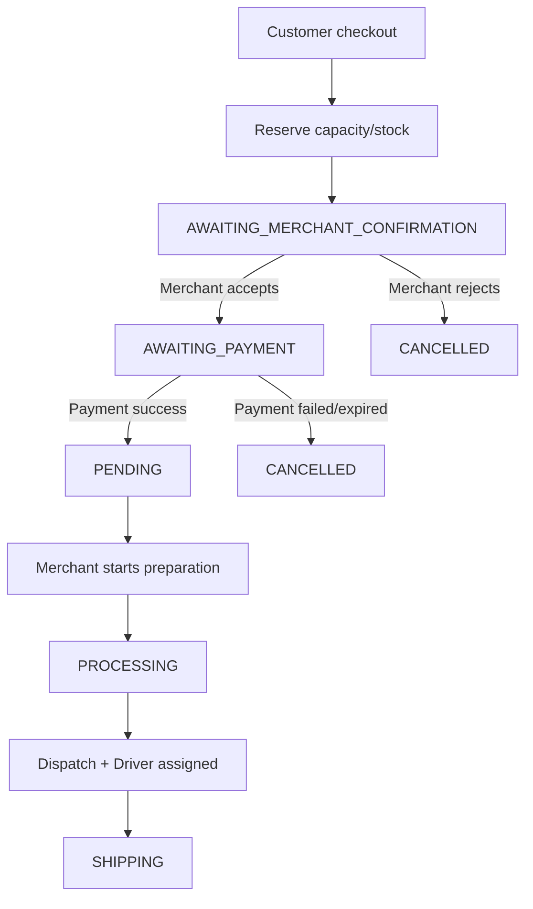
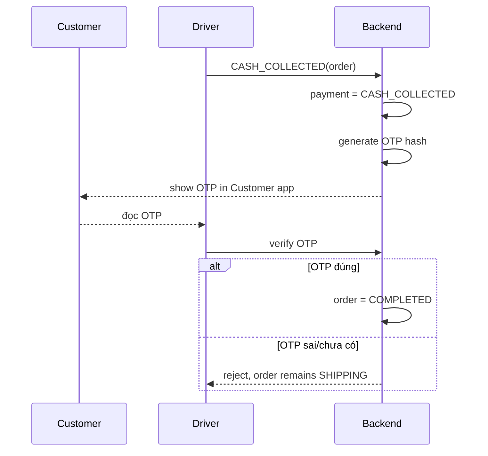

# FreshFlow Order State Machine

**Phiên bản:** 2.0  
**Ngày:** 18 tháng 8 năm 2026  
**Phạm vi:** FreshFlow MVP — Customer Android, Merchant React Web, Driver Android  
**Tài liệu liên quan:** `scope.md`, `requirements.md`, `docs/architecture/erd.md`

## 1. Mục đích

Tài liệu này định nghĩa vòng đời Order, các trạng thái hợp lệ, actor được phép chuyển trạng thái, quan hệ giữa Order State và Payment State, quy tắc capacity/stock, Merchant acceptance, COD, bank transfer on delivery, OTP/PIN, Driver assignment, delivery failure và dispute.

FreshFlow là food-ordering platform. Món được chế biến sau khi nhận order có thể dùng daily capacity thay vì stock thành phẩm. Vì vậy Order State Machine không được giả định rằng mọi món đều đã có sẵn trong kho.

## 2. Actors

| Actor | Trách nhiệm |
|---|---|
| Customer | Tạo order, chọn payment method, hủy theo policy, xem order/OTP, mở dispute |
| Merchant | Accept/reject order, bắt đầu chuẩn bị, dispatch, retry/cancel delivery failure, resolve dispute |
| Driver | Nhận assignment, xác nhận tiền COD, nhập OTP/PIN, báo delivery failure |
| Backend/System | Kiểm tra quyền, tính giá, giữ/release capacity/stock, tạo assignment, kiểm tra transition và audit |
| Payment Mock | Mô phỏng online success/failure/expiration/refund/cash/transfer confirmation |

## 3. Order States

| State | Ý nghĩa | Có phải terminal không? |
|---|---|---:|
| `AWAITING_MERCHANT_CONFIRMATION` | Order cần Merchant xác nhận trước khi xử lý; thường áp dụng khi Store/Variant manual | Không |
| `AWAITING_PAYMENT` | Order đã được accept nhưng Customer phải thanh toán `ONLINE_MOCK` | Không |
| `PENDING` | Online payment đã `SUCCEEDED`, Order chờ Merchant bắt đầu chuẩn bị | Không |
| `PROCESSING` | Merchant đang chuẩn bị; COD/Bank on delivery có thể vào state này trước khi trả tiền | Không |
| `SHIPPING` | Order đã dispatch và Driver đang giao | Không |
| `DELIVERY_FAILED` | Driver không giao thành công và ghi failure reason | Không |
| `DISPUTED` | Customer mở khiếu nại delivery; Merchant cần xử lý | Không |
| `COMPLETED` | Order hoàn tất theo payment/delivery rule | Có, nhưng Customer có thể mở dispute trong policy window |
| `CANCELLED` | Order bị từ chối, hủy, payment fail/expire hoặc không thể phục vụ | Có |

`PENDING` không có nghĩa “mọi order mới đều pending”. Nó chỉ dành cho Order có `ONLINE_MOCK` payment đã thành công và đang chờ Merchant bắt đầu xử lý.

## 4. Payment States

| Payment State | Ý nghĩa |
|---|---|
| `PENDING` | Chưa có payment success hoặc đang chờ payment action |
| `SUCCEEDED` | `ONLINE_MOCK` đã thanh toán thành công |
| `FAILED` | Online payment thất bại |
| `REFUNDED` | Payment đã thành công nhưng được hoàn tiền mock |
| `CASH_COLLECTED` | Driver đã nhận tiền mặt của COD |
| `TRANSFER_CONFIRMED` | Payment Mock xác nhận bank transfer on delivery |
| `EXPIRED` | Online payment hết thời gian thanh toán |

Một Order có thể có nhiều payment attempt. Payment attempt phải có method, status, mock/provider reference và timestamps. Online flow chỉ được có tối đa một attempt `SUCCEEDED`.

## 5. ProductVariant và inventory mode

### 5.1. ProductVariant

Customer mua ProductVariant, không mua Product gốc trực tiếp.

```text
Product: Trà sữa
├── Variant M — size=M, giá 30.000
└── Variant L — size=L, giá 40.000

Product: Cà phê đen
└── Variant STANDARD — size=NULL, giá 25.000
```

`STANDARD` là tên quy ước cho lựa chọn mặc định của món không có size. Nó không phải một size vật lý.

### 5.2. Inventory mode

| Mode | Cách kiểm soát |
|---|---|
| `MADE_TO_ORDER` | Dùng `inventory_capacity_records` theo `capacity_date`; món làm sau khi nhận order |
| `LIMITED_STOCK` | Dùng `inventory_stock_records` với stock/reservation và version |

Mỗi Store có một `MAIN_KITCHEN` mặc định trong MVP. `MAIN_KITCHEN` là location chuẩn bị món, không phải hệ thống quản lý nguyên liệu.

### 5.3. Reservation rule

Backend giữ capacity/stock ngay khi tạo Order để tránh overbooking/concurrent oversell.

```text
Reservation success -> tiếp tục acceptance/payment flow
Merchant reject -> release reservation
Customer/System cancel -> release reservation
Payment fail/expire -> release reservation
Payment success nhưng compensation -> refund + release nếu còn reservation
```

Nếu capacity/stock không giữ được, Backend không tạo Order phục vụ Merchant; request checkout thất bại theo error schema. Cart vẫn giữ item invalid để Customer biết và tự sửa.

## 6. Auto-accept policy

Store có `auto_accept_orders` làm default. ProductVariant có `auto_accept_override` có thể là `NULL`, `true` hoặc `false`.

```text
variant override != NULL -> dùng override
variant override == NULL -> dùng Store default
```

Nếu một cart có ít nhất một item yêu cầu manual acceptance, toàn bộ Order đi vào `AWAITING_MERCHANT_CONFIRMATION`. Không tách cart thành nhiều Order trong MVP.

## 7. Transition table

| Current | Next | Điều kiện | Actor |
|---|---|---|---|
| `AWAITING_MERCHANT_CONFIRMATION` | `AWAITING_PAYMENT` | Merchant accept và method `ONLINE_MOCK` | Merchant/Backend |
| `AWAITING_MERCHANT_CONFIRMATION` | `PROCESSING` | Merchant accept và method COD/Bank on delivery | Merchant/Backend |
| `AWAITING_MERCHANT_CONFIRMATION` | `CANCELLED` | Merchant reject | Merchant |
| `AWAITING_PAYMENT` | `PENDING` | Online payment `SUCCEEDED` | Backend/Payment Mock |
| `AWAITING_PAYMENT` | `CANCELLED` | Payment `FAILED` hoặc `EXPIRED` | Backend |
| `PENDING` | `PROCESSING` | Merchant bắt đầu chuẩn bị | Merchant |
| `PENDING` | `CANCELLED` | Customer cancel theo policy hoặc System/Merchant cancel | Customer/Merchant/System |
| `PROCESSING` | `SHIPPING` | Merchant dispatch, Backend đã gán Driver | Merchant/Backend |
| `PROCESSING` | `CANCELLED` | Merchant/System cancel trước delivery | Merchant/System |
| `SHIPPING` | `COMPLETED` | Bank transfer `TRANSFER_CONFIRMED` | Backend |
| `SHIPPING` | `COMPLETED` | COD `CASH_COLLECTED` và OTP đúng | Driver/Backend |
| `SHIPPING` | `DELIVERY_FAILED` | Driver báo failure reason hợp lệ | Driver |
| `SHIPPING` | `DISPUTED` | Customer mở dispute trong lúc giao | Customer |
| `DELIVERY_FAILED` | `PROCESSING` | Merchant retry/gán lại Driver | Merchant |
| `DELIVERY_FAILED` | `CANCELLED` | Merchant không thể giao và hủy | Merchant |
| `COMPLETED` | `DISPUTED` | Customer mở dispute trong policy window | Customer |
| `DISPUTED` | `COMPLETED` | Merchant resolve là đã giao | Merchant |
| `DISPUTED` | `CANCELLED` | Merchant resolve là giao thất bại; refund nếu đã trả | Merchant |

## 8. Payment-specific flows

### 8.1. `ONLINE_MOCK` — manual acceptance



Nếu Merchant reject trước khi payment success, không refund. Nếu payment đã success nhưng hệ thống/merchant phải cancel, Payment chuyển `REFUNDED`.

### 8.2. `ONLINE_MOCK` — auto-accept

```text
Customer checkout
-> reserve capacity/stock
-> AWAITING_PAYMENT
-> Payment SUCCEEDED
-> PENDING
-> Merchant starts preparation
-> PROCESSING
```

### 8.3. `CASH_ON_DELIVERY`

Manual acceptance:

```text
Customer checkout
-> reserve capacity/stock
-> AWAITING_MERCHANT_CONFIRMATION
-> Merchant accepts
-> PROCESSING
-> Merchant dispatches + Driver assigned
-> SHIPPING
```

Auto-accept bỏ qua bước Merchant confirmation:

```text
Customer checkout
-> reserve capacity/stock
-> PROCESSING
-> SHIPPING
```

Khi giao:



Driver không được yêu cầu OTP trước khi Backend ghi nhận `CASH_COLLECTED`.

### 8.4. `BANK_TRANSFER_ON_DELIVERY`

Manual acceptance:

```text
Customer checkout
-> reserve capacity/stock
-> AWAITING_MERCHANT_CONFIRMATION
-> Merchant accepts
-> PROCESSING
-> SHIPPING
```

Auto-accept bắt đầu từ `PROCESSING`.

Khi nhận món:

```text
Customer chuyển khoản
-> Payment Mock xác nhận TRANSFER_CONFIRMED
-> Backend payment = TRANSFER_CONFIRMED
-> Backend order = COMPLETED
```

Flow này không dùng OTP vì payment confirmation là bằng chứng hoàn tất trong MVP.

## 9. OTP/PIN rules

1. OTP/PIN chỉ được tạo sau `CASH_COLLECTED` đối với COD.
2. Backend chỉ lưu hash, không lưu plaintext.
3. Credential gắn với `delivery_assignment_id`; retry/gán Driver mới tạo credential mới.
4. Customer chỉ xem OTP của Order thuộc chính mình.
5. Driver chỉ verify OTP của assignment active được gán cho chính Driver.
6. OTP sai không đổi Order state.
7. OTP expired hoặc vượt attempt limit trả business error và audit event.
8. Nếu Customer không cung cấp OTP, Driver giữ Order ở `SHIPPING` hoặc báo `DELIVERY_FAILED` theo reason.

## 10. Delivery assignment

Backend tự gán Driver có:

```text
isAvailable = true
store_id = order.store_id
```

Trong các Driver phù hợp, Backend ưu tiên Driver có ít Order `SHIPPING` nhất. MVP không giới hạn cứng số Order/Driver và không dùng GPS/map.

Một Order có nhiều `delivery_assignments` để lưu history, nhưng chỉ một record active. `orders.current_driver_id` là shortcut query; Backend phải cập nhật shortcut và assignment trong cùng transaction. Client không được tự sửa Driver.

## 11. Delivery failure

Driver gửi failure reason thuộc enum, ví dụ:

```text
CUSTOMER_UNREACHABLE
WRONG_ADDRESS
CUSTOMER_REFUSED
VEHICLE_PROBLEM
STORE_DELAY
OTHER
```

Transition:

```text
SHIPPING -> DELIVERY_FAILED
```

Merchant quyết định:

```text
DELIVERY_FAILED -> PROCESSING
```

để retry/gán Driver khác, hoặc:

```text
DELIVERY_FAILED -> CANCELLED
```

để hủy và refund nếu payment đã thu.

## 12. Dispute

Customer có thể mở dispute khi:

```text
Order = SHIPPING hoặc COMPLETED
```

Một Order có thể có nhiều dispute history nhưng chỉ một dispute active theo policy. Dispute lưu order, customer, reason, message, status, resolution, resolver và timestamps. Evidence upload để Phase 2.

Merchant xử lý:

```text
DISPUTED -> COMPLETED
```

nếu xác định delivery hợp lệ, hoặc:

```text
DISPUTED -> CANCELLED
```

nếu xác định không thể giao. Nếu payment đã thu, Payment chuyển `REFUNDED` theo resolution policy.

## 13. Invalid transitions

Các transition sau luôn bị từ chối:

```text
AWAITING_PAYMENT -> SHIPPING
Lý do: chưa thanh toán online thành công và chưa qua chuẩn bị/dispatch.

PENDING -> SHIPPING
Lý do: chưa qua PROCESSING và chưa có dispatch hợp lệ.

PENDING -> COMPLETED
Lý do: không được bỏ qua chuẩn bị, giao và payment/delivery confirmation.

CANCELLED -> PROCESSING
Lý do: Order đã kết thúc bằng cancellation.

CANCELLED -> PENDING
Lý do: Order đã hủy không thể quay lại payment flow.

COMPLETED -> SHIPPING
Lý do: Order đã hoàn tất.

DISPUTED -> SHIPPING
Lý do: Order đang được Merchant xử lý dispute, không được tiếp tục giao.

DISPUTED -> PROCESSING
Lý do: không quay ngược về chuẩn bị trong dispute flow.

SHIPPING -> PROCESSING
Lý do: đã dispatch; nếu giao lỗi phải đi qua DELIVERY_FAILED.
```

Invalid actor actions cũng bị từ chối, ví dụ Customer cố accept order, Driver cố resolve dispute hoặc Merchant cố verify OTP thay Driver.

## 14. Idempotency và concurrency

### 14.1. Checkout idempotency

Customer gửi `Idempotency-Key` cho checkout. Backend lưu:

```text
user_id
idempotency_key
request_hash
order_id
response_status
created_at
expires_at
```

Cùng user/key/request hash trả lại cùng kết quả. Cùng user/key nhưng request hash khác bị từ chối vì key reuse sai.

### 14.2. Capacity/stock concurrency

Transaction checkout phải lock hoặc optimistic-lock record capacity/stock. Customer nào commit reservation hợp lệ trước được giữ suất; request còn lại nhận lỗi capacity/stock unavailable. Payment không được dùng thay cho inventory reservation.

## 15. Audit events

Audit bắt buộc cho:

```text
Order transition
Payment attempt/status/refund
Inventory reserve/release
Merchant acceptance/rejection
Driver assignment/reassignment
Driver availability change
Cash collected
OTP generated/failed/succeeded
Delivery failure
Dispute opened/resolved
```

Audit lưu actor, actor role, from/to hoặc event type, reason, order/payment/reference id và UTC timestamp.

## 16. Test case matrix

| ID | Scenario | Expected |
|---|---|---|
| SM-01 | Manual online order created | `AWAITING_MERCHANT_CONFIRMATION` |
| SM-02 | Merchant accepts online order | `AWAITING_PAYMENT` |
| SM-03 | Online payment succeeds | `PENDING` + Payment `SUCCEEDED` |
| SM-04 | Online payment fails | `CANCELLED` + Payment `FAILED`, release reservation |
| SM-05 | Online payment expires | `CANCELLED` + Payment `EXPIRED`, release reservation |
| SM-06 | Merchant rejects unpaid order | `CANCELLED`, no refund |
| SM-07 | Merchant rejects paid order | `CANCELLED` + `REFUNDED` |
| SM-08 | Merchant starts preparation | `PENDING -> PROCESSING` |
| SM-09 | Merchant dispatches with Driver | `PROCESSING -> SHIPPING` |
| SM-10 | COD auto-accept | `PROCESSING`, no `PENDING` |
| SM-11 | COD Driver collects cash | Payment `CASH_COLLECTED`, OTP generated |
| SM-12 | COD OTP correct | `SHIPPING -> COMPLETED` |
| SM-13 | COD OTP wrong | State remains `SHIPPING` |
| SM-14 | COD OTP before cash collected | Request rejected |
| SM-15 | Bank transfer confirmed | Payment `TRANSFER_CONFIRMED`, Order `COMPLETED` without OTP |
| SM-16 | Bank transfer pending | State remains `SHIPPING` |
| SM-17 | Driver reports failure | `SHIPPING -> DELIVERY_FAILED` |
| SM-18 | Merchant retries failure | `DELIVERY_FAILED -> PROCESSING` |
| SM-19 | Merchant cancels failure | `DELIVERY_FAILED -> CANCELLED` + refund if needed |
| SM-20 | Customer disputes shipping | `SHIPPING -> DISPUTED` |
| SM-21 | Customer disputes completed | `COMPLETED -> DISPUTED` within policy |
| SM-22 | Merchant resolves delivered | `DISPUTED -> COMPLETED` |
| SM-23 | Merchant resolves failed | `DISPUTED -> CANCELLED` + refund if needed |
| SM-24 | Invalid cancelled-to-processing | Rejected |
| SM-25 | Invalid completed-to-shipping | Rejected |
| SM-26 | Duplicate checkout key | Same Order returned |
| SM-27 | Capacity race | Only one reservation succeeds |
| SM-28 | Unavailable cart item | Checkout rejected; cart item remains visible |

## 17. Source of truth

Khi có mâu thuẫn, ưu tiên kiểm tra theo thứ tự:

1. ERD và database invariant cho data ownership/constraint.
2. Tài liệu này cho Order/Payment transition.
3. `requirements.md` cho acceptance criteria.
4. `scope.md` cho MVP boundary.
5. Backlog cho thứ tự triển khai.

Mọi thay đổi sau này phải cập nhật đồng thời ba tài liệu Markdown, ERD/migration và backlog traceability.
