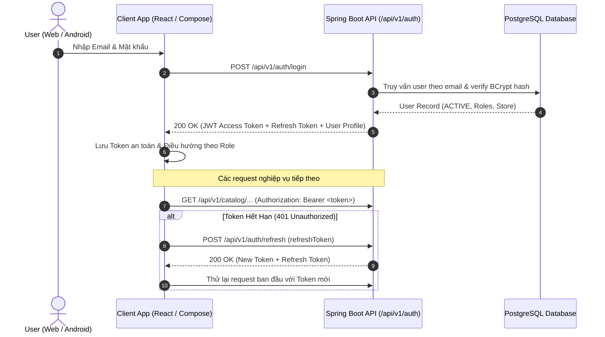

# FreshFlow MVP — Auth API Contract & Android Foundation Plan

> **Mã Task:** `FF-03-07-2`  
> **Trạng thái:** Chấp thuận (Approved)  
> **Hạng mục:** Planning (`Cross-client contract planning`)  
> **Phạm vi áp dụng:** Spring Boot API (`freshflow-api`), React Merchant Web (`freshflow-web`), Android Mobile (`freshflow-mobile`)  
> **Ngày phê duyệt:** 20/09/2026 (Tuần 3 - Ngày 6)  

---

## 1. Mục Đích & Nguyên Tắc Cốt Lõi (Core Principles)

Tài liệu này xác lập quy chuẩn kỹ thuật cho hệ thống xác thực (Authentication & Authorization) và quy hoạch nền tảng ứng dụng di động Android cho FreshFlow MVP:

1. **Một Điểm Xác Thực Duy Nhất (Single Auth Endpoint)**: Cả 3 đối tượng người dùng:
   - Chủ quán (*Merchant* — truy cập trên React Web),
   - Khách hàng (*Customer* — mua hàng trên Android Mobile),
   - Tài xế (*Driver* — nhận và giao đơn trên Android Mobile),  
   đều sử dụng chung một tập hợp API `/api/v1/auth/*` với cùng cấu trúc Token JWT và định dạng lỗi. Không tạo endpoint đăng nhập riêng biệt cho từng client.
2. **Quyền Hạn Dựa Trên Role & Store Scope**: Token mang định danh người dùng (`sub`), danh sách vai trò (`roles`), và định danh cửa hàng liên kết (`store_id`) để các client tự điều hướng giao diện phù hợp.
3. **Bảo Lưu Trạng Thái Cục Bộ An Toàn**: Web lưu trữ Access Token trong bộ nhớ / Cookie/Storage an toàn; Android lưu trữ qua `EncryptedSharedPreferences` / `Jetpack DataStore` và quản lý Giỏ hàng bằng `Room Database`.

---

## 2. Đặc Tả Chi Tiết Auth REST API Contract

Tất cả các endpoint thuộc nhóm `/api/v1/auth` đều được cấu hình công khai (không yêu cầu Bearer token trước khi gọi, ngoại trừ `/me` và `/logout`).



---

### 2.1. Đăng Nhập (`POST /api/v1/auth/login`)

Xác thực thông tin tài khoản và cấp phát cặp token (Access Token & Refresh Token).

- **URL**: `/api/v1/auth/login`
- **Method**: `POST`
- **Content-Type**: `application/json`

#### Request Body
```json
{
  "email": "merchant@freshflow.com",
  "password": "Password@123",
  "clientType": "WEB_MERCHANT"
}
```

| Thuộc tính | Kiểu dữ liệu | Bắt buộc | Mô tả |
| :--- | :--- | :---: | :--- |
| `email` | `string` | Có | Email tài khoản, chuẩn hóa chữ thường (lowercase). |
| `password` | `string` | Có | Mật khẩu tài khoản (tối thiểu 8 ký tự). |
| `clientType` | `string` | Không | Định danh client: `"WEB_MERCHANT"`, `"MOBILE_CUSTOMER"`, `"MOBILE_DRIVER"`. Dùng để ghi log audit và kiểm soát truy cập sớm. |

#### Response Thành Công (`200 OK`)
```json
{
  "token": "eyJhbGciOiJIUzI1NiIsInR5cCI6IkpXVCJ9.eyJzdWIiOiIxIiwiZW1haWwiOiJtZXJjaGFudEBmcmVzaGZsb3cuY29tIiwicm9sZXMiOlsicm9sZV9tZXJjaGFudCJdLCJzdG9yZUlkIjoxLCJpYXQiOjE3NTgzNjAwMDAsImV4cCI6MTc1ODQ0NjQwMH0.signature...",
  "refreshToken": "7a3f89e2-8d76-4a5c-9c3f-91823abce123",
  "tokenType": "Bearer",
  "expiresIn": 86400,
  "user": {
    "id": 1,
    "email": "merchant@freshflow.com",
    "fullName": "Nguyễn Văn Chủ Quán",
    "phone": "0901234567",
    "status": "ACTIVE",
    "roles": ["MERCHANT"],
    "store": {
      "id": 1,
      "name": "FreshFlow Flagship Kitchen - Quận 1",
      "autoAcceptDefault": true,
      "status": "ACTIVE"
    },
    "driverProfile": null
  }
}
```

#### Response Lỗi
- **`400 Bad Request`**: Dữ liệu gửi lên sai định dạng (ví dụ: email không hợp lệ, thiếu mật khẩu).
  ```json
  {
    "status": 400,
    "code": "VALIDATION_FAILED",
    "message": "Dữ liệu đăng nhập không hợp lệ",
    "errors": {
      "email": "Email không đúng định dạng",
      "password": "Mật khẩu không được để trống"
    },
    "timestamp": "2026-09-20T08:00:00Z"
  }
  ```
- **`401 Unauthorized`**: Sai thông tin xác thực hoặc tài khoản bị khóa.
  ```json
  {
    "status": 401,
    "code": "INVALID_CREDENTIALS",
    "message": "Email hoặc mật khẩu không chính xác",
    "timestamp": "2026-09-20T08:00:00Z"
  }
  ```
  *(Trường hợp tài khoản bị khóa: `"code": "ACCOUNT_LOCKED"`, `"message": "Tài khoản của bạn đã bị khóa. Vui lòng liên hệ quản trị viên."`)*
- **`403 Forbidden`**: Tài khoản không có quyền truy cập vào client này.
  ```json
  {
    "status": 403,
    "code": "ROLE_NOT_AUTHORIZED_FOR_CLIENT",
    "message": "Tài khoản khách hàng không có quyền đăng nhập vào hệ thống Merchant Web",
    "timestamp": "2026-09-20T08:00:00Z"
  }
  ```

---

### 2.2. Làm Mới Token (`POST /api/v1/auth/refresh`)

Cấp phát Access Token mới khi token cũ hết hạn mà không yêu cầu người dùng đăng nhập lại.

- **URL**: `/api/v1/auth/refresh`
- **Method**: `POST`
- **Content-Type**: `application/json`

#### Request Body
```json
{
  "refreshToken": "7a3f89e2-8d76-4a5c-9c3f-91823abce123"
}
```

#### Response Thành Công (`200 OK`)
```json
{
  "token": "eyJhbGciOiJIUzI1NiIsInR5cCI6IkpXVCJ9...",
  "refreshToken": "new-refresh-token-uuid...",
  "tokenType": "Bearer",
  "expiresIn": 86400
}
```

---

### 2.3. Lấy Thông Tin Tài Khoản Hiện Tại (`GET /api/v1/auth/me`)

Truy vấn thông tin người dùng dựa trên Bearer token hiện tại. Dùng khi ứng dụng khởi động lại để xác thực phiên làm việc.

- **URL**: `/api/v1/auth/me`
- **Method**: `GET`
- **Headers**: `Authorization: Bearer <token>`

#### Response Thành Công (`200 OK`)
Cấu trúc tương đương thuộc tính `user` trong response đăng nhập ở mục 2.1.

---

### 2.4. Đăng Xuất (`POST /api/v1/auth/logout`)

Vô hiệu hóa Refresh Token trên server và làm sạch phiên làm việc.

- **URL**: `/api/v1/auth/logout`
- **Method**: `POST`
- **Headers**: `Authorization: Bearer <token>`
- **Response (`200 OK`)**:
  ```json
  {
    "success": true,
    "message": "Đăng xuất thành công"
  }
  ```

---

## 3. Quy Chuẩn Token & Bảo Mật (Token Security Contract)

### 3.1. Cấu Trúc JWT Claims
```json
{
  "sub": "1",
  "email": "merchant@freshflow.com",
  "fullName": "Nguyễn Văn Chủ Quán",
  "roles": ["MERCHANT"],
  "storeId": 1,
  "iss": "freshflow-api",
  "iat": 1758360000,
  "exp": 1758446400
}
```

| Claim | Ý nghĩa nghiệp vụ |
| :--- | :--- |
| `sub` | ID người dùng (`users.id` dạng chuỗi để chống tràn số trong JavaScript). |
| `email` | Email tài khoản chuẩn hóa. |
| `fullName` | Họ tên hiển thị trên header/thanh công cụ. |
| `roles` | Danh sách mã vai trò: `["MERCHANT"]`, `["CUSTOMER"]`, `["DRIVER"]`. |
| `storeId` | ID cửa hàng mà user trực thuộc (áp dụng cho Merchant và Driver; `null` đối với Customer). |
| `exp` | Thời điểm hết hạn (mặc định: 24 giờ kể từ khi phát hành). |

---

## 4. Ma Trận Tài Khoản Demo (Demo Accounts Matrix)

Nhằm phục vụ quá trình phát triển độc lập, kiểm thử liên thông (Cross-client Testing) và demo đồ án, hệ thống thiết lập sẵn 3 tài khoản mặc định đại diện cho 3 phân hệ:

| Thuộc tính | Tài khoản Merchant (Web) | Tài khoản Customer (Android) | Tài khoản Driver (Android) |
| :--- | :--- | :--- | :--- |
| **Email** | `merchant.tea@freshflow.vn` / `merchant.bakery@freshflow.vn` | `customer.demo@freshflow.vn` | `driver.tea@freshflow.vn` / `driver.bakery@freshflow.vn` |
| **Mật khẩu** | Cấu hình local `FRESHFLOW_DEMO_PASSWORD` | Cấu hình local `FRESHFLOW_DEMO_PASSWORD` | Cấu hình local `FRESHFLOW_DEMO_PASSWORD` |
| **Họ & Tên** | Nguyễn Văn Chủ Quán | Lê Hoàng Khách Mua | Trần Quốc Tài Xế |
| **Số điện thoại** | `0901234567` | `0912345678` | `0987654321` |
| **Vai trò (Role)** | `MERCHANT` | `CUSTOMER` | `DRIVER` |
| **Cửa hàng (Store)** | Store #1 (*FreshFlow Flagship Q1*) | Không thuộc Store | Store #1 (*FreshFlow Flagship Q1*) |
| **Profile riêng** | Sở hữu Store ID 1 | Quản lý Giỏ hàng & Địa chỉ | Driver Profile ID 1 (`vehicleType: BIKE`) |
| **Client Đích** | `clients/freshflow-web` | `clients/freshflow-mobile` | `clients/freshflow-mobile` |
| **Luồng Nghiệp vụ** | Cấu hình catalog, duyệt đơn, xem capacity | Chọn variant, đặt món, chọn COD/Bank | Bật sẵn sàng (`is_available`), xác nhận COD/OTP |

---

## 5. Quy Hoạch Nền Tảng Ứng Dụng Di Động Android (`freshflow-mobile`)

### 5.1. Công Nghệ & Thư Viện Nền Tảng
- **Ngôn ngữ**: Kotlin 1.9+ (100% Kotlin).
- **UI Framework**: Jetpack Compose kết hợp Material 3 Design System.
- **Kiến trúc ứng dụng**: MVVM (Model - View - ViewModel) tuân thủ Android Architecture Guidelines:
  - **Data Layer**: Retrofit2 (REST API), OkHttp3 (Interceptors), Room Database (Offline Cart), DataStore (Tokens).
  - **Domain Layer**: Repositories, UseCases (Validation, Cart Operations, Order State Machine).
  - **UI Layer**: Compose Screens, ViewModels với `StateFlow` và `SharedFlow` cho One-time Events (Toast/Navigation).

### 5.2. Sơ Đồ Điều Hướng Màn Hình (Android Screen Map)

```mermaid
graph TD
    %% Entry & Auth
    Splash[1. SplashScreen\nKiểm tra Token cached] -->|Chưa đăng nhập| Login[2. LoginScreen\nEmail + Mật khẩu + 1-Click Demo Selector]
    Splash -->|Token hợp lệ| Dispatcher{Phân luồng theo Role}

    Login -->|Đăng nhập thành công| Dispatcher

    Dispatcher -->|Role: CUSTOMER| CustomerHome[3. Customer CatalogHomeScreen]
    Dispatcher -->|Role: DRIVER| DriverHome[8. DriverHomeScreen]

    %% Customer Flow
    subgraph "Customer Experience (Mua Hàng)"
        CustomerHome -->|Chọn món ăn| ProductDetail[4. ProductDetailScreen\nChọn Variant M/L/STANDARD\nXem Capacity còn lại]
        ProductDetail -->|Bấm Thêm vào giỏ| Cart[5. CartScreen (Room DB)\nCảnh báo món unavailable\nTính tổng tiền]
        CustomerHome -->|Bấm icon giỏ hàng| Cart
        Cart -->|Bấm Thanh toán| Checkout[6. CheckoutScreen\nĐịa chỉ, Ghi chú\nChọn COD / Mock Bank / Online]
        Checkout -->|Tạo đơn thành công| OrderDetail[7. OrderDetailScreen\nTheo dõi trạng thái Real-time\nHiển thị Mã OTP/PIN nhận hàng]
        OrderDetail -->|Khiếu nại sự cố| Dispute[12. CreateDisputeScreen\nGửi lý do & ảnh khiếu nại]
    end

    %% Driver Flow
    subgraph "Driver Experience (Giao Hàng)"
        DriverHome -->|Bật Switch Sẵn sàng| ToggleAvailable[Cập nhật is_available = true]
        DriverHome -->|Chọn đơn được gán| DeliveryDetail[9. DeliveryDetailScreen\nĐịa chỉ khách, Số điện thoại\nTổng tiền COD cần thu]
        DeliveryDetail -->|Đã đến nơi| DeliveryConfirm[10. DeliveryConfirmationScreen\nXác nhận thu COD\nNhập OTP từ Customer]
        DeliveryDetail -->|Gặp sự cố không giao được| DeliveryFail[11. DeliveryFailureReportScreen\nChọn lý do: Khách hủy/Không liên lạc được]
    end
```

### 5.3. Chi Tiết Các Màn Hình Chính

#### Phân Hệ Chung (Common & Auth)
1. **`SplashScreen`**:
   - Kiểm tra Token trong `DataStore`. Nếu còn hạn, gọi `/api/v1/auth/me` để làm mới thông tin và điều hướng thẳng vào Home tương ứng.
2. **`LoginScreen`**:
   - Ô nhập Email & Mật khẩu kèm kiểm tra định dạng tại chỗ (validation inline).
   - **Nút "Chọn Tài Khoản Demo" (1-Click Selector)**: Cho phép chọn nhanh giữa `Merchant`, `Customer`, và `Driver` để lập trình viên và người chấm đồ án không phải nhập tay.

#### Phân Hệ Khách Hàng (Customer Flow)
3. **`CatalogHomeScreen`**:
   - Thanh tìm kiếm món ăn, danh mục ngang (Categories).
   - Danh sách món ăn dạng Card kèm giá khởi điểm, ảnh và trạng thái còn hàng/hết hàng.
4. **`ProductDetailScreen`**:
   - Hiển thị đầy đủ thông tin món: Mô tả, ảnh lớn.
   - **Lựa chọn Variant**: Nút Radio chọn kích cỡ (Size M, Size L hoặc STANDARD). Tự động cập nhật giá bán và trạng thái công suất (`capacity remaining`).
   - Nút tăng giảm số lượng (tối đa `maxQuantityPerOrder`) và nút "Thêm vào giỏ hàng".
5. **`CartScreen` (Lưu trữ cục bộ Room DB)**:
   - Danh sách các món đã chọn.
   - **Kiểm tra tính khả dụng (Availability Check)**: Nếu một món trong giỏ bị Merchant ẩn mềm (Soft Hide) hoặc Category bị đóng, hiển thị nhãn cảnh báo đỏ `"Món này hiện tạm ngưng phục vụ"` và vô hiệu hóa nút Checkout.
6. **`CheckoutScreen`**:
   - Nhập thông tin người nhận: Địa chỉ giao hàng, số điện thoại, ghi chú bếp.
   - Lựa chọn phương thức thanh toán: `CASH_ON_DELIVERY` (Tiền mặt), `BANK_TRANSFER_ON_DELIVERY` (Chuyển khoản khi nhận), `ONLINE_MOCK`.
   - Sinh `Idempotency-Key` (UUIDv4) gắn vào header để chống trùng đơn khi bấm nhiều lần.
7. **`OrderDetailScreen`**:
   - Hiển thị tiến trình đơn hàng trực quan (Stepper): `PENDING` $\rightarrow$ `ACCEPTED` $\rightarrow$ `PREPARING` $\rightarrow$ `READY_FOR_PICKUP` $\rightarrow$ `DISPATCHED` $\rightarrow$ `DELIVERED`.
   - **Hiển thị Mã OTP/PIN**: Khách hàng cung cấp mã này cho Tài xế khi nhận hàng đối với đơn COD.

#### Phân Hệ Tài Xế (Driver Flow)
8. **`DriverHomeScreen`**:
   - Switch trạng thái `Sẵn sàng nhận đơn` (`is_available` toggle) gọi API cập nhật trạng thái hoạt động.
   - Danh sách các đơn hàng được hệ thống phân bổ (`Assigned Orders`).
9. **`DeliveryDetailScreen`**:
   - Bản đồ/địa chỉ giao hàng, thông tin liên hệ khách hàng (nút gọi điện nhanh).
   - Danh sách món ăn cần nhận từ bếp của Store.
   - Trạng thái thanh toán (Cần thu tiền mặt bao nhiêu VND hoặc Đã thanh toán).
10. **`DeliveryConfirmationScreen`**:
    - Đối với đơn COD: Ô nhập mã OTP 4-6 chữ số do khách hàng cung cấp.
    - Đối với đơn Chuyển khoản: Nút xác nhận tài khoản đã nhận được tiền.
    - Hoàn tất giao đơn $\rightarrow$ chuyển trạng thái đơn sang `DELIVERED`.
11. **`DeliveryFailureReportScreen`**:
    - Cho phép tài xế báo cáo sự cố giao hàng không thành công (Khách không nghe máy, sai địa chỉ, khách từ chối nhận).
    - Chuyển đơn sang trạng thái `DELIVERY_FAILED` để Merchant xử lý tiếp.

---

## 6. Cấu Trúc Khung Ứng Dụng Mobile (`clients/freshflow-mobile`)

Cấu trúc thư mục nguồn dự kiến cho dự án Android:

```
clients/freshflow-mobile/
├── app/
│   ├── build.gradle.kts
│   └── src/
│       └── main/
│           ├── AndroidManifest.xml
│           └── java/com/freshflow/mobile/
│               ├── FreshFlowApplication.kt
│               ├── core/
│               │   ├── network/
│               │   │   ├── AuthInterceptor.kt
│               │   │   ├── TokenAuthenticator.kt
│               │   │   └── ApiClient.kt
│               │   ├── storage/
│               │   │   ├── TokenDataStore.kt
│               │   │   └── database/ (Room DB for Cart)
│               │   └── ui/theme/ (Color, Type, Theme Material 3)
│               ├── features/
│               │   ├── auth/
│               │   │   ├── data/ (AuthRepository, AuthApi)
│               │   │   ├── domain/ (LoginUseCase, UserProfile)
│               │   │   └── ui/ (LoginScreen, LoginViewModel)
│               │   ├── customer/
│               │   │   ├── catalog/ (CatalogScreen, ProductDetailScreen)
│               │   │   ├── cart/ (CartScreen, CartViewModel)
│               │   │   ├── checkout/ (CheckoutScreen)
│               │   │   └── order/ (OrderDetailScreen)
│               │   └── driver/
│               │       ├── home/ (DriverHomeScreen)
│               │       └── delivery/ (DeliveryDetailScreen, ConfirmScreen)
│               └── navigation/
│                   ├── NavGraph.kt
│                   └── Destinations.kt
├── build.gradle.kts
├── settings.gradle.kts
└── README.md
```

---

## 7. Tiêu Chí Nghiệm Thu (Acceptance Criteria Verification)

| STT | Tiêu chí | Kết quả kiểm tra | Trạng thái |
| :---: | :--- | :--- | :---: |
| 1 | **Chốt Auth Contract** | Đầy đủ endpoint `/login`, `/refresh`, `/me`, `/logout`, mã lỗi và schema token. | **ĐẠT** |
| 2 | **Web và Mobile dùng cùng endpoint** | `POST /api/v1/auth/login` dùng chung cho Web Merchant, Android Customer và Driver. | **ĐẠT** |
| 3 | **Ma trận Demo Accounts** | Đầy đủ 3 tài khoản mẫu kèm thông tin đăng nhập, role và context. | **ĐẠT** |
| 4 | **Android Screen Map** | Đầy đủ sơ đồ Mermaid và mô tả tương tác 12 màn hình cho 2 phân hệ Customer & Driver. | **ĐẠT** |
| 5 | **Không tác động file Excel** | Giữ nguyên vẹn 100% tệp `plan/backlog-freshflow-mvp-12-tuan-updated.xlsx`. | **ĐẠT** |


## FF-07-01-1 implementation update (2026-10-09)

Identity implementation and current scope rules are documented in [DB-07-A](../database/07-identity-schema.md). User/UserRepository now belong to identity. CUSTOMER grants have null Store scope; MERCHANT/DRIVER grants require a Store. Active account and scoped grant are checked on existing APIs; Drivers also need an ACTIVE profile and their latest assignment in the same Store. Availability controls new assignments, not access to assigned work. Store responses omit owner credentials. Demo emails now follow existing V6 identities and the profile-gated dev seed, not the earlier proposed login matrix. JWT/principal integration remains a subsequent task.
