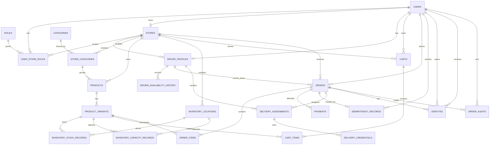
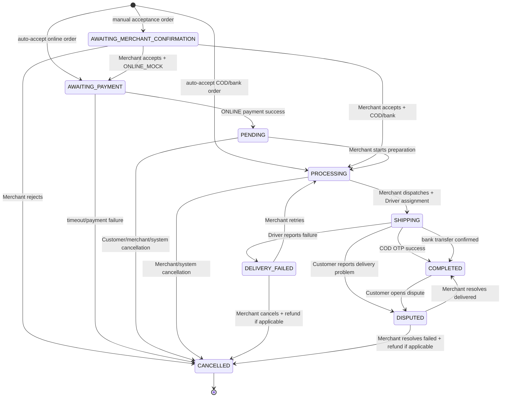

# FreshFlow MVP — Entity Relationship Design (ERD)

> **Task:** `FF-01-05-1`
> **Status:** Approved
> **Scope:** FreshFlow MVP with Customer Android, Merchant React Web and Driver Android
> **Database:** PostgreSQL
> **Author:** Manus AI

## 1. Purpose

Tài liệu này định nghĩa mô hình dữ liệu quan hệ cho FreshFlow MVP. Thiết kế đã được chốt sau khi phân tích nghiệp vụ đặt món chế biến theo order, ProductVariant, capacity theo ngày, Merchant acceptance, ba phương thức thanh toán, Driver assignment, OTP/PIN, dispute và idempotency.

FreshFlow không quản lý nguyên liệu như sữa, bột, thịt hoặc công thức chế biến trong MVP. Database chỉ quản lý **khả năng nhận order của ProductVariant** và **số lượng giới hạn bán ra**. Điều này phù hợp hơn với mô hình cửa hàng nhận order rồi mới chế biến món.

Thiết kế sử dụng 18 nhóm domain chính và 23 bảng vật lý. Các nhóm được tổ chức thành tài khoản, catalog, inventory/capacity, cart/order/payment, delivery/dispute và audit.

## 2. Quyết định thiết kế đã được chốt

| Quyết định | Thiết kế chính thức |
|---|---|
| User/role | Một bảng `users`; role mở rộng qua `roles` và `user_store_roles` |
| Role scope | Một User có thể có nhiều role trong Store cụ thể |
| Merchant/Store | Một Merchant có tối đa một Store trong MVP |
| Driver/Store | Một Store có nhiều Driver; Driver thuộc một Store trong MVP |
| Category/Store | Category dùng chung; Store bật Category qua `store_categories` |
| Product/variant | Product là món gốc; Customer mua `product_variants` |
| Món không có size | Tạo một variant mặc định tên `STANDARD`, `size = NULL` |
| Inventory mode | `MADE_TO_ORDER` hoặc `LIMITED_STOCK` |
| Capacity | `MADE_TO_ORDER` dùng capacity theo ngày |
| Inventory location | Mỗi Store có một `MAIN_KITCHEN` mặc định trong MVP |
| Cart invalidation | Giữ item unavailable trong cart; chặn checkout và hiển thị lý do |
| Order/Driver | Có `orders.current_driver_id` để query nhanh và `delivery_assignments` để lưu history |
| Payment | Một Order có nhiều payment attempts |
| Payment methods | `ONLINE_MOCK`, `CASH_ON_DELIVERY`, `BANK_TRANSFER_ON_DELIVERY` |
| COD completion | Driver xác nhận thu tiền, Backend sinh OTP, Driver nhập OTP đúng |
| Bank transfer completion | Payment Mock xác nhận `TRANSFER_CONFIRMED`; không cần OTP |
| Money | PostgreSQL `NUMERIC(12,2)`; Java `BigDecimal` |
| Time | Lưu UTC timestamp |
| ID | `BIGINT` tự tăng cho MVP |
| Delete policy | Không hard-delete dữ liệu đã tham gia nghiệp vụ; dùng status/`is_active` |

## 3. Domain overview



## 4. Entity and table definitions

### 4.1 Account and Store domain

#### `users`

Lưu thông tin tài khoản đăng nhập chung cho Customer, Merchant và Driver.

| Column | Type | Null | Rule |
|---|---|---:|---|
| `id` | `BIGINT` | No | Primary key, identity/sequence |
| `email` | `VARCHAR(255)` | No | Unique, normalized lowercase |
| `password_hash` | `VARCHAR(255)` | No | Không lưu plaintext password |
| `full_name` | `VARCHAR(150)` | No | Display name |
| `phone` | `VARCHAR(30)` | Yes | Có thể unique nếu dùng login bằng phone |
| `status` | `VARCHAR(20)` | No | `ACTIVE`, `LOCKED`, `PENDING` |
| `created_at` | `TIMESTAMPTZ` | No | UTC |
| `updated_at` | `TIMESTAMPTZ` | No | UTC |

#### `roles`

Danh mục role. MVP dùng `CUSTOMER`, `MERCHANT`, `DRIVER`; các role `STAFF`, `ADMIN`, `SUPPORT` có thể thêm sau.

| Column | Type | Null | Rule |
|---|---|---:|---|
| `id` | `BIGINT` | No | Primary key |
| `code` | `VARCHAR(30)` | No | Unique, uppercase |
| `name` | `VARCHAR(80)` | No | Display name |
| `created_at` | `TIMESTAMPTZ` | No | UTC |

#### `stores`

Lưu cửa hàng thuộc Merchant. MVP giới hạn một Merchant sở hữu tối đa một Store.

| Column | Type | Null | Rule |
|---|---|---:|---|
| `id` | `BIGINT` | No | Primary key |
| `owner_user_id` | `BIGINT` | No | FK -> `users.id`, unique |
| `name` | `VARCHAR(150)` | No | Store name |
| `phone` | `VARCHAR(30)` | Yes | Store contact |
| `address_line` | `VARCHAR(255)` | No | Delivery address |
| `auto_accept_default` | `BOOLEAN` | No | Store-level default |
| `status` | `VARCHAR(20)` | No | `ACTIVE`, `INACTIVE`, `SUSPENDED` |
| `created_at` | `TIMESTAMPTZ` | No | UTC |
| `updated_at` | `TIMESTAMPTZ` | No | UTC |

Constraint:

```sql
UNIQUE (owner_user_id)
```

#### `user_store_roles`

Gắn một User với một Role trong một Store. Thiết kế này cho phép mở rộng role theo Store mà không làm mất khả năng một User có nhiều role.

| Column | Type | Null | Rule |
|---|---|---:|---|
| `id` | `BIGINT` | No | Primary key |
| `user_id` | `BIGINT` | No | FK -> `users.id` |
| `store_id` | `BIGINT` | No | FK -> `stores.id` |
| `role_id` | `BIGINT` | No | FK -> `roles.id` |
| `status` | `VARCHAR(20)` | No | `ACTIVE`, `INACTIVE` |
| `created_at` | `TIMESTAMPTZ` | No | UTC |
| `updated_at` | `TIMESTAMPTZ` | No | UTC |

Constraint:

```sql
UNIQUE (user_id, store_id, role_id)
```

#### `driver_profiles`

Thông tin nghiệp vụ riêng của Driver. `is_available` là trạng thái hiện tại để Backend tìm Driver nhanh; lịch sử thay đổi lưu ở bảng riêng.

| Column | Type | Null | Rule |
|---|---|---:|---|
| `id` | `BIGINT` | No | Primary key |
| `user_id` | `BIGINT` | No | FK -> `users.id`, unique |
| `store_id` | `BIGINT` | No | FK -> `stores.id` |
| `is_available` | `BOOLEAN` | No | Default `false` |
| `vehicle_type` | `VARCHAR(30)` | Yes | Optional MVP metadata |
| `status` | `VARCHAR(20)` | No | `ACTIVE`, `SUSPENDED`, `INACTIVE` |
| `created_at` | `TIMESTAMPTZ` | No | UTC |
| `updated_at` | `TIMESTAMPTZ` | No | UTC |

#### `driver_availability_history`

Audit việc Driver bật/tắt nhận order.

| Column | Type | Null | Rule |
|---|---|---:|---|
| `id` | `BIGINT` | No | Primary key |
| `driver_profile_id` | `BIGINT` | No | FK -> `driver_profiles.id` |
| `is_available` | `BOOLEAN` | No | Giá trị mới |
| `changed_by_user_id` | `BIGINT` | No | FK -> `users.id` |
| `changed_at` | `TIMESTAMPTZ` | No | UTC |
| `reason` | `VARCHAR(255)` | Yes | Optional |

### 4.2 Catalog domain

#### `categories`

Category dùng chung giữa nhiều Store.

| Column | Type | Null | Rule |
|---|---|---:|---|
| `id` | `BIGINT` | No | Primary key |
| `name` | `VARCHAR(100)` | No | Global category name |
| `description` | `VARCHAR(255)` | Yes | Optional |
| `is_active` | `BOOLEAN` | No | Soft visibility |
| `created_at` | `TIMESTAMPTZ` | No | UTC |
| `updated_at` | `TIMESTAMPTZ` | No | UTC |

#### `store_categories`

Bật một Category dùng chung cho Store. Product tham chiếu bảng này thay vì tham chiếu trực tiếp `categories`.

| Column | Type | Null | Rule |
|---|---|---:|---|
| `id` | `BIGINT` | No | Primary key |
| `store_id` | `BIGINT` | No | FK -> `stores.id` |
| `category_id` | `BIGINT` | No | FK -> `categories.id` |
| `is_active` | `BOOLEAN` | No | Store visibility |
| `display_order` | `INTEGER` | No | Default `0` |
| `created_at` | `TIMESTAMPTZ` | No | UTC |
| `updated_at` | `TIMESTAMPTZ` | No | UTC |

Constraint:

```sql
UNIQUE (store_id, category_id)
```

#### `products`

Món gốc do Store quản lý. Product không phải đơn vị cuối cùng Customer mua; Customer mua ProductVariant.

| Column | Type | Null | Rule |
|---|---|---:|---|
| `id` | `BIGINT` | No | Primary key |
| `store_id` | `BIGINT` | No | FK -> `stores.id` |
| `store_category_id` | `BIGINT` | No | FK -> `store_categories.id` |
| `name` | `VARCHAR(150)` | No | Product name |
| `description` | `TEXT` | Yes | Optional |
| `image_url` | `VARCHAR(500)` | Yes | Optional |
| `is_active` | `BOOLEAN` | No | Soft visibility |
| `created_at` | `TIMESTAMPTZ` | No | UTC |
| `updated_at` | `TIMESTAMPTZ` | No | UTC |

Application/service constraint: `products.store_id` must match `store_categories.store_id`.

#### `product_variants`

Đơn vị Customer chọn trong catalog, cart và order. Product có size thì có M/L/XL; Product không có size có một variant `STANDARD` với `size = NULL`.

| Column | Type | Null | Rule |
|---|---|---:|---|
| `id` | `BIGINT` | No | Primary key |
| `product_id` | `BIGINT` | No | FK -> `products.id` |
| `name` | `VARCHAR(80)` | No | `STANDARD`, `M`, `L`, `XL`... |
| `size` | `VARCHAR(30)` | Yes | Null for STANDARD |
| `price` | `NUMERIC(12,2)` | No | Greater than or equal to zero |
| `inventory_mode` | `VARCHAR(30)` | No | `MADE_TO_ORDER`, `LIMITED_STOCK` |
| `auto_accept_override` | `BOOLEAN` | Yes | Null means inherit Store default |
| `max_quantity_per_order` | `INTEGER` | Yes | Not required in current MVP |
| `is_available` | `BOOLEAN` | No | Merchant can pause sales |
| `is_active` | `BOOLEAN` | No | Soft visibility |
| `created_at` | `TIMESTAMPTZ` | No | UTC |
| `updated_at` | `TIMESTAMPTZ` | No | UTC |

Constraint:

```sql
UNIQUE (product_id, name)
CHECK (price >= 0)
```

### 4.3 Inventory and capacity domain

#### `inventory_locations`

Địa điểm chuẩn bị món. MVP tự tạo một location `MAIN_KITCHEN` cho mỗi Store. Đây không phải bảng quản lý nguyên liệu.

| Column | Type | Null | Rule |
|---|---|---:|---|
| `id` | `BIGINT` | No | Primary key |
| `store_id` | `BIGINT` | No | FK -> `stores.id` |
| `name` | `VARCHAR(100)` | No | `MAIN_KITCHEN` in MVP |
| `type` | `VARCHAR(30)` | No | `MAIN_KITCHEN`, future `WAREHOUSE` |
| `is_default` | `BOOLEAN` | No | One default per Store |
| `is_active` | `BOOLEAN` | No | Soft status |
| `created_at` | `TIMESTAMPTZ` | No | UTC |
| `updated_at` | `TIMESTAMPTZ` | No | UTC |

Constraint:

```sql
UNIQUE (store_id, name)
```

#### `inventory_stock_records`

Dùng cho ProductVariant `LIMITED_STOCK`.

| Column | Type | Null | Rule |
|---|---|---:|---|
| `id` | `BIGINT` | No | Primary key |
| `variant_id` | `BIGINT` | No | FK -> `product_variants.id` |
| `location_id` | `BIGINT` | No | FK -> `inventory_locations.id` |
| `stock_quantity` | `INTEGER` | No | Greater than or equal to zero |
| `reserved_quantity` | `INTEGER` | No | Default `0` |
| `version` | `BIGINT` | No | Optimistic locking |
| `updated_at` | `TIMESTAMPTZ` | No | UTC |

Constraint:

```sql
UNIQUE (variant_id, location_id)
CHECK (stock_quantity >= 0)
CHECK (reserved_quantity >= 0)
CHECK (reserved_quantity <= stock_quantity)
```

Available stock is calculated rather than stored twice:

```text
available_quantity = stock_quantity - reserved_quantity
```

#### `inventory_capacity_records`

Dùng cho ProductVariant `MADE_TO_ORDER`, capacity theo ngày.

| Column | Type | Null | Rule |
|---|---|---:|---|
| `id` | `BIGINT` | No | Primary key |
| `variant_id` | `BIGINT` | No | FK -> `product_variants.id` |
| `location_id` | `BIGINT` | No | FK -> `inventory_locations.id` |
| `capacity_date` | `DATE` | No | Store business date |
| `capacity_limit` | `INTEGER` | No | Greater than or equal to zero |
| `reserved_quantity` | `INTEGER` | No | Default `0` |
| `version` | `BIGINT` | No | Optimistic locking |
| `created_at` | `TIMESTAMPTZ` | No | UTC |
| `updated_at` | `TIMESTAMPTZ` | No | UTC |

Constraint:

```sql
UNIQUE (variant_id, location_id, capacity_date)
CHECK (capacity_limit >= 0)
CHECK (reserved_quantity >= 0)
CHECK (reserved_quantity <= capacity_limit)
```

### 4.4 Cart and Order domain

#### `carts`

Cart active của Customer tại một Store. MVP không cho một cart chứa sản phẩm của nhiều Store.

| Column | Type | Null | Rule |
|---|---|---:|---|
| `id` | `BIGINT` | No | Primary key |
| `customer_user_id` | `BIGINT` | No | FK -> `users.id` |
| `store_id` | `BIGINT` | No | FK -> `stores.id` |
| `status` | `VARCHAR(20)` | No | `ACTIVE`, `CHECKED_OUT`, `ABANDONED` |
| `created_at` | `TIMESTAMPTZ` | No | UTC |
| `updated_at` | `TIMESTAMPTZ` | No | UTC |

Application constraint: mỗi Customer chỉ có một cart `ACTIVE` cho một Store.

#### `cart_items`

Sản phẩm Customer chọn. Nếu variant unavailable sau khi được thêm vào cart, record vẫn giữ lại nhưng checkout bị từ chối.

| Column | Type | Null | Rule |
|---|---|---:|---|
| `id` | `BIGINT` | No | Primary key |
| `cart_id` | `BIGINT` | No | FK -> `carts.id` |
| `variant_id` | `BIGINT` | No | FK -> `product_variants.id` |
| `quantity` | `INTEGER` | No | Greater than zero |
| `created_at` | `TIMESTAMPTZ` | No | UTC |
| `updated_at` | `TIMESTAMPTZ` | No | UTC |

Constraint:

```sql
UNIQUE (cart_id, variant_id)
CHECK (quantity > 0)
```

#### `orders`

Order chính. `current_driver_id` dùng để query nhanh; lịch sử gán Driver vẫn nằm ở `delivery_assignments`.

| Column | Type | Null | Rule |
|---|---|---:|---|
| `id` | `BIGINT` | No | Primary key |
| `order_number` | `VARCHAR(30)` | No | Unique public identifier |
| `customer_user_id` | `BIGINT` | No | FK -> `users.id` |
| `store_id` | `BIGINT` | No | FK -> `stores.id` |
| `current_driver_id` | `BIGINT` | Yes | FK -> `driver_profiles.id` |
| `status` | `VARCHAR(40)` | No | State machine value |
| `payment_method` | `VARCHAR(40)` | No | Payment method |
| `merchant_acceptance_status` | `VARCHAR(20)` | No | `PENDING`, `ACCEPTED`, `REJECTED` |
| `subtotal` | `NUMERIC(12,2)` | No | Snapshot total before fees |
| `delivery_fee` | `NUMERIC(12,2)` | No | Default zero in MVP if unused |
| `discount_amount` | `NUMERIC(12,2)` | No | Default zero |
| `total_amount` | `NUMERIC(12,2)` | No | Greater than or equal to zero |
| `cancel_reason` | `VARCHAR(80)` | Yes | `CUSTOMER_CANCELLED`, `PAYMENT_FAILED`, etc. |
| `created_at` | `TIMESTAMPTZ` | No | UTC |
| `accepted_at` | `TIMESTAMPTZ` | Yes | UTC |
| `processing_at` | `TIMESTAMPTZ` | Yes | UTC |
| `completed_at` | `TIMESTAMPTZ` | Yes | UTC |
| `cancelled_at` | `TIMESTAMPTZ` | Yes | UTC |
| `updated_at` | `TIMESTAMPTZ` | No | UTC |

Order states:

```text
AWAITING_MERCHANT_CONFIRMATION
AWAITING_PAYMENT
PENDING
PROCESSING
SHIPPING
DELIVERY_FAILED
DISPUTED
COMPLETED
CANCELLED
```

Constraint:

```sql
CHECK (subtotal >= 0)
CHECK (delivery_fee >= 0)
CHECK (discount_amount >= 0)
CHECK (total_amount >= 0)
```

#### `order_items`

Lưu snapshot để order cũ không bị thay đổi khi Product/ProductVariant đổi tên hoặc giá.

| Column | Type | Null | Rule |
|---|---|---:|---|
| `id` | `BIGINT` | No | Primary key |
| `order_id` | `BIGINT` | No | FK -> `orders.id` |
| `product_id` | `BIGINT` | Yes | Traceability FK |
| `product_variant_id` | `BIGINT` | No | FK -> `product_variants.id` |
| `product_name_snapshot` | `VARCHAR(150)` | No | Snapshot |
| `variant_name_snapshot` | `VARCHAR(80)` | No | `STANDARD`, `M`, `L`... |
| `unit_price_snapshot` | `NUMERIC(12,2)` | No | Price at checkout |
| `quantity` | `INTEGER` | No | Greater than zero |
| `line_total` | `NUMERIC(12,2)` | No | Unit price multiplied by quantity |

Constraint:

```sql
CHECK (unit_price_snapshot >= 0)
CHECK (quantity > 0)
CHECK (line_total >= 0)
```

### 4.5 Payment and idempotency domain

#### `payments`

Một Order có thể có nhiều payment attempt. Chỉ một attempt được `SUCCEEDED` đối với `ONLINE_MOCK`; COD và bank transfer on delivery dùng status riêng.

| Column | Type | Null | Rule |
|---|---|---:|---|
| `id` | `BIGINT` | No | Primary key |
| `order_id` | `BIGINT` | No | FK -> `orders.id` |
| `attempt_number` | `INTEGER` | No | Starts at `1` |
| `method` | `VARCHAR(40)` | No | `ONLINE_MOCK`, `CASH_ON_DELIVERY`, `BANK_TRANSFER_ON_DELIVERY` |
| `status` | `VARCHAR(30)` | No | Payment state |
| `amount` | `NUMERIC(12,2)` | No | Amount of attempt |
| `provider_reference` | `VARCHAR(120)` | Yes | Unique when present |
| `failure_reason` | `VARCHAR(255)` | Yes | Optional |
| `paid_at` | `TIMESTAMPTZ` | Yes | UTC |
| `refunded_at` | `TIMESTAMPTZ` | Yes | UTC |
| `created_at` | `TIMESTAMPTZ` | No | UTC |
| `updated_at` | `TIMESTAMPTZ` | No | UTC |

Payment statuses:

```text
PENDING
SUCCEEDED
FAILED
REFUNDED
CASH_COLLECTED
TRANSFER_CONFIRMED
EXPIRED
```

Business constraints:

```text
- REFUNDED chỉ áp dụng cho payment đã SUCCEEDED hoặc payment method đã thu tiền.
- Một Order không có hai payment attempt ONLINE_MOCK cùng SUCCEEDED.
- provider_reference không được xử lý thành công hai lần.
- Payment fail của online order làm release reservation/capacity.
```

#### `idempotency_records`

Chống tạo order trùng khi Customer retry checkout do mạng chậm hoặc bấm nút nhiều lần.

| Column | Type | Null | Rule |
|---|---|---:|---|
| `id` | `BIGINT` | No | Primary key |
| `user_id` | `BIGINT` | No | FK -> `users.id` |
| `idempotency_key` | `VARCHAR(120)` | No | Client-generated key |
| `request_hash` | `VARCHAR(128)` | No | Hash của request body |
| `order_id` | `BIGINT` | Yes | FK -> `orders.id` |
| `response_status` | `INTEGER` | Yes | HTTP status |
| `response_body` | `JSONB` | Yes | Cached response nếu cần |
| `expires_at` | `TIMESTAMPTZ` | No | UTC |
| `created_at` | `TIMESTAMPTZ` | No | UTC |

Constraint:

```sql
UNIQUE (user_id, idempotency_key)
```

Nếu cùng key nhưng request hash khác, Backend trả lỗi conflict thay vì trả lại order cũ.

### 4.6 Delivery, OTP và dispute domain

#### `delivery_assignments`

Lịch sử Backend gán Driver cho Order. Một Order có thể có nhiều assignment khi giao thất bại và Merchant retry.

| Column | Type | Null | Rule |
|---|---|---:|---|
| `id` | `BIGINT` | No | Primary key |
| `order_id` | `BIGINT` | No | FK -> `orders.id` |
| `driver_profile_id` | `BIGINT` | No | FK -> `driver_profiles.id` |
| `status` | `VARCHAR(30)` | No | `ASSIGNED`, `DISPATCHED`, `DELIVERING`, `DELIVERED`, `FAILED`, `ENDED` |
| `attempt_number` | `INTEGER` | No | Starts at `1` |
| `assigned_at` | `TIMESTAMPTZ` | No | UTC |
| `dispatched_at` | `TIMESTAMPTZ` | Yes | UTC |
| `delivered_at` | `TIMESTAMPTZ` | Yes | UTC |
| `ended_at` | `TIMESTAMPTZ` | Yes | UTC |
| `failure_reason` | `VARCHAR(255)` | Yes | Optional |
| `created_at` | `TIMESTAMPTZ` | No | UTC |
| `updated_at` | `TIMESTAMPTZ` | No | UTC |

Business constraint: tối đa một assignment active cho một Order. Có thể dùng partial unique index trong PostgreSQL trên các status active.

#### `delivery_credentials`

OTP/PIN gắn với từng delivery assignment. Mỗi lần retry tạo credential mới.

| Column | Type | Null | Rule |
|---|---|---:|---|
| `id` | `BIGINT` | No | Primary key |
| `delivery_assignment_id` | `BIGINT` | No | FK -> `delivery_assignments.id` |
| `otp_hash` | `VARCHAR(255)` | No | Không lưu OTP plaintext |
| `expires_at` | `TIMESTAMPTZ` | No | UTC |
| `used_at` | `TIMESTAMPTZ` | Yes | UTC |
| `attempt_count` | `INTEGER` | No | Default `0` |
| `max_attempts` | `INTEGER` | No | Default theo policy |
| `created_at` | `TIMESTAMPTZ` | No | UTC |

#### `disputes`

Lưu lịch sử tranh chấp. Customer có thể mở dispute trong `SHIPPING` hoặc sau `COMPLETED`; Merchant xử lý và chọn kết quả.

| Column | Type | Null | Rule |
|---|---|---:|---|
| `id` | `BIGINT` | No | Primary key |
| `order_id` | `BIGINT` | No | FK -> `orders.id` |
| `customer_user_id` | `BIGINT` | No | FK -> `users.id` |
| `reason` | `VARCHAR(60)` | No | `NOT_RECEIVED`, `WRONG_ITEM`, `DAMAGED`, etc. |
| `customer_message` | `TEXT` | No | Customer description |
| `status` | `VARCHAR(30)` | No | `OPEN`, `RESOLVED_DELIVERED`, `RESOLVED_CANCELLED` |
| `merchant_resolution` | `TEXT` | Yes | Merchant explanation |
| `resolved_by_user_id` | `BIGINT` | Yes | FK -> `users.id` |
| `resolved_at` | `TIMESTAMPTZ` | Yes | UTC |
| `created_at` | `TIMESTAMPTZ` | No | UTC |
| `updated_at` | `TIMESTAMPTZ` | No | UTC |

MVP chưa có `evidence_url`, chat, Support queue hoặc dispute SLA.

#### `order_audits`

Lưu audit trail cho các transition và event quan trọng.

| Column | Type | Null | Rule |
|---|---|---:|---|
| `id` | `BIGINT` | No | Primary key |
| `order_id` | `BIGINT` | No | FK -> `orders.id` |
| `actor_user_id` | `BIGINT` | Yes | Null nếu Backend/System |
| `actor_role` | `VARCHAR(30)` | Yes | Role tại thời điểm event |
| `event_type` | `VARCHAR(50)` | No | Event code |
| `from_status` | `VARCHAR(40)` | Yes | State cũ |
| `to_status` | `VARCHAR(40)` | Yes | State mới |
| `reason` | `VARCHAR(255)` | Yes | Optional |
| `metadata` | `JSONB` | Yes | Structured context |
| `created_at` | `TIMESTAMPTZ` | No | UTC |

Các event cần audit gồm order transition, payment attempt/success/failure/refund, inventory reserve/release, Driver assignment/dispatch, OTP success/failure, delivery failure và dispute open/resolve.

## 5. Checkout and capacity flow

### 5.1 Validation trước checkout

Backend phải đọc lại catalog và capacity/stock hiện tại, không tin hoàn toàn dữ liệu cart cũ ở Android Room. Nếu một cart item unavailable, Backend trả lỗi chi tiết; không tự động xóa item và không tạo partial order.

```text
Customer checkout
    |
    v
Validate Store active, Product active, Variant active/is_available
    |
    +-- Có item unavailable/capacity hết
    |       -> Reject checkout
    |       -> Giữ item trong cart
    |       -> Trả validation error cho Customer
    |
    +-- Hợp lệ
            -> Giữ capacity hoặc stock trong transaction
            -> Tạo Order và OrderItems snapshot
            -> Xử lý Merchant acceptance/payment theo flow
```

### 5.2 Reserve capacity/stock

Capacity được giữ ngay khi Order được tạo để tránh hai Customer cùng chiếm một capacity cuối.

```text
MADE_TO_ORDER:
reserved_quantity += order_item.quantity

LIMITED_STOCK:
reserved_quantity += order_item.quantity
```

Update phải dùng optimistic locking bằng `version`. Nếu update version thất bại, Backend đọc lại record và trả lỗi capacity/stock không còn đủ.

### 5.3 Release capacity/stock

Khi Order bị Merchant reject, Customer cancel hợp lệ, online payment fail hoặc payment timeout, Backend release phần đã giữ trong cùng transaction nghiệp vụ.

```text
reserved_quantity -= order_item.quantity
Order = CANCELLED
Payment = FAILED/EXPIRED hoặc không có refund nếu chưa thu tiền
```

Nếu payment đã thành công nhưng Merchant reject hoặc system không thể phục vụ:

```text
Order = CANCELLED
Payment = REFUNDED
reserved_quantity được release
```

## 6. Merchant acceptance and payment flow

### 6.1 Auto-accept resolution

Store có `auto_accept_default`. ProductVariant có `auto_accept_override`:

```text
variant override != NULL -> dùng override
variant override == NULL -> dùng Store default
```

Nếu một Order có ít nhất một item cần manual acceptance, toàn bộ Order đi qua `AWAITING_MERCHANT_CONFIRMATION`.

### 6.2 Online mock payment

```text
Manual acceptance:
AWAITING_MERCHANT_CONFIRMATION
    -> Merchant accepts
AWAITING_PAYMENT
    -> Payment SUCCEEDED
PENDING
    -> Merchant starts preparation
PROCESSING
```

```text
Auto-accept:
AWAITING_PAYMENT
    -> Payment SUCCEEDED
PENDING
    -> PROCESSING
```

Payment timeout tại `AWAITING_PAYMENT` làm Order `CANCELLED`, Payment `EXPIRED` và release capacity/stock.

### 6.3 Cash on Delivery

```text
Manual acceptance:
AWAITING_MERCHANT_CONFIRMATION
    -> Merchant accepts
PROCESSING
    -> SHIPPING
    -> Driver bấm CASH_COLLECTED
    -> Payment CASH_COLLECTED
    -> Backend sinh OTP
    -> Driver nhập OTP
    -> OTP đúng: COMPLETED
```

Nếu OTP sai hoặc chưa có OTP, Order giữ `SHIPPING`. Driver có thể thử lại trong giới hạn policy hoặc báo `DELIVERY_FAILED`.

Auto-accept COD đi thẳng vào `PROCESSING` sau khi tạo Order và giữ capacity/stock.

### 6.4 Bank transfer on delivery

```text
PROCESSING
    -> SHIPPING
    -> Customer chuyển khoản
    -> Payment Mock TRANSFER_CONFIRMED
    -> COMPLETED
```

MVP không yêu cầu OTP cho `BANK_TRANSFER_ON_DELIVERY` sau khi Payment Mock xác nhận. Nếu chưa xác nhận transfer, Order giữ `SHIPPING`.

## 7. Order state flow



## 8. Cardinality summary

| Relationship | Cardinality |
|---|---|
| User — UserStoreRole | `1:N` |
| Store — UserStoreRole | `1:N` |
| Store — Product | `1:N` |
| Store — DriverProfile | `1:N` |
| Store — StoreCategory | `1:N` |
| Category — StoreCategory | `1:N` |
| Product — ProductVariant | `1:N` |
| Store — InventoryLocation | `1:N` |
| ProductVariant — StockRecord | `1:0..1` per location |
| ProductVariant — CapacityRecord | `1:N` by date/location |
| Customer — Cart | `1:N` historically, one `ACTIVE` per Store |
| Cart — CartItem | `1:N` |
| Customer — Order | `1:N` |
| Store — Order | `1:N` |
| Order — OrderItem | `1:N` |
| Order — Payment | `1:N` attempts |
| Order — DeliveryAssignment | `1:N` history |
| DeliveryAssignment — Credential | `1:N` retry credentials |
| Order — Dispute | `1:N` history |
| Order — Audit | `1:N` |

## 9. Authorization ownership rules

| Action | Required actor | Required ownership check |
|---|---|---|
| Create order | Customer | Customer owns cart |
| Accept/reject order | Merchant | Merchant role in `order.store_id` |
| Start preparation | Merchant | Merchant role in `order.store_id` |
| Dispatch order | Merchant | Merchant role in `order.store_id` |
| Set availability | Driver or Merchant | Driver profile belongs to Store |
| View assigned delivery | Driver | `delivery_assignments.driver_profile_id` belongs to current user |
| Mark cash collected | Driver | Driver owns active assignment |
| Submit OTP | Driver | Driver owns active assignment |
| Confirm bank transfer mock | Payment Mock/Backend | Must be idempotent by provider reference |
| Open dispute | Customer | Customer owns Order |
| Resolve dispute | Merchant | Merchant role in `order.store_id` |

## 10. Traceability to requirements

| ERD design | Related requirement area |
|---|---|
| `users`, `roles`, `user_store_roles` | Authentication and RBAC |
| `stores`, `products`, `product_variants`, `store_categories` | Merchant catalog management |
| `carts`, `cart_items`, `orders`, `order_items` | Customer browsing, cart and checkout |
| `inventory_stock_records` | Limited stock reservation and optimistic locking |
| `inventory_capacity_records` | Made-to-order daily capacity |
| `payments` | Online, COD and bank transfer payment flows |
| `idempotency_records` | Duplicate checkout protection |
| `driver_profiles`, `delivery_assignments` | Driver assignment and delivery workflow |
| `delivery_credentials` | COD OTP/PIN confirmation |
| `disputes` | Delivery dispute and Merchant resolution |
| `order_audits` | Auditability and operational troubleshooting |

## 11. Implementation order for database foundation

The ERD should be implemented in this order so foreign keys can be created safely:

```text
1. users, roles, stores, user_store_roles
2. driver_profiles, driver_availability_history
3. categories, store_categories, products, product_variants
4. inventory_locations
5. inventory_stock_records, inventory_capacity_records
6. carts, cart_items
7. orders, order_items
8. payments, idempotency_records
9. delivery_assignments, delivery_credentials
10. disputes, order_audits
```

Flyway migrations should be small and ordered. Each migration should have a deterministic name such as:

```text
V1__create_users_roles_stores.sql
V2__create_driver_profiles.sql
V3__create_catalog.sql
V4__create_inventory_and_capacity.sql
V5__create_carts_and_orders.sql
V6__create_payments_and_idempotency.sql
V7__create_delivery_and_disputes.sql
V8__create_audit_tables.sql
```

## 12. Explicit MVP exclusions

The following are intentionally excluded from this ERD:

- Ingredient, recipe and bill-of-material management.
- Real bank integration and real refund gateway.
- GPS tracking, maps and route optimization.
- Multiple store branches for one Merchant.
- Multiple active inventory locations in the initial seed data.
- Warehouse transfer and purchase order management.
- Driver fleet management.
- Evidence file storage and dispute chat.
- Support/Admin dispute queue.

These exclusions keep the design appropriate for the FreshFlow MVP while leaving extension points for Phase 2.

## 13. Definition of Done for `FF-01-02-2`

Task `FF-01-02-2` is complete when:

- All core entities and relationships in this document are reviewed and accepted.
- ProductVariant is the purchasable unit.
- Made-to-order capacity and limited-stock reservation are separated.
- Merchant acceptance and three payment flows are represented.
- Driver assignment history and current Driver lookup are represented.
- COD OTP and bank transfer confirmation are represented.
- Dispute, idempotency and audit requirements are represented.
- PostgreSQL types and critical constraints are documented.
- The implementation order for Flyway migrations is defined.

**Next task:** Database foundation and Flyway migration setup according to the backlog.
