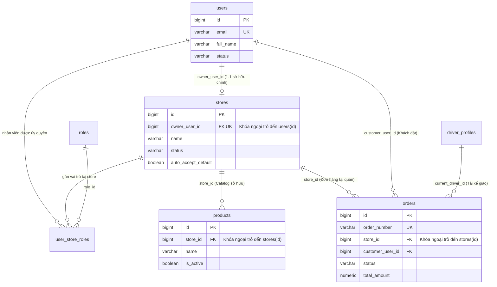

# FreshFlow Database & Security Architecture — User/Store Ownership Model (DB-04-A)

> **Mã thiết kế:** `DB-04-A` — Nhiệm vụ `FF-04-01-2`  
> **Chủ đề:** Thiết kế ownership và authorization data — Foreign key ownership, row-level rule ở application layer  
> **Thời gian:** 25/09/2026  
> **Trạng thái:** Approved & Implemented  

---

## 1. Bối cảnh & Mục tiêu

FreshFlow là nền tảng F&B đa người thuê (Multi-tenant) phục vụ nhiều chủ cửa hàng (Merchants), hàng nghìn khách hàng (Customers) và tài xế (Drivers). Để bảo vệ dữ liệu kinh doanh tối mật giữa các cửa hàng cạnh tranh nhau (doanh số, thực đơn riêng, thông tin khách hàng, số lượng đơn), hệ thống bắt buộc phải có cơ chế phân quyền sở hữu (Ownership Authorization) chặt chẽ và không thể bị vượt qua (Bypass).

Tài liệu này định nghĩa:
1. Mô hình quan hệ cơ sở dữ liệu (Relational Ownership Model).
2. Quy tắc phân quyền mức dòng ở tầng ứng dụng (Application Row-Level Security Rules).
3. Chiến lược Migration dữ liệu mẫu Seed V6 đảm bảo kiểm thử cô lập đa người thuê.

---

## 2. Mô hình Dữ liệu Quan hệ (Relational Model)



### 2.1. Các Ràng buộc Toàn vẹn (Integrity Constraints)
1. **Ràng buộc Khóa Ngoại:** `stores.owner_user_id REFERENCES users(id)` với `ON DELETE RESTRICT` để ngăn việc xóa nhầm người dùng đang làm chủ cửa hàng.
2. **Ràng buộc Đơn Nhất (1-1 MVP):** Trong phạm vi MVP, mỗi Merchant làm chủ một Store duy nhất: `CONSTRAINT uk_stores_owner_user_id UNIQUE (owner_user_id)`.
3. **Chỉ mục Hiệu năng:**
   - `idx_products_store_active_id` trên `products (store_id, is_active, id)`.
   - `idx_orders_store_status_created` trên `orders (store_id, status, created_at DESC)`.

---

## 3. Quy tắc Phân quyền Tầng Ứng dụng (Application Row-Level Security)

Thay vì phụ thuộc vào Row-Level Security phức tạp trong PostgreSQL (gây khó khăn cho connection pooling dùng chung), FreshFlow áp dụng chuẩn **Application-Enforced Ownership Validation** trong Spring Boot Services:

### 3.1. Xác thực Danh tính (Identity Extraction)
- Mọi Merchant request phải mang theo thông tin định danh:
  - Header: `Authorization: Bearer <JWT>` hoặc `X-User-Id: <Long>` (khi chạy mock test).
- Tầng Filter / Interceptor giải mã token thành `AuthenticatedUser(id, email, roles)`.

### 3.2. Rào chắn Kiểm tra Quyền Sở hữu (`CatalogAccessService` & `OrderAccessService`)
Trước khi thực hiện bất kỳ thao tác đọc hoặc ghi nào trên Catalog hoặc Order:

```java
public Store requireOwnedStore(Long storeId, Long actorUserId) {
    if (actorUserId == null || actorUserId <= 0) {
        throw new CatalogRuleViolationException(
            CatalogErrorCode.ACTOR_REQUIRED, "X-User-Id is required for merchant operations");
    }
    Store store = storeRepository.findById(storeId)
        .orElseThrow(() -> new CatalogNotFoundException(
            CatalogErrorCode.STORE_NOT_FOUND, "Store", storeId));
            
    if (store.getOwnerUser() == null || !Objects.equals(store.getOwnerUser().getId(), actorUserId)) {
        throw new CatalogRuleViolationException(
            CatalogErrorCode.STORE_ACCESS_DENIED, 
            "Merchant does not own this Store. Access denied to Store ID: " + storeId);
    }
    return store;
}
```

### 3.3. Quy tắc Truy vấn Bảng (Query Scope Enforcement)
- **Tuyệt đối không query `findAll()`:** Không bao giờ cung cấp method truy vấn không có điều kiện `storeId`.
- **Luôn gắn `storeId` vào Repository:**
  - `Page<Product> findByStoreIdAndIsActiveTrue(Long storeId, Pageable pageable)`
  - `Page<Order> findByStoreId(Long storeId, Pageable pageable)`
  - `Optional<Order> findByIdAndStoreId(Long orderId, Long storeId)`

---

## 4. Kịch bản Dữ liệu Seed Đa Người thuê (Migration V6)

Để kiểm thử tính cô lập dữ liệu 100%, Seed V6 thiết lập 2 Merchant hoàn toàn độc lập:

| Thông tin | Merchant 1 (Trà Sữa & Cà Phê) | Merchant 2 (Tiệm Bánh Mì & Ăn Sáng) |
|---|---|---|
| **User ID** | `2` | `3` |
| **Email** | `merchant.tea@freshflow.com` | `merchant.bakery@freshflow.com` |
| **Họ tên** | Nguyễn Văn Chủ Quán Trà | Trần Thị Bánh Mì Giòn |
| **Store ID** | `1` | `2` |
| **Tên Store** | Trà Sữa & Cà Phê Tươi FreshFlow | Tiệm Bánh Mì Sài Gòn & Điểm Tâm Sáng |
| **Catalog** | 26 món đồ uống | 15 món bánh mì, xôi, cà phê sáng |
| **Đơn hàng mẫu** | `ORD-2026-001`, `ORD-2026-002`, `ORD-2026-003` | `ORD-2026-101`, `ORD-2026-102` |

**Kiểm định cô lập:**
- Khi Merchant 1 truy vấn danh sách đơn hoặc dashboard: Chỉ thấy 3 đơn (`ORD-2026-001`..`003`).
- Khi Merchant 1 cố tình truy vấn `GET /merchant/stores/2/orders`: Backend ném lỗi `403 STORE_ACCESS_DENIED`.
