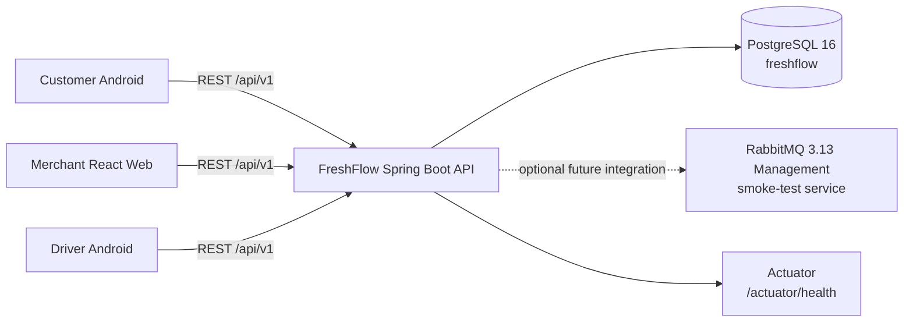
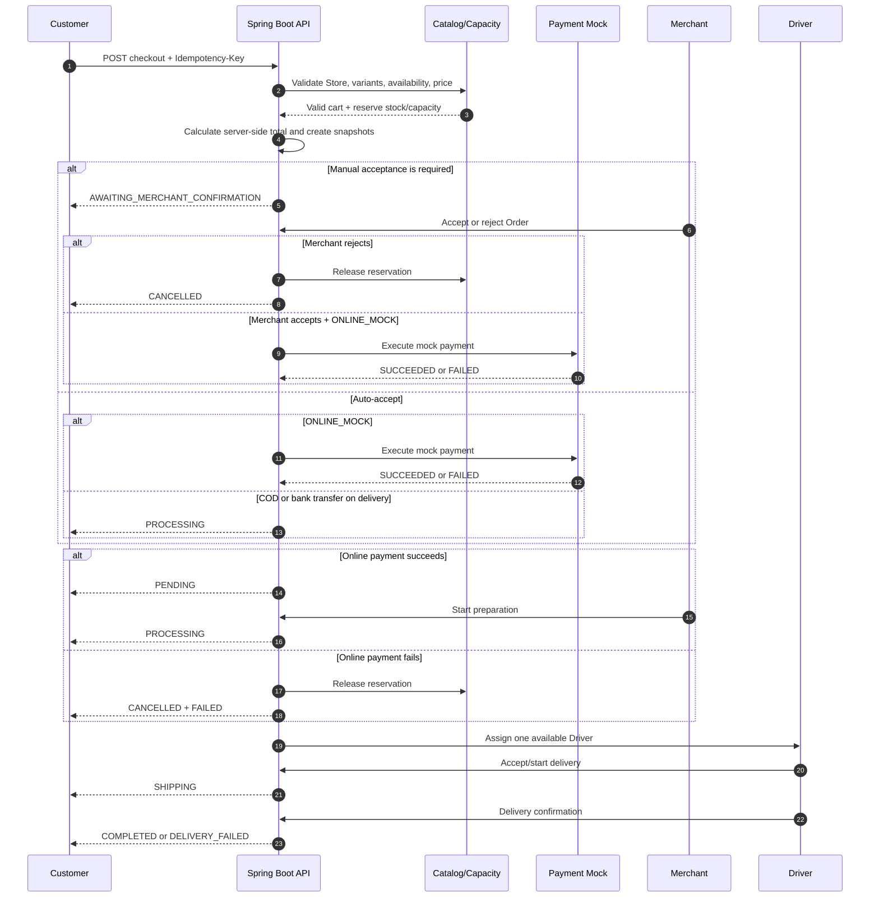
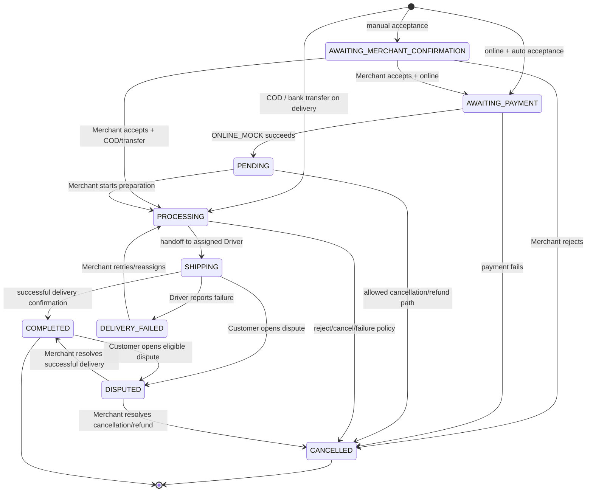

# FF-01-06-1 — Demo môi trường và domain

**Trạng thái:** In Progress — tài liệu demo đã chuẩn bị, cần commit sau khi review
**Phạm vi:** FreshFlow MVP — Week 1
**Backend:** Java 21, Spring Boot, PostgreSQL 16, Flyway, Actuator
**Infrastructure:** Docker Compose, PostgreSQL và RabbitMQ 3.13 Management
**Ngày ghi nhận evidence:** 22 August 2026

## 1. Mục tiêu

Tài liệu này chứng minh FreshFlow có thể được khởi động từ một repository sạch với PostgreSQL, RabbitMQ và Spring Boot API. Tài liệu cũng dùng để trình bày checkout flow, order state machine, bốn actor chính và tám business rule cốt lõi của MVP.

RabbitMQ được khởi động trong task này vì backlog FF-01-06-1 yêu cầu demo infrastructure gồm database, RabbitMQ và API. Tuy nhiên, RabbitMQ chỉ là **demo-only infrastructure smoke test** ở giai đoạn hiện tại. MVP chưa thêm Spring AMQP producer/consumer và chưa coi message broker là dependency bắt buộc của checkout flow. Quyết định này vẫn phù hợp với modular-monolith ADR: không thêm container hoặc distributed workflow nếu chưa có use case nghiệp vụ rõ ràng.[2]

> **Definition of done:** Một người khác có thể đọc README và tài liệu này, tạo local `.env`, khởi động PostgreSQL/RabbitMQ, kiểm tra health, chạy Spring Boot API và nhận HTTP 200 từ Actuator. Người trình bày giải thích được checkout flow, bốn actor và tám business rule mà không cần viết thêm tính năng mới.

## 2. Kiến trúc demo

FreshFlow MVP chạy một Spring Boot application theo modular-monolith boundary. Các module nghiệp vụ gồm `common`, `catalog`, `order`, `payment` và `delivery`. PostgreSQL là persistence store của API. RabbitMQ được chạy độc lập trong Docker Compose để kiểm tra khả năng vận hành infrastructure; task này chưa tạo queue, exchange, publisher hoặc consumer.[2]



| Thành phần | Vai trò trong demo | Kiểm tra |
|---|---|---|
| PostgreSQL | Lưu dữ liệu backend; database `freshflow` | Container `healthy`, port `5432` |
| RabbitMQ | Infrastructure smoke test theo backlog; chưa dùng trong business flow | Container `healthy`, AMQP `5672`, Management UI `15672` |
| Spring Boot API | REST API, domain rules, PostgreSQL connection và Actuator | `GET http://localhost:8080/actuator/health` trả HTTP 200 |
| Actuator | Endpoint quan sát liveness, readiness, database và disk space | Response có `status: UP` |

## 3. Bốn actor chính

FreshFlow có ba actor người dùng và một actor hệ thống trong demo. Payment Mock được xem là module nội bộ của backend, không phải actor người dùng thứ năm.[1]

| Actor | Kênh | Trách nhiệm chính |
|---|---|---|
| **Customer** | Android Kotlin | Xem Store/catalog, chọn ProductVariant, quản lý cart, checkout, chọn payment, theo dõi order và mở dispute của chính mình |
| **Merchant** | React Web | Quản lý Store/catalog, capacity, tiếp nhận hoặc từ chối order, theo dõi preparation, dispatch và xử lý dispute của Store |
| **Driver** | Android Kotlin | Nhận order do Backend gán, quản lý availability, giao hàng, xác nhận COD, nhập OTP/PIN, xác nhận transfer và báo delivery failure |
| **FreshFlow Backend** | Spring Boot REST API | Xác thực/RBAC, kiểm tra ownership, tính giá, giữ capacity/stock, payment state, assignment, state transition, audit và idempotency |

## 4. Tám business rule cần trình bày

Các rule dưới đây được rút gọn từ scope, order state machine, domain design và relational model hiện có.[1]

| Mã | Business rule | Ý nghĩa khi demo |
|---|---|---|
| **BR-01** | Một cart và một Order chỉ thuộc đúng một Store | Customer không thể checkout các ProductVariant từ nhiều Store trong cùng Order |
| **BR-02** | ProductVariant là đơn vị Customer mua và giá phải tính ở server | Client không được quyết định `unit_price`, `line_total` hoặc tổng tiền cuối cùng |
| **BR-03** | Backend phải kiểm tra availability, capacity/stock và giữ reservation trong transaction | Món unavailable vẫn có thể nằm trong cart nhưng checkout bị chặn; tránh overbooking |
| **BR-04** | Order status và Payment status là hai state độc lập; `PENDING` chỉ dùng sau khi online payment thành công | `ONLINE_MOCK` thành công dẫn đến `PENDING`; COD và bank transfer on delivery không đi qua `PENDING` |
| **BR-05** | Nếu Store hoặc một ProductVariant yêu cầu manual acceptance, toàn bộ Order phải chờ Merchant | Merchant reject làm Order `CANCELLED`; Merchant accept mới cho flow thanh toán/processing tiếp tục |
| **BR-06** | Capacity/stock phải được release khi reject, cancel hoặc payment failure; payment đã thành công nhưng không giữ được inventory phải refund | Không để reservation hoặc tiền bị treo sau failure path |
| **BR-07** | Backend tự gán một Driver available thuộc Store; mỗi Order chỉ có tối đa một Driver active | Assignment ưu tiên Driver có ít Order `SHIPPING` hơn; Driver không xem order không được gán |
| **BR-08** | Delivery confirmation phụ thuộc payment method | COD cần `CASH_COLLECTED` rồi OTP đúng; `BANK_TRANSFER_ON_DELIVERY` cần `TRANSFER_CONFIRMED` và không cần OTP |

## 5. Checkout flow

Checkout được bắt đầu từ cart của Customer. Backend không tin total hoặc availability do client gửi lên mà đọc lại ProductVariant, giá, capacity/stock và Store policy từ server. Cart có item unavailable vẫn được giữ để Customer nhìn thấy lý do, nhưng order không được tạo thành công cho đến khi cart hợp lệ.[1]



### 5.1. Payment branches

| Payment method | Checkout result | Delivery confirmation |
|---|---|---|
| `ONLINE_MOCK` | Mock payment succeeds before Merchant preparation; Order moves through `PENDING` and then `PROCESSING` | No COD OTP is needed |
| `CASH_ON_DELIVERY` | Order can move directly to `PROCESSING`; it does not use `PENDING` | Driver marks `CASH_COLLECTED`, Backend generates OTP, Driver enters correct OTP |
| `BANK_TRANSFER_ON_DELIVERY` | Order can move directly to `PROCESSING`; it does not use `PENDING` | Payment Mock records `TRANSFER_CONFIRMED`; no OTP is required |

## 6. Order state machine

Order state and payment state must be explained separately. `PENDING` is not a generic “new order” state; in this MVP it specifically represents successful online payment before Merchant processing. `CANCELLED`, `DELIVERY_FAILED` and `DISPUTED` are explicit outcomes and are not hidden as generic errors.[1]



### 6.1. Cancellation and payment interpretation

Customer cancellation is limited by the order state policy; earlier design decisions restrict Customer cancellation to `PENDING`. When an online payment failure occurs, the expected combination is `Order=CANCELLED` and `Payment=FAILED`. When online payment succeeded but inventory cannot be retained, the expected outcome is cancellation with a refund record. Merchant rejection follows the cancellation/refund policy and must release capacity/stock.

## 7. Local prerequisites

The demonstration assumes Windows, Git Bash, Docker Desktop with Docker Compose, Java 21 and a repository checkout. The backend uses PostgreSQL at `localhost:5432`, database `freshflow`, and Actuator at port `8080`. The repository currently uses `ddl-auto=validate` and Flyway for schema migration.[4]

Credentials must be local only. Create `.env` from `infrastructure/.env.example`, keep `.env` ignored by Git, and never paste its password into an issue, screenshot, PR or public documentation. The PostgreSQL password used by the local API configuration must match the password used by the PostgreSQL container.

## 8. Clean run from a new checkout

The following sequence is the reproducible runbook. Run the first group from the repository root:

```bash
git clone https://github.com/trunghieu2910/FreshFlow.git
cd FreshFlow
cp infrastructure/.env.example .env
```

Open `.env` and verify the PostgreSQL values match the current local Spring Boot configuration. Add the RabbitMQ values if they are not already present:

```dotenv
POSTGRES_DB=freshflow
POSTGRES_USER=freshflow
POSTGRES_PASSWORD=<the local password used by the API>
POSTGRES_PORT=5432

RABBITMQ_DEFAULT_USER=freshflow
RABBITMQ_DEFAULT_PASS=<local RabbitMQ password>
RABBITMQ_DEFAULT_VHOST=/freshflow
RABBITMQ_AMQP_PORT=5672
RABBITMQ_MANAGEMENT_PORT=15672
```

Start the infrastructure:

```bash
docker compose -f infrastructure/docker-compose.yml up -d
docker compose -f infrastructure/docker-compose.yml ps
```

Verify both containers:

```bash
docker inspect --format '{{.Name}} {{if .State.Health}}{{.State.Health.Status}}{{else}}no-healthcheck{{end}}' \
  freshflow-postgres freshflow-rabbitmq

curl -I --max-time 10 http://localhost:15672
```

Expected evidence is `freshflow-postgres healthy`, `freshflow-rabbitmq healthy`, published ports `5432`, `5672` and `15672`, and an HTTP response from the RabbitMQ Management endpoint. A `401 Unauthorized` response can still indicate that the management endpoint is reachable and is asking for authentication; an HTTP `200 OK` was observed in the completed local run.

Start the API in a second terminal:

```bash
cd services/freshflow-api
./mvnw spring-boot:run
```

When the application has started, verify Actuator from a third terminal:

```bash
curl -i --max-time 10 http://localhost:8080/actuator/health
```

Expected response:

```http
HTTP/1.1 200
Content-Type: application/vnd.spring-boot.actuator.v3+json
```

The response must contain an overall `"status":"UP"`, a PostgreSQL component with `"status":"UP"`, and both `livenessState` and `readinessState` with `"status":"UP"`.

## 9. Evidence from the completed run

The following evidence was recorded during the FF-01-06-1 local run. Passwords and tokens are intentionally excluded.

| Check | Observed result |
|---|---|
| Compose startup | RabbitMQ image `rabbitmq:3.13-management` pulled; `freshflow-rabbitmq` started; existing `freshflow-postgres` remained running |
| PostgreSQL health | `/freshflow-postgres healthy` |
| RabbitMQ health | `/freshflow-rabbitmq healthy` |
| AMQP port | `0.0.0.0:5672->5672/tcp` |
| Management port | `0.0.0.0:15672->15672/tcp` |
| Management endpoint | `HTTP/1.1 200 OK` from `http://localhost:15672` |
| API health | `HTTP/1.1 200` from `http://localhost:8080/actuator/health` |
| API overall status | `UP` |
| API database status | PostgreSQL `UP` |
| API liveness/readiness | Both `UP` |

The recorded API response also showed `diskSpace=UP`, `ping=UP` and valid SSL-chain details. These are supplementary Actuator details; the acceptance-critical checks are HTTP 200, overall `UP`, PostgreSQL `UP`, liveness `UP` and readiness `UP`.

## 10. Troubleshooting

### 10.1. Compose reports an unset `RABBITMQ_*` variable

Compose loads `.env` from the directory where the command is run, not from `.env.example`. Run the command from `/d/FreshFlow`, create `/d/FreshFlow/.env`, and add all RabbitMQ variables. Do not rename `.env.example` in the repository or commit the real `.env`.

### 10.2. RabbitMQ has empty ports or credentials

Run `docker compose -f infrastructure/docker-compose.yml config`. If `published` is empty or a `RABBITMQ_* variable is not set` warning appears, fix `.env` before running `up`. Do not rely on a container that was created with blank values; recreate it only after the local variables are correct.

```bash
docker compose -f infrastructure/docker-compose.yml down
docker compose -f infrastructure/docker-compose.yml up -d
docker compose -f infrastructure/docker-compose.yml ps
```

The `down` command does not remove named volumes unless `-v` is added. Do not use `-v` for routine troubleshooting because it deletes local database/broker data.

### 10.3. Port 5672, 15672, 5432 or 8080 is already in use

Inspect the owning process or container before changing ports. Prefer stopping the stale local process/container. If a port must be changed, update the local `.env` and the corresponding client configuration consistently; document the change in the demo evidence.

### 10.4. API health reports database DOWN

Confirm PostgreSQL is healthy, the database is `freshflow`, the username is `freshflow`, and the password in the API configuration matches the password used when the PostgreSQL volume was initialized. Existing named volumes retain their original credentials; changing `.env` alone does not change credentials inside an already initialized PostgreSQL volume.

```bash
docker compose -f infrastructure/docker-compose.yml ps
curl -i --max-time 10 http://localhost:8080/actuator/health
```

### 10.5. The API fails because Flyway or schema validation is unavailable

This task does not bypass the real database with H2. Start PostgreSQL first, inspect the first meaningful Flyway/JPA error, and fix the environment or migration issue. Do not hide a real configuration failure by replacing PostgreSQL with an in-memory database.

## 11. Demo presentation script

The presenter should first show the repository root and explain that `.env` is local and excluded from Git. Next, show `docker compose ps` and point out the `healthy` status for PostgreSQL and RabbitMQ, the AMQP port `5672` and Management UI port `15672`. Open `http://localhost:15672` only if credentials can be entered without exposing them in the recording.

Then show the Spring Boot terminal with the successful startup message and run the Actuator curl command. Explain that HTTP 200 and `status=UP` prove the API is alive, while `db=UP` proves the API can validate its PostgreSQL connection. The RabbitMQ check proves the broker container and management endpoint are available; it does not claim that FreshFlow already uses asynchronous messaging in its business flow.

Finally, use the checkout sequence diagram and state machine to explain that the Customer starts checkout, Backend validates and calculates, Merchant may accept or reject, Payment Mock determines the payment branch, Backend assigns one Driver, and delivery confirmation leads to `COMPLETED`, `DELIVERY_FAILED` or `DISPUTED`. Explicitly explain why online payment uses `PENDING`, while COD and bank transfer on delivery do not.

## 12. Acceptance checklist

- [x] PostgreSQL starts through Docker Compose.
- [x] RabbitMQ starts through Docker Compose with AMQP and Management ports published.
- [x] PostgreSQL and RabbitMQ report `healthy`.
- [x] RabbitMQ Management endpoint is reachable.
- [x] Spring Boot API starts against PostgreSQL.
- [x] Actuator health returns HTTP 200 and overall `UP`.
- [x] API database, liveness and readiness checks report `UP`.
- [x] Four actors are documented and explainable.
- [x] Eight business rules are documented and explainable.
- [x] Checkout flow is documented with a sequence diagram.
- [x] Order state machine is documented with a state diagram.
- [x] No new application feature code or messaging consumer was added for this demo.
- [x] No `.env`, password, token or private credential is included in the document.
- [ ] Add final terminal screenshots or a short screen recording to the repository evidence folder before closing the task.

## 13. References

[1]: https://raw.githubusercontent.com/trunghieu2910/FreshFlow/main/docs/FF-01-01-1_scope.md "FreshFlow MVP Project Scope"

[2]: https://raw.githubusercontent.com/trunghieu2910/FreshFlow/main/docs/adr/ADR-001-modular-monolith.md "ADR-001: Chọn Modular Monolith cho FreshFlow MVP"

[3]: https://raw.githubusercontent.com/trunghieu2910/FreshFlow/main/docs/database/02-postgres-convention.md "FreshFlow PostgreSQL Convention"

[4]: https://raw.githubusercontent.com/trunghieu2910/FreshFlow/main/services/freshflow-api/src/main/resources/application.properties "FreshFlow Spring Boot application.properties"

[5]: https://raw.githubusercontent.com/trunghieu2910/FreshFlow/main/infrastructure/docker-compose.yml "FreshFlow Docker Compose baseline"

[6]: https://raw.githubusercontent.com/trunghieu2910/FreshFlow/main/infrastructure/.env.example "FreshFlow environment example"
