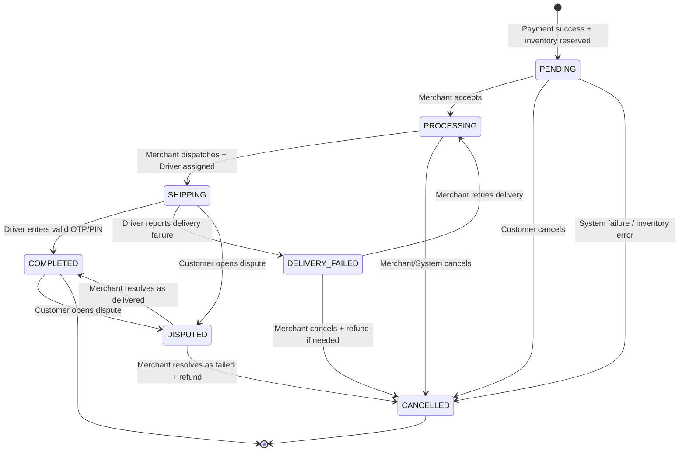

# FreshFlow — Order State Machine

**Task:** `FF-01-02-1`  
**Phiên bản:** 1.0  
**Trạng thái:** Đã chốt ở mức nghiệp vụ, sẵn sàng làm ERD/API/test  
**Phạm vi:** FreshFlow MVP có Customer Android, Merchant React Web và Driver Android

## 1. Mục đích

Tài liệu này định nghĩa vòng đời của một `Order`, các trạng thái hợp lệ, điều kiện chuyển trạng thái, actor được phép thực hiện hành động và cách xử lý các tình huống payment, inventory, giao hàng thất bại, tranh chấp và request lặp.

Order State Machine là nguồn quy tắc nghiệp vụ cho backend Spring Boot, database PostgreSQL, React Web, Android Customer và Android Driver. Client không được tự ý đổi trạng thái; mọi transition phải được Backend kiểm tra.

## 2. Quyết định phạm vi

Trong quá trình phân tích Socratic của task `FF-01-02-1`, nhóm đã quyết định bổ sung **Driver Android app** vào MVP. Driver là actor thực sự tương tác với hệ thống khi nhận và giao order.

Quyết định này làm thay đổi baseline trước đó. Các phiên bản hiện tại của `scope.md` và `requirements.md` vẫn còn ghi Driver là out of scope và đang mô tả state machine cũ. Trước khi bắt đầu các task backend/client phụ thuộc vào Driver, cần cập nhật hai tài liệu đó và backlog để tránh mâu thuẫn tài liệu.

Phạm vi Driver trong MVP chỉ bao gồm việc xem order được Backend gán, nhận thông tin giao, nhập OTP/PIN để xác nhận giao thành công và báo giao thất bại. MVP **không** bao gồm GPS tracking, bản đồ, định tuyến tối ưu, tính phí giao hàng động, chat hoặc ứng dụng giao hàng production.

## 3. Các trạng thái của Order

| State | Ý nghĩa | Trạng thái kết thúc? |
|---|---|---:|
| `PENDING` | Payment đã thành công, inventory đã được reserve và order đang chờ Merchant tiếp nhận | Không |
| `PROCESSING` | Merchant đã tiếp nhận và đang chuẩn bị món; nếu chưa có Driver thì order vẫn ở state này | Không |
| `SHIPPING` | Merchant đã dispatch order và Backend đã gán Driver; order đang được giao | Không |
| `DELIVERY_FAILED` | Driver không giao thành công và đã ghi nhận lý do | Không |
| `DISPUTED` | Customer báo có vấn đề trong lúc giao hoặc sau khi hệ thống ghi nhận giao thành công | Không |
| `COMPLETED` | Driver nhập đúng OTP/PIN do Customer cung cấp; món được xác nhận đã giao | Có |
| `CANCELLED` | Order bị hủy do Customer, payment failure, inventory/system failure hoặc Merchant xử lý thất bại | Có |

`PROCESSING` được dùng cả trong hai trường hợp: Merchant đang chuẩn bị món và Merchant đang chờ Driver được gán/nhận order. Không thêm `WAITING_FOR_DRIVER` trong MVP để tránh tăng số transition. Client có thể dùng thêm dữ liệu như `driverId`, `assignedAt` và `dispatchStatus` để hiển thị chi tiết hơn mà không tạo thêm Order State.

## 4. Payment State riêng biệt

Payment không được trộn vào Order State Machine. Hai state machine có liên quan nhưng phục vụ hai mục đích khác nhau.

| Payment state | Ý nghĩa |
|---|---|
| `PENDING` | Payment Mock đang được xử lý |
| `SUCCEEDED` | Payment Mock trả về thành công |
| `FAILED` | Payment Mock trả về thất bại; chưa thu tiền |
| `REFUNDED` | Khoản payment đã thành công được hoàn lại trong môi trường mock |

Luồng thông thường là:

```text
Payment PENDING -> SUCCEEDED
Payment PENDING -> FAILED
Payment SUCCEEDED -> REFUNDED
```

Nếu payment thất bại, order vẫn được lưu để audit nhưng có:

```text
Order   = CANCELLED
Payment = FAILED
```

Nếu payment đã thành công nhưng hệ thống không thể phục vụ order vì inventory/system error, hệ thống có:

```text
Order   = CANCELLED
Payment = REFUNDED
```

Payment Mock không lưu card number, CVV hoặc thông tin payment thật.

## 5. Sơ đồ Order State Machine



## 6. Transition catalogue

| ID | From | To | Actor | Điều kiện bắt buộc | Side effect |
|---|---|---|---|---|---|
| `T-01` | `[*]` | `PENDING` | Backend | Checkout hợp lệ, inventory reserve thành công, Payment Mock `SUCCEEDED` | Tạo order, order items, payment success và reservation |
| `T-02` | `[*]` | `CANCELLED` | Backend | Inventory không reserve được hoặc payment fail trong checkout flow | Lưu order failure record, release reservation nếu có |
| `T-03` | `PENDING` | `PROCESSING` | Merchant | Merchant sở hữu store và order đang đúng state | Ghi `acceptedAt` và audit event |
| `T-04` | `PENDING` | `CANCELLED` | Customer | Order thuộc Customer hiện tại và chưa được Merchant tiếp nhận | Release inventory; refund chỉ khi payment đã success |
| `T-05` | `PROCESSING` | `SHIPPING` | Merchant | Merchant sở hữu order, order đã sẵn sàng dispatch và Backend đã gán một Driver | Ghi `driverId`, `dispatchedAt`, tạo delivery OTP/PIN |
| `T-06` | `PROCESSING` | `CANCELLED` | Merchant/Backend | Không thể phục vụ order hoặc Merchant hủy theo policy | Release inventory; refund nếu payment success |
| `T-07` | `SHIPPING` | `COMPLETED` | Driver qua Backend | Driver được gán cho order và OTP/PIN hợp lệ | Ghi `deliveredAt`, lưu delivery confirmation |
| `T-08` | `SHIPPING` | `DELIVERY_FAILED` | Driver qua Backend | Driver được gán cho order và gửi failure reason hợp lệ | Ghi lý do, thời điểm và actor |
| `T-09` | `SHIPPING` | `DISPUTED` | Customer | Customer sở hữu order và gửi dispute hợp lệ | Ghi dispute reason, khóa transition giao tiếp theo policy |
| `T-10` | `DELIVERY_FAILED` | `PROCESSING` | Merchant | Merchant quyết định retry; order còn đủ điều kiện xử lý lại | Có thể gán Driver mới hoặc dispatch lại |
| `T-11` | `DELIVERY_FAILED` | `CANCELLED` | Merchant | Merchant quyết định không giao lại | Release inventory; Payment `SUCCEEDED -> REFUNDED` |
| `T-12` | `COMPLETED` | `DISPUTED` | Customer | Customer sở hữu order và mở dispute trong thời hạn policy | Ghi dispute record, chờ Merchant xử lý |
| `T-13` | `DISPUTED` | `COMPLETED` | Merchant | Merchant xác định order đã giao thành công | Ghi resolution và người xử lý |
| `T-14` | `DISPUTED` | `CANCELLED` | Merchant | Merchant xác định giao thất bại hoặc không thể phục vụ | Payment refund nếu đã success; release inventory nếu còn |

Mọi transition không có trong catalogue đều bị từ chối bằng lỗi nghiệp vụ, không được âm thầm sửa thành transition gần nhất.

## 7. Checkout, inventory và payment

FreshFlow sử dụng checkout flow giữ inventory trước rồi mới gọi Payment Mock:

```text
1. Customer gửi checkout cùng Idempotency-Key.
2. Backend kiểm tra user, store, product, price, quantity và cart intent.
3. Backend thực hiện inventory reservation trong transaction có locking/version check.
4. Nếu không reserve được, checkout thất bại; order failure record được lưu với Order CANCELLED.
5. Nếu reserve thành công, tạo payment attempt ở trạng thái PENDING.
6. Payment Mock trả SUCCESS hoặc FAILURE.
7. Nếu SUCCESS, Payment = SUCCEEDED và Order = PENDING.
8. Nếu FAILURE, Payment = FAILED, Order = CANCELLED và reservation được release.
```

Nếu payment đã `SUCCEEDED` nhưng reservation bị mất do lỗi hệ thống hoặc transaction bất thường, Backend không gửi order cho Merchant. Backend phải:

```text
Order   -> CANCELLED
Payment -> REFUNDED
Inventory -> release phần reservation còn tồn tại
```

Inventory không được âm. Khi nhiều Customer mua suất cuối cùng, request chỉ được thành công nếu transaction của request đó reserve được inventory. Request còn lại nhận lỗi nghiệp vụ như `INVENTORY_UNAVAILABLE` và không được tạo order phục vụ Merchant.

## 8. Idempotency và request đến trễ

Mỗi checkout request phải có `Idempotency-Key`. Với cùng một Customer và cùng một key, Backend phải trả lại kết quả của request trước đó hoặc response tương đương, không tạo order thứ hai.

Ví dụ:

```text
Request 1: checkout với key abc-123 -> tạo Order FF1001
Request 2: checkout với key abc-123 -> trả lại Order FF1001
```

Nếu Merchant gửi một request cũ đến sau khi order đã chuyển sang state mới, Backend không được cho request cũ ghi đè state hiện tại. Backend phải kiểm tra state hiện tại, transition được phép và phiên bản entity/optimistic-lock version trước khi update.

## 9. Driver assignment

Một Store có thể có nhiều Driver. Mỗi Order chỉ có tối đa một Driver chịu trách nhiệm tại một thời điểm.

MVP sử dụng cờ đơn giản:

```text
Driver.isAvailable = true/false
```

Backend chỉ tự động gán order cho Driver có `isAvailable = true` và thuộc Store tương ứng. Không đặt giới hạn cứng số order cho một Driver trong MVP. Để cân bằng tương đối, Backend chọn Driver có ít order đang ở `SHIPPING` nhất; nếu bằng nhau thì dùng tiêu chí ổn định như `driverId` tăng dần.

Đây là load balancing theo số lượng order, không phải thuật toán tối ưu theo vị trí địa lý. Nếu không có Driver available, order vẫn giữ ở `PROCESSING`; Merchant không được chuyển sang `SHIPPING` cho đến khi Backend gán được Driver.

## 10. OTP/PIN xác nhận giao hàng

OTP/PIN là cơ chế xác nhận giao hàng tối giản và không yêu cầu Customer phải bấm thêm nút xác nhận.

1. Khi order chuyển sang `SHIPPING`, Backend sinh một mã OTP/PIN ngẫu nhiên.
2. Customer nhìn thấy mã trong order detail trên Android Customer app.
3. Driver giao món và yêu cầu Customer đọc mã.
4. Driver nhập mã trong Driver app.
5. Backend kiểm tra mã và chỉ cho phép `SHIPPING -> COMPLETED` khi mã đúng.
6. Mã sai bị từ chối và không làm thay đổi Order State.
7. Nếu Customer không cung cấp mã, Driver có thể chuyển `SHIPPING -> DELIVERY_FAILED` với lý do phù hợp.

Mã OTP/PIN không nên lưu plaintext trong database; nên lưu hash hoặc giá trị được bảo vệ tương đương, có thời hạn và giới hạn số lần thử ở mức phù hợp MVP.

## 11. Delivery failure

Driver có thể báo giao thất bại từ `SHIPPING`. Backend yêu cầu một failure reason hợp lệ, ví dụ:

```text
CUSTOMER_UNAVAILABLE
INVALID_ADDRESS
CUSTOMER_REFUSED
DRIVER_VEHICLE_ISSUE
OTHER
```

Order chuyển sang `DELIVERY_FAILED`. Merchant có hai hướng xử lý:

```text
DELIVERY_FAILED -> PROCESSING
```

để giao lại hoặc gán Driver khác; hoặc:

```text
DELIVERY_FAILED -> CANCELLED
```

nếu không thể tiếp tục giao. Khi hủy sau payment success, Payment chuyển sang `REFUNDED` và inventory được release nếu reservation còn tồn tại.

## 12. Dispute có kết quả

Customer được mở dispute khi order đang `SHIPPING` hoặc đã `COMPLETED`. Dispute tối giản trong MVP gồm lý do, mô tả tùy chọn, thời điểm tạo và actor tạo.

Merchant là actor xử lý dispute:

```text
DISPUTED -> COMPLETED
```

khi Merchant xác định món đã được giao; hoặc:

```text
DISPUTED -> CANCELLED
```

khi Merchant xác định giao thất bại hoặc không thể phục vụ. Nếu payment đã success, hướng hủy phải thực hiện refund mock.

MVP không bao gồm chat, upload bằng chứng, SLA, Support portal hoặc workflow tranh chấp đầy đủ.

## 13. Actor và quyền

| Actor | Được phép | Không được phép |
|---|---|---|
| Customer | Checkout, xem order của mình, hủy `PENDING`, mở dispute ở `SHIPPING`/`COMPLETED` | Tự đổi state sang `PROCESSING`, `SHIPPING` hoặc `COMPLETED`; hủy sau `PENDING` |
| Merchant | Tiếp nhận `PENDING`, dispatch `PROCESSING -> SHIPPING` khi đã có Driver, hủy theo policy, retry/cancel delivery failure, xử lý dispute | Thao tác trên store/order không sở hữu; bỏ qua bước; xác nhận OTP thay Driver |
| Driver | Xem order được gán, nhập OTP/PIN, báo delivery failure | Nhận order không được gán; giao order của Store khác; tự đổi order sang `PROCESSING` hoặc xử lý dispute |
| Backend/System | Reserve/release inventory, gọi Payment Mock, gán Driver, validate transition, refund mock, audit | Không được bỏ qua authorization hoặc tin state do client gửi |
| Payment Mock | Trả success/failure và mock refund | Không truy cập hoặc tự thay đổi Order State ngoài contract Backend |

## 14. Invalid transitions bắt buộc kiểm thử

| ID | Transition không hợp lệ | Lý do |
|---|---|---|
| `INV-01` | `PENDING -> SHIPPING` | Chưa qua Merchant tiếp nhận và chưa thỏa điều kiện dispatch |
| `INV-02` | `PENDING -> COMPLETED` | Không thể hoàn tất khi chưa chuẩn bị và giao món |
| `INV-03` | `PROCESSING -> COMPLETED` | Không được bỏ qua bước `SHIPPING` và OTP/PIN |
| `INV-04` | `CANCELLED -> PROCESSING` | `CANCELLED` là trạng thái kết thúc |
| `INV-05` | `CANCELLED -> SHIPPING` | Order đã hủy không được giao tiếp |
| `INV-06` | `SHIPPING -> PROCESSING` | Không quay ngược về bước chuẩn bị sau khi dispatch |
| `INV-07` | `COMPLETED -> SHIPPING` | Order đã hoàn tất |
| `INV-08` | `DISPUTED -> SHIPPING` | Order đang được Merchant xử lý tranh chấp |
| `INV-09` | `DISPUTED -> PROCESSING` | Không quay ngược về bước chuẩn bị trong dispute |
| `INV-10` | `DELIVERY_FAILED -> COMPLETED` | Driver chưa cung cấp giao thành công bằng OTP/PIN sau retry |

## 15. Test cases cho `FF-01-02-1`

Các test case dưới đây là acceptance-level test cases. Khi backend được khởi tạo, chúng sẽ được chuyển thành unit test cho transition policy/domain service và integration test cho transaction/inventory/payment.

| ID | Type | Given | When | Expected |
|---|---|---|---|---|
| `TC-01` | Valid | Cart hợp lệ, inventory đủ, Driver chưa cần gán, Payment Mock trả success | Customer checkout với Idempotency-Key mới | Order tạo ở `PENDING`, Payment `SUCCEEDED`, inventory reserved |
| `TC-02` | Failure | Inventory không đủ | Customer checkout | Không tạo order phục vụ Merchant; record order ở `CANCELLED`, lỗi `INVENTORY_UNAVAILABLE` |
| `TC-03` | Failure | Inventory reserve thành công | Payment Mock trả failure | Order `CANCELLED`, Payment `FAILED`, reservation được release |
| `TC-04` | Failure/refund | Payment đã success nhưng reservation/system consistency failure xảy ra | Backend xử lý compensation | Order `CANCELLED`, Payment `REFUNDED`, inventory được release nếu còn reservation |
| `TC-05` | Idempotency | Customer đã checkout key `abc-123` tạo Order `FF1001` | Gửi lại checkout cùng user và key | Backend trả lại kết quả/Order `FF1001`, không tạo order thứ hai |
| `TC-06` | Valid transition | Order ở `PENDING`, Merchant sở hữu Store | Merchant accepts order | Order chuyển `PROCESSING`, có audit event |
| `TC-07` | Valid transition | Order ở `PENDING`, Customer sở hữu order | Customer cancel | Order `CANCELLED`, inventory release |
| `TC-08` | Invalid transition | Order ở `PROCESSING` | Customer cancel | Request bị từ chối; state vẫn `PROCESSING` |
| `TC-09` | Valid transition | Order `PROCESSING`, Driver available được Backend gán | Merchant dispatches | Order chuyển `SHIPPING`, có `driverId`, OTP/PIN được tạo |
| `TC-10` | Invalid transition | Order `PROCESSING`, không có Driver available | Merchant dispatches | Request bị từ chối; state vẫn `PROCESSING` |
| `TC-11` | Valid delivery | Order `SHIPPING`, Driver đúng được gán, OTP/PIN đúng | Driver submits OTP/PIN | Order chuyển `COMPLETED`, ghi `deliveredAt` |
| `TC-12` | Invalid delivery | Order `SHIPPING`, Driver đúng được gán, OTP/PIN sai | Driver submits OTP/PIN | Request bị từ chối; state vẫn `SHIPPING` |
| `TC-13` | Valid failure | Order `SHIPPING`, Driver đúng được gán | Driver báo `CUSTOMER_UNAVAILABLE` | Order chuyển `DELIVERY_FAILED`, lưu reason |
| `TC-14` | Valid retry | Order `DELIVERY_FAILED` | Merchant chọn retry | Order chuyển `PROCESSING`, cho phép gán/retry Driver |
| `TC-15` | Valid cancellation | Order `DELIVERY_FAILED`, payment đã success | Merchant quyết định không giao lại | Order `CANCELLED`, Payment `REFUNDED`, inventory release |
| `TC-16` | Valid dispute | Order `SHIPPING`, Customer sở hữu order | Customer mở dispute | Order `DISPUTED`, lưu reason và actor |
| `TC-17` | Valid dispute | Order `COMPLETED`, Customer sở hữu order trong thời hạn policy | Customer mở dispute | Order chuyển `DISPUTED` |
| `TC-18` | Valid resolution | Order `DISPUTED` | Merchant xác định đã giao thành công | Order chuyển `COMPLETED`, lưu resolution |
| `TC-19` | Valid resolution/refund | Order `DISPUTED`, payment success | Merchant xác định giao thất bại | Order `CANCELLED`, Payment `REFUNDED` |
| `TC-20` | Invalid transition | Order `CANCELLED` | Bất kỳ actor nào cố chuyển sang `PROCESSING` | Request bị từ chối; state vẫn `CANCELLED` |
| `TC-21` | Invalid transition | Order `COMPLETED` | Driver cố chuyển lại `SHIPPING` | Request bị từ chối; state vẫn `COMPLETED` |
| `TC-22` | Concurrency | Chỉ còn một inventory unit, hai Customer checkout đồng thời | Hai transaction cùng reserve | Chỉ một request reserve thành công; request còn lại nhận `INVENTORY_UNAVAILABLE` |
| `TC-23` | Authorization | Driver A được gán Order 1, không được gán Order 2 | Driver A submit OTP cho Order 2 | Request trả `403 Forbidden` hoặc lỗi ownership; state Order 2 không đổi |
| `TC-24` | Late request | Order đã ở `COMPLETED` | Request cũ muốn chuyển `SHIPPING` đến sau | Request bị từ chối; state không bị ghi đè |

## 16. Invariants cần bảo vệ trong code

Backend phải duy trì các bất biến sau:

1. `CANCELLED` và `COMPLETED` không có transition ra state khác trong Order State Machine, ngoại trừ việc `COMPLETED` có thể mở `DISPUTED` trong thời hạn policy.
2. Customer chỉ được hủy order ở `PENDING`.
3. Customer chỉ mở dispute trên order của chính mình.
4. Merchant chỉ thao tác trên order thuộc Store mình sở hữu.
5. Driver chỉ thao tác trên order được gán cho mình.
6. `SHIPPING -> COMPLETED` chỉ thành công khi OTP/PIN hợp lệ.
7. Inventory không âm và một reservation không được release nhiều lần gây tăng stock sai.
8. Payment `FAILED` không được refund; chỉ Payment `SUCCEEDED` mới có thể chuyển `REFUNDED`.
9. Cùng Customer và Idempotency-Key không tạo duplicate order.
10. Request đến trễ không được ghi đè state mới hơn.

## 17. Đầu ra của task

Task `FF-01-02-1` được coi là hoàn thành khi có:

- Tài liệu này trong `docs/order-state-machine.md`.
- Order State Machine và Payment State tách biệt.
- Transition catalogue và actor permission matrix.
- Quy tắc inventory reservation/release và idempotency.
- Quy tắc Driver assignment và OTP/PIN delivery confirmation.
- Luồng `DELIVERY_FAILED` và `DISPUTED`.
- Ít nhất 10 test case valid/invalid; tài liệu này hiện có 24 test case.
- Quyết định cập nhật scope/requirements để phản ánh Driver đã được đưa vào MVP.

## 18. Tài liệu liên quan

- `docs/scope.md` hoặc `scope.md`: Product Scope FreshFlow MVP.
- `docs/requirements.md` hoặc `requirements.md`: Software Requirements Specification.
- `backlog-freshflow-mvp-12-tuan.md`: Backlog điều khiển công việc 12 tuần.
- Task tiếp theo dự kiến: `FF-01-02-2` — ERD design.
