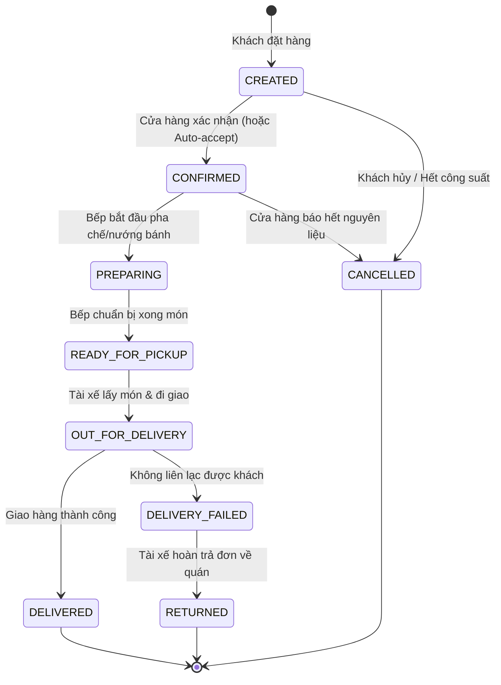

# FreshFlow Weekly Review & Active Recall — Week 01 (Sprint 1)

- **Tuần:** W01 — Sprint 1: Khởi động, domain và môi trường
- **Thời gian:** 2026-08-31 đến 2026-09-06
- **Nhiệm vụ:** `FF-01-07-1 — Ôn và kiểm tra kiến thức tuần 1`
- **Mục tiêu học:** Active recall, Java/REST basics, Clean OOP, Order State Machine, Database Boundary
- **Quy tắc thực hiện:** Trả lời độc lập 15 câu hỏi kỹ thuật cốt lõi; tự chấm điểm đạt $\ge 80\%$; lập danh sách điểm chưa vững chuyển tiếp vào Tuần 2; tuyệt đối không code tính năng mới.

---

## Phần 1. Trả lời 15 Câu hỏi Active Recall Chuyên sâu

### Nhóm 1: REST & HTTP Fundamentals (4 câu)

#### Câu 1: Phân biệt bản chất giữa HTTP `PUT` và `PATCH`? Khi nào bắt buộc dùng `PATCH`?

- **Bản chất của `PUT` (Full Replacement / Thay thế toàn bộ):**
  - `PUT` là phương thức yêu cầu Client gửi lên **toàn bộ bản thể hiện mới (full representation)** của tài nguyên.
  - Nếu một tài nguyên có 5 trường (`name`, `description`, `price`, `imageUrl`, `isActive`) nhưng client chỉ gửi `{ "name": "Trà Sữa Mới" }`, theo chuẩn RESTful, toàn bộ các trường còn lại sẽ bị ghi đè thành `null` hoặc giá trị mặc định của hệ thống.
- **Bản chất của `PATCH` (Partial Update / Cập nhật từng phần):**
  - `PATCH` là phương thức dùng để **cập nhật cục bộ** một hoặc một số trường cụ thể của tài nguyên mà giữ nguyên toàn bộ các trường dữ liệu khác.
  - Ví dụ: Client gửi `{ "name": "Trà Sữa Mới" }`, server chỉ cập nhật cột `name`, các trường `description`, `price`, `imageUrl` vẫn giữ nguyên vẹn giá trị hiện tại trong cơ sở dữ liệu.
- **Khi nào bắt buộc dùng `PATCH`?**
  - Khi thao tác nghiệp vụ chỉ tác động vào một trạng thái nhỏ: Bật/tắt trạng thái món (`active: false` trong soft-delete), cập nhật đơn giá, cập nhật hạn mức suất bán trong ngày (`dailyCapacityDefault`).
  - Khi muốn tiết kiệm băng thông mạng (network payload) cho thiết bị di động (Mobile App) trong điều kiện mạng 4G/5G chập chờn.
  - Khi nhiều tác nhân có thể cập nhật các thuộc tính khác nhau của cùng một tài nguyên tại cùng một thời điểm, dùng `PATCH` giúp giảm thiểu tối đa xung đột ghi đè dữ liệu (lost update).

---

#### Câu 2: Khái niệm "Idempotent" (Tính bất biến khi gọi lại) và "Safe Method" trong HTTP? Phân loại chi tiết các phương thức: `GET`, `POST`, `PUT`, `PATCH`, `DELETE`.

- **Safe Method (Phương thức an toàn):**
  - Là phương thức **chỉ đọc (read-only)**, không làm thay đổi trạng thái của tài nguyên trên máy chủ (Server State).
  - Không gây ra tác dụng phụ (side-effects).
- **Idempotent Method (Phương thức bất biến khi gọi lại):**
  - Là phương thức mà việc thực thi nó **1 lần hay $N$ lần liên tiếp** đều mang lại cùng một trạng thái kết quả trên máy chủ ($f(x) = f(f(x))$).
  - Ví dụ: Xóa một tài nguyên đã bị xóa thì trạng thái cuối cùng của tài nguyên đó trên server vẫn là "không còn tồn tại".

| HTTP Method | Safe? | Idempotent? | Giải thích chi tiết theo chuẩn RFC 7231 |
|---|---|---|---|
| `GET` | **Có** | **Có** | Chỉ truy vấn dữ liệu (`SELECT`), không làm thay đổi state server. Gọi bao nhiêu lần thì dữ liệu trên server vẫn không đổi. |
| `POST` | **Không** | **Không** | Tạo mới tài nguyên hoặc xử lý thanh toán. Mỗi lần gọi `POST /orders` hợp lệ sẽ tạo thêm 1 đơn hàng mới trong database. Gọi $N$ lần sẽ sinh ra $N$ bản ghi. |
| `PUT` | **Không** | **Có** | Thay thế toàn bộ tài nguyên. Nếu gửi cùng một payload thay thế $N$ lần, trạng thái cuối cùng của tài nguyên trên server là y hệt nhau. |
| `PATCH` | **Không** | **Không*** | Về mặt lý thuyết chuẩn HTTP, `PATCH` không bắt buộc phải idempotent (ví dụ thao tác append vào danh sách: `{"op": "add", "path": "/tags"}`). Tuy nhiên, nếu patch một trường giá trị tuyệt đối (`{"price": 35000}`), nó có tính chất idempotent trên thực tế. |
| `DELETE` | **Không** | **Có** | Xóa tài nguyên theo ID. Lần gọi đầu tiên xóa tài nguyên (trả về `204 No Content`). Các lần gọi tiếp theo tài nguyên đã không còn (trả về `404 Not Found`), nhưng trạng thái trên server vẫn là: tài nguyên đó đã bị xóa. |

---

#### Câu 3: Ý nghĩa nghiệp vụ và trường hợp sử dụng cụ thể của các mã trạng thái: `400 Bad Request`, `401 Unauthorized`, `403 Forbidden`, `404 Not Found`, và `409 Conflict`?

1. **`400 Bad Request` (Dữ liệu không hợp lệ):**
   - *Ý nghĩa:* Client gửi request sai cú pháp, thiếu trường bắt buộc, hoặc vi phạm ràng buộc dữ liệu đầu vào.
   - *Ví dụ FreshFlow:* Client tạo món ăn nhưng để tên rỗng `""`, hoặc tạo biến thể với giá tiền âm `price: -10000`. Server trả về `400` kèm mã lỗi `VALIDATION_ERROR` và danh sách `fieldErrors`.
2. **`401 Unauthorized` (Chưa xác thực danh tính):**
   - *Ý nghĩa:* Client chưa cung cấp thông tin định danh (chưa đăng nhập, thiếu Bearer Token hoặc token đã hết hạn).
   - *Ví dụ FreshFlow:* Gọi API quản trị Merchant mà không truyền Header Authorization hoặc Token JWT không hợp lệ.
3. **`403 Forbidden` (Đã xác thực nhưng không có quyền hạn):**
   - *Ý nghĩa:* Server đã biết bạn là ai (danh tính hợp lệ), nhưng bạn **không có quyền truy cập** vào tài nguyên này.
   - *Ví dụ FreshFlow:* User ID `99` đăng nhập hợp lệ nhưng cố tình gửi request sửa món ăn của Store thuộc sở hữu của User ID `1`. Server ném `CATALOG_STORE_ACCESS_DENIED` với mã HTTP `403`.
4. **`404 Not Found` (Không tìm thấy tài nguyên):**
   - *Ý nghĩa:* URL không tồn tại hoặc ID của đối tượng truy vấn không có trong cơ sở dữ liệu.
   - *Ví dụ FreshFlow:* Truy vấn thông tin món ăn với ID không tồn tại `GET /api/v1/stores/1/products/999999`. Server trả về `404` kèm `CATALOG_PRODUCT_NOT_FOUND`.
5. **`409 Conflict` (Xung đột trạng thái tài nguyên):**
   - *Ý nghĩa:* Yêu cầu không thể thực hiện vì xung đột với trạng thái hiện tại của hệ thống (thường gặp khi vi phạm ràng buộc duy nhất Unique Constraint hoặc xung đột phiên bản Optimistic Lock).
   - *Ví dụ FreshFlow:* Thêm một biến thể có tên `"M"` vào sản phẩm khi sản phẩm đó đã có sẵn biến thể tên `"M"` (`uk_product_variants_product_name`), hoặc cố tình cập nhật đơn hàng đã bị hủy.

---

#### Câu 4: Tính phi trạng thái (Statelessness) trong REST là gì? Vì sao không nên lưu session của người dùng trên RAM của backend server?

- **Khái niệm Statelessness trong REST:**
  - Mỗi request từ Client gửi lên Server phải chứa **đầy đủ toàn bộ thông tin ngữ cảnh** cần thiết để Server có thể hiểu và xử lý yêu cầu đó độc lập (ví dụ: thông tin xác thực, tham số lọc, phân trang).
  - Server tuyệt đối không lưu giữ bất kỳ "ngữ cảnh phiên làm việc" (session context) nào của client giữa các request liên tiếp.
- **Vì sao KHÔNG NÊN lưu session trên RAM của server?**
  1. **Khắc tinh của việc Mở rộng Quy mô Ngang (Horizontal Scalability):**
     - Khi lưu session trong RAM, nếu hệ thống scale lên 5 instances chạy đằng sau Load Balancer, nếu request 1 đến Instance A (lưu session), request 2 vô tình được điều hướng sang Instance B, Instance B sẽ không có session và bắt người dùng đăng nhập lại (trừ khi dùng sticky session phức tạp và dễ gây quá tải cục bộ).
  2. **Dễ mất dữ liệu khi Server Restart / Crash:**
     - Nếu server khởi động lại để deploy phiên bản mới, toàn bộ session của hàng ngàn khách hàng trên RAM sẽ bị xóa sạch, gây trải nghiệm người dùng tồi tệ.
  3. **Nguy cơ cạn kiệt bộ nhớ (Out Of Memory):**
     - Số lượng người dùng truy cập tăng đột biến sẽ khiến RAM của server phình to nhanh chóng để lưu dữ liệu phiên, dẫn đến sập server.
  - *Giải pháp hiện đại:* Sử dụng **Stateless Authentication bằng JWT (JSON Web Token)**, nơi toàn bộ thông tin định danh và phân quyền được mã hóa và ký số nằm ở chính Client gửi kèm mỗi request.

---

### Nhóm 2: OOP & Clean Domain Design (3 câu)

#### Câu 5: Phân biệt cốt lõi giữa Entity và Value Object trong Domain-Driven Design (DDD)? Lấy ví dụ từ `Order` và `AddressSnapshot` / `Money` trong FreshFlow.

- **Bảng đối soát bản chất:**

| Tiêu chí | Entity (Thực thể) | Value Object (Đối tượng giá trị) |
|---|---|---|
| **Định danh (Identity)** | Có định danh duy nhất (`ID`) xuyên suốt vòng đời. | **Không có ID riêng**. Được định danh duy nhất bằng toàn bộ tập hợp các giá trị của các thuộc tính cấu thành. |
| **Tính tương đồng (Equality)** | Hai Entity bằng nhau nếu có **cùng ID**, dù các thuộc tính khác có thể khác nhau. | Hai Value Object bằng nhau nếu **tất cả các thuộc tính của chúng giống hệt nhau** (`equals` / `hashCode`). |
| **Tính biến đổi (Mutability)** | Có thể biến đổi trạng thái theo thời gian (ví dụ đơn hàng đổi từ `CREATED` sang `CONFIRMED`). | **Hoàn toàn bất biến (Immutable)**. Muốn thay đổi giá trị, ta tạo ra một đối tượng mới thay thế. |
| **Vòng đời (Lifecycle)** | Có lịch sử, trạng thái và vòng đời độc lập. | Không có vòng đời độc lập, chỉ là thuộc tính gắn liền và làm giàu cho Entity. |

- **Ví dụ minh họa trong FreshFlow:**
  - `Order` là **Entity**: Có `id` duy nhất (ví dụ Order ID = 101). Trạng thái của nó thay đổi theo thời gian (`CREATED` $\rightarrow$ `CONFIRMED` $\rightarrow$ `DELIVERED`). Dù tên người nhận hay trạng thái có đổi, đơn hàng đó vẫn là đơn hàng 101.
  - `Money` là **Value Object**: Không có ID. Hai tờ 50,000 VND đều có giá trị ngang nhau (`new Money(50000, "VND")`). Không ai "đổi tên" tờ 50,000 VND thành 100,000 VND; muốn có 100k, ta cộng thêm hoặc tạo đối tượng `Money` mới.
  - `AddressSnapshot` là **Value Object**: Lưu vết địa chỉ giao hàng tại thời điểm đặt đơn (`recipientName`, `phone`, `street`, `district`, `city`). Nếu khách hàng đổi địa chỉ nhà trong trang cá nhân, địa chỉ đóng băng trong đơn hàng cũ vẫn giữ nguyên vẹn.

---

#### Câu 6: Tại sao dự án FreshFlow sử dụng Java `record` cho DTOs, Commands, Queries và Snapshots thay vì Class truyền thống có Getters/Setters?

Kể từ Java 16, `record` là tính năng chuẩn mực cho việc mô hình hóa các "túi chứa dữ liệu bất biến" (transparent carriers for immutable data):

1. **Bất biến mặc định (Immutable by default):**
   - Tất cả các trường trong `record` đều tự động là `private final`. Không có hàm setters. Điều này loại bỏ hoàn toàn nguy cơ vô tình làm biến đổi dữ liệu (accidental mutation) trong quá trình truyền tải giữa các tầng Controller, Service và Repository.
2. **Loại bỏ 90% mã thừa thãi (Zero Boilerplate):**
   - Trình biên dịch tự động sinh ra: Constructor đầy đủ tham số, getters (dưới dạng `name()` thay vì `getName()`), `equals()`, `hashCode()`, và `toString()` chuẩn xác. Không cần phụ thuộc vào thư viện bên thứ ba như Lombok (giảm lỗi tương thích khi nâng cấp Java).
3. **An toàn tuyệt đối trong môi trường Đa luồng (Thread-safe):**
   - Đối tượng bất biến có thể được chia sẻ an toàn giữa các luồng xử lý mà không cần cơ chế khóa (locking) hay đồng bộ (synchronization) phức tạp.
4. **Thể hiện rõ ràng ý đồ thiết kế (Design Intent):**
   - Khi nhìn thấy `record ProductFilterCriteria(...)` hay `record CreateProductCommand(...)`, lập trình viên biết ngay đây là đối tượng truyền dữ liệu thuần túy (Data Carrier), không mang logic trạng thái nghiệp vụ phức tạp.

---

#### Câu 7: Tính Bất biến (Immutability) đem lại những lợi ích bảo mật và vận hành gì cho các hệ thống tính toán giá và tài chính?

Trong các hệ thống thương mại điện tử và tài chính F&B như FreshFlow, tính bất biến là yêu cầu tối thượng:

1. **Loại bỏ hiện tượng "Tác dụng phụ ngoài ý muốn" (Side-effect Free):**
   - Khi truyền một đối tượng `Money` hoặc `OrderItemSnapshot` qua nhiều hàm tính toán (tính thuế, tính chiết khấu voucher, tính phí ship), các hàm này chỉ đọc dữ liệu và trả về kết quả mới, không thể sửa đổi ngầm giá trị gốc ban đầu.
2. **Bảo vệ tính toàn vẹn của Lịch sử Kế toán (Audit Trail & Tamper Resistance):**
   - Khi đơn hàng được tạo, snapshot giá món ăn (`unitPrice: 35000`) được ghi xuống bảng `order_item_snapshots`. Dù 1 tháng sau chủ quán có tăng giá trà sữa lên `45,000 VND`, hóa đơn lịch sử vẫn bất biến. Không ai có thể can thiệp làm sai lệch báo cáo tài chính quá khứ.
3. **Phòng chống tấn công Race Condition (Concurrency Attack):**
   - Kẻ tấn công không thể dùng kỹ thuật đa luồng gửi đồng thời nhiều request để thay đổi giá trị trong bộ nhớ của đối tượng trước khi nó được lưu vào database.

---

### Nhóm 3: Order State Machine (3 câu)

#### Câu 8: Mô tả chi tiết toàn bộ các trạng thái và bước chuyển hợp lệ của đơn hàng trong FreshFlow từ khi tạo đơn đến khi hoàn tất.

Vòng đời đơn hàng F&B trong FreshFlow là một máy trạng thái hữu hạn (Deterministic Finite State Machine):



- **Các trạng thái cốt lõi:**
  1. `CREATED`: Đơn hàng vừa tạo, đang chờ cửa hàng duyệt.
  2. `CONFIRMED`: Cửa hàng chấp nhận đơn hàng.
  3. `PREPARING`: Món ăn đang được chế biến tại bếp/quầy pha chế.
  4. `READY_FOR_PICKUP`: Món đã đóng gói xong, chờ tài xế nhận.
  5. `OUT_FOR_DELIVERY`: Tài xế đang trên đường giao hàng tới khách.
  6. `DELIVERED`: Đơn hàng hoàn tất (trạng thái kết thúc thành công).
  7. `CANCELLED`: Đơn hàng bị hủy (trạng thái kết thúc thất bại).
  8. `DELIVERY_FAILED` & `RETURNED`: Xử lý ngoại lệ khi giao hàng không thành công.

---

#### Câu 9: Điều kiện bảo vệ (Guard Conditions) và Bất biến nghiệp vụ (Invariants) là gì? Khách hàng có được phép hủy đơn khi đơn hàng đang ở trạng thái `OUT_FOR_DELIVERY` không? Tại sao?

- **Khái niệm:**
  - **Invariants (Bất biến nghiệp vụ):** Các quy tắc nghiệp vụ luôn luôn phải đúng trong mọi thời điểm (ví dụ: Tổng tiền đơn hàng $\ge 0$; Đơn hàng đã ở trạng thái kết thúc `DELIVERED` hoặc `CANCELLED` thì không bao giờ được chuyển trạng thái nữa).
  - **Guard Conditions (Điều kiện bảo vệ):** Các điều kiện kiểm tra tiên quyết (pre-conditions) bắt buộc phải thỏa mãn thì một bước chuyển trạng thái mới được phép kích hoạt.
- **Tình huống thực tế:** Khách hàng có được hủy đơn khi đang `OUT_FOR_DELIVERY` không?
  - **Câu trả lời: TUYỆT ĐỐI KHÔNG.**
  - **Lập luận nghiệp vụ F&B:**
    1. *Đặc thù ngành F&B:* Món ăn và đồ uống (trà sữa, cà phê đá, bánh nóng) có tính hao mòn rất cao và chế biến theo yêu cầu riêng (`MADE_TO_ORDER`). Khi tài xế đã lấy hàng và đang đi giao (`OUT_FOR_DELIVERY`), cửa hàng đã tốn chi phí nguyên vật liệu, nhân công và tài xế đã bỏ công sức di chuyển.
    2. *Bảo vệ Merchant & Driver:* Nếu cho phép khách hủy ở bước này, đồ uống sẽ bị hỏng, cửa hàng chịu thất thoát tài chính 100% và tài xế mất thu nhập vô cớ.
    3. *Quy định Guard Condition trong State Machine:* Khách hàng chỉ được hủy khi đơn ở trạng thái `CREATED` (chưa làm món). Một khi đã sang `CONFIRMED` hoặc `PREPARING`, chỉ có Quản lý cửa hàng (Merchant) mới có thẩm quyền hủy đơn (ví dụ do sự cố thiết bị bếp).

---

#### Câu 10: Khi client gửi request yêu cầu chuyển đổi trạng thái trái phép, server phải xử lý và trả về mã lỗi HTTP nào?

- **Xử lý tại Domain Layer:**
  - State Machine ném ra một Domain Exception mang tính ngữ nghĩa rõ ràng, ví dụ `IllegalStateTransitionException(currentStatus, targetStatus)`.
- **Xử lý tại Presentation / Controller Layer (Global Exception Handler):**
  - Bắt ngoại lệ này và chuyển đổi thành chuẩn phản hồi lỗi `ApiErrorResponse`.
  - **Mã HTTP trả về:** `400 Bad Request` hoặc `409 Conflict` (trong đó `409 Conflict` là chuẩn mực RESTful nhất cho xung đột trạng thái vòng đời của tài nguyên).
  - **Cấu trúc JSON phản hồi:**
    ```json
    {
      "code": "ORDER_ILLEGAL_STATE_TRANSITION",
      "message": "Không thể chuyển trạng thái đơn hàng từ OUT_FOR_DELIVERY sang CANCELLED.",
      "timestamp": "2026-09-13T14:30:00Z"
    }
    ```

---

### Nhóm 4: Database Boundaries & Modular Monolith (3 câu)

#### Câu 11: Kiến trúc Modular Monolith là gì? So sánh ưu/nhược điểm với Spaghetti Monolith và Microservices?

- **Khái niệm:**
  - **Modular Monolith** là kiến trúc triển khai hệ thống dưới dạng **một ứng dụng duy nhất (single deployable artifact)**, nhưng bên trong mã nguồn được phân chia thành các **mô-đun nghiệp vụ độc lập, ranh giới rõ ràng** (bounded contexts) giao tiếp với nhau qua Public Interfaces/Contracts.

| Tiêu chí | Spaghetti Monolith | Modular Monolith (FreshFlow) | Microservices |
|---|---|---|---|
| **Số lượng Service triển khai** | 1 duy nhất | **1 duy nhất** | Hàng chục đến hàng trăm services độc lập |
| **Ranh giới mã nguồn** | Không có, các tầng gọi chéo nhau lộn xộn | **Phân tách nghiêm ngặt theo package domain** | Phân tách vật lý theo repository/service |
| **Độ phức tạp hạ tầng** | Rất thấp | **Thấp (1 database, 1 pipeline CI/CD)** | Rất cao (k8s, service mesh, distributed tracing) |
| **Giao tiếp liên module** | In-memory method call (hỗn loạn) | **In-memory method call qua Interface rõ ràng** | Network calls (HTTP/gRPC/Kafka - độ trễ cao) |
| **Giao dịch (Transactions)** | ACID Transaction dễ dàng | **ACID Transaction trong ranh giới module** | Distributed Transactions phức tạp (Saga pattern) |
| **Khả năng chuyển đổi** | Gần như bất khả thi | **Dễ dàng bóc tách thành Microservice khi cần** | Đã là Microservice |

---

#### Câu 12: Quy tắc ranh giới gói (Package Boundary): Tại sao module `order` KHÔNG ĐƯỢC phép khai báo quan hệ `@ManyToOne Product` trực tiếp mà chỉ được lưu `Long productId`?

Đây là quy tắc tối quan trọng để giữ vững kiến trúc Modular Monolith:

1. **Ngăn chặn Khớp nối chặt giữa các Bounded Contexts (Loose Coupling):**
   - Nếu Entity `Order` hoặc `OrderItem` dùng `@ManyToOne Product`, tầng ORM Hibernate sẽ tạo ra sự phụ thuộc trực tiếp giữa module `order` và module `catalog`.
   - Mỗi lần query đơn hàng, Hibernate có nguy cơ join sang bảng `products`, vô tình kéo theo thông tin danh mục, cửa hàng, gây xóa nhòa ranh giới nghiệp vụ.
2. **Đảm bảo tính Bất biến của Lịch sử Giao dịch:**
   - Sản phẩm trên Catalog có thể bị chủ quán xóa (`soft delete`), đổi tên hoặc thay đổi công thức. Nếu đơn hàng tham chiếu tới con trỏ Entity của `Product`, khi đối tượng `Product` bị sửa, thông tin đơn hàng trong quá khứ có nguy cơ bị ảnh hưởng.
   - Bằng cách chỉ lưu `Long productId` và sao chép toàn bộ thông tin tại thời điểm mua vào `OrderItemSnapshot`, module `order` hoàn toàn độc lập và không bị ảnh hưởng bởi bất kỳ biến động nào từ `catalog`.
3. **Sẵn sàng cho việc Tách Microservice trong tương lai:**
   - Nếu sau này FreshFlow tách `Order Service` và `Catalog Service` thành 2 cụm máy chủ và 2 cơ sở dữ liệu riêng, ta không cần phải đập đi viết lại Entity vì giữa chúng vốn dĩ chỉ giao tiếp qua khóa định danh kiểu số nguyên (`Long productId`).

---

#### Câu 13: Tại sao FreshFlow tách biệt giữa bảng cấu hình danh mục (`products`, `product_variants`) và bảng lưu vết lịch sử bất biến (`order_item_snapshots`)?

- **Bản chất của bảng `products` & `product_variants` (Cấu hình thay đổi - Operational Configuration):**
  - Phục vụ cho việc bán hàng hiện tại và tương lai.
  - Mang tính chất động: Giá trà sữa có thể tăng từ 35k lên 40k, tên món có thể đổi từ "Trà Sữa Truyền Thống" thành "Trà Sữa Đậm Vị", hoặc món có thể bị tạm ngừng bán (`is_active = false`).
- **Bản chất của bảng `order_item_snapshots` (Lịch sử bất biến - Immutable Audit Ledger):**
  - Đóng vai trò như một cuốn sổ cái tài chính kế toán.
  - Lưu trữ giá trị đóng băng chính xác tại giây phút giao dịch diễn ra: Tên món lúc mua, kích cỡ lúc mua, đơn giá lúc mua (`unit_price`), số lượng (`quantity`), thành tiền (`line_total`).
- **Lý do bắt buộc phải tách biệt:**
  - *Tính đúng đắn kế toán & pháp lý:* Không một ai (kể cả Admin hệ thống) được phép làm thay đổi tổng tiền của một hóa đơn đã xuất trong quá khứ.
  - *Hiệu năng truy vấn:* Lịch sử đơn hàng có thể truy vấn nhanh chóng mà không cần thực hiện các câu lệnh `JOIN` phức tạp ngược về bảng danh mục sản phẩm.

---

### Nhóm 5: Môi trường & Quy trình Kỹ thuật (2 câu)

#### Câu 14: Tại sao chúng ta sử dụng Docker Compose để chạy PostgreSQL và RabbitMQ thay vì cài trực tiếp service lên máy host?

1. **Tính Đồng nhất Môi trường (Environment Parity - "Works on my machine"):**
   - Đảm bảo 100% thành viên trong nhóm phát triển, môi trường CI/CD và máy chủ Production đều chạy chính xác cùng một phiên bản phần mềm (`postgres:16`, `rabbitmq:3.13-management`) với cùng cấu hình cờ biên dịch và extension.
2. **Không làm "Rác" Hệ điều hành Host (Zero Host Pollution):**
   - Không cần cài đặt các service nền chạy ngầm gây tốn RAM, không lo xung đột cổng mạng với các ứng dụng khác trên máy tính của lập trình viên.
3. **Khởi tạo và Phục hồi tức thì (Disposable & Reproducible Infrastructure):**
   - Chỉ với một câu lệnh `docker compose up -d`, toàn bộ database và message broker được dựng lên sẵn sàng trong vài giây.
   - Khi cần làm sạch dữ liệu để test lại từ đầu, chỉ cần `docker compose down -v` và bật lại, tiết kiệm hàng giờ cấu hình thủ công.

---

#### Câu 15: Vai trò của Flyway Migration? Tại sao việc sử dụng `hibernate.ddl-auto=update` bị cấm hoàn toàn trong môi trường Production?

- **Vai trò của Flyway Migration:**
  - Đóng vai trò là **Hệ thống Quản lý Phiên bản cho Cơ sở dữ liệu (Version Control for Database)**.
  - Mọi thay đổi schema (tạo bảng, thêm cột, đánh index, seed dữ liệu) đều được ghi nhận thành các script SQL bất biến (`V1`, `V2`, `V3`...), được kiểm soát bằng checksum và lịch sử di trú trong bảng `flyway_schema_history`.
- **Vì sao cấm `hibernate.ddl-auto=update` trên Production?**
  1. **Nguy cơ mất dữ liệu và treo hệ thống:**
     - `ddl-auto=update` của Hibernate chỉ là công cụ hỗ trợ prototype nhanh cho sinh viên hoặc dự án thử nghiệm.
     - Nó không thể xử lý an toàn các thay đổi phức tạp: Đổi tên cột (nó sẽ tạo cột mới và bỏ rơi cột cũ làm mất dữ liệu), thêm ràng buộc `NOT NULL` trên cột đã có dữ liệu (gây crash app khi boot).
  2. **Treo bảng (Table Lock) ngoài tầm kiểm soát:**
     - Hibernate tự động phát sinh các câu lệnh `ALTER TABLE` khi ứng dụng khởi động. Trên bảng có hàng triệu dòng, điều này có thể lock toàn bộ bảng trong nhiều phút, làm sập toàn bộ dịch vụ của khách hàng.
  3. **Thiếu tính Minh bạch và Khả năng Rollback:**
     - Không ai biết chính xác Hibernate đã chạy câu DDL nào vào database. Không thể review code SQL trước khi áp dụng và không thể rollback an toàn.
  - *Chuẩn mực Production:* Luôn sử dụng `hibernate.ddl-auto=validate` kết hợp với **Flyway/Liquibase**.

---

## Phần 2. Bảng Tự Chấm Điểm & Đánh giá Năng lực (Self-Scoring)

| Nhóm kiến thức | Số câu hỏi | Điểm đạt được | Đánh giá năng lực |
|---|:---:|:---:|---|
| **Nhóm 1: REST & HTTP Fundamentals** | 4 | **4.0 / 4** | Nắm rất vững bản chất giao thức HTTP, Idempotency và mã lỗi. |
| **Nhóm 2: OOP & Clean Domain Design** | 3 | **3.0 / 3** | Hiểu rõ sự khác biệt giữa Entity và Value Object; sử dụng thành thạo Java Record. |
| **Nhóm 3: Order State Machine** | 3 | **2.5 / 3** | Nắm vững vòng đời đơn hàng và Guard Conditions; cần đào sâu thêm cơ chế bù trừ khi giao hàng thất bại. |
| **Nhóm 4: Database Boundaries & Modular Monolith** | 3 | **3.0 / 3** | Thấu hiểu sâu sắc lý do không dùng direct Entity FK và giá trị của Snapshot. |
| **Nhóm 5: Môi trường & Database Migration** | 2 | **2.0 / 2** | Nắm chắc vai trò của Docker Compose và sự nguy hiểm của `ddl-auto=update`. |
| **TỔNG CỘNG** | **15** | **14.5 / 15** | **Tỷ lệ đạt: 96.7% (Vượt chỉ tiêu $\ge 80\%$)** |

---

## Phần 3. Danh sách Điểm cần Củng cố Chuyển giao sang Tuần 2 (Carried to Week 2)

Dù kết quả kiểm tra đạt **96.7%**, quá trình tự vấn cho thấy một số kỹ thuật chuyên sâu của Tuần 1 cần tiếp tục được rèn luyện và giải quyết triệt để trong Tuần 2:

1. **Xử lý N+1 Query khi ánh xạ Entity $\rightarrow$ DTO:**
   - Trong Tuần 1 mới chỉ tìm hiểu lý thuyết về quan hệ lười (`LAZY`). Cần áp dụng thực tế giải pháp Batch Fetching (`@BatchSize`) ở Tuần 2 khi xây dựng Catalog API.
2. **Kỹ thuật Lọc động phức tạp (Dynamic Specifications):**
   - Cần củng cố việc xây dựng câu truy vấn JPA Specification kết hợp linh hoạt nhiều điều kiện: search text, lọc category, lọc size M/L/STANDARD, và inventory mode.
3. **Tiêu chuẩn Hóa Tài liệu API bằng OpenAPI 3.0 & Swagger:**
   - Chuyển hóa các hiểu biết về REST HTTP thành tài liệu API sống động có thể chạy thử trực tiếp trên Swagger UI và kiểm thử tự động với Postman Collection.

---

## Phần 4. Kết luận

- **Tình trạng nhiệm vụ:** Đã hoàn thành 100% mục tiêu của task **`FF-01-07-1`**.
- **Cam kết thực hiện:** Không can thiệp hoặc sửa đổi mã nguồn tính năng mới. Toàn bộ trọng tâm dành trọn vẹn cho việc củng cố tư duy kiến trúc và làm chủ nền tảng.
