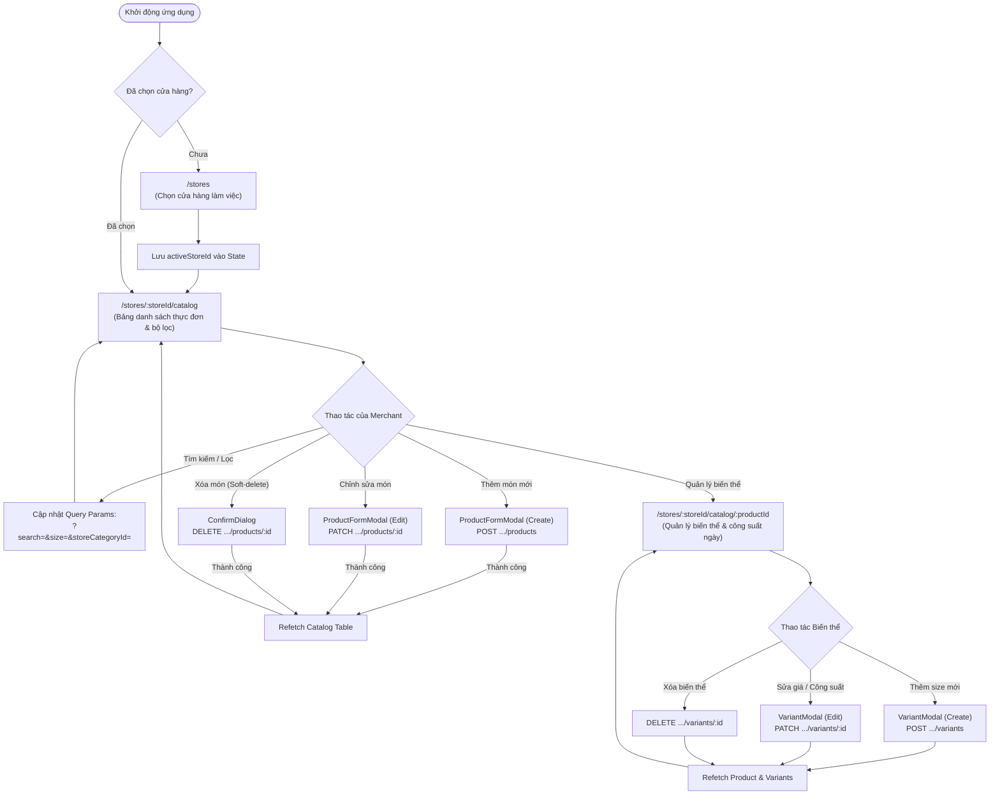
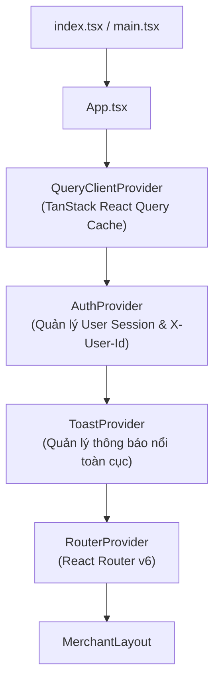
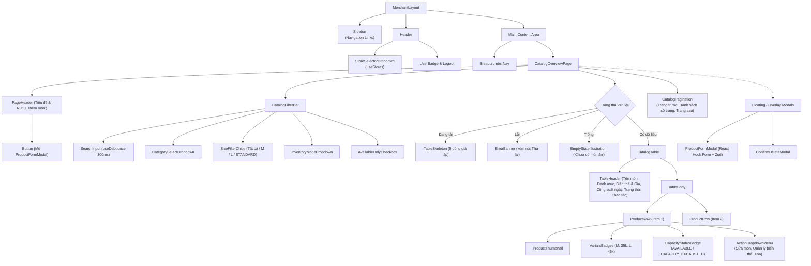

# Kiến trúc Frontend: FreshFlow Merchant Web Portal

**Phiên bản:** `1.0.0`  
**Ngày phê duyệt:** `13/09/2026`  
**Module:** `clients/freshflow-web`  
**Track:** `Planning` / `Frontend Architecture`  
**Nhiệm vụ backlog liên quan:** `FF-02-07-2`  

---

## 1. Giới thiệu & Mục tiêu (Introduction & Scope)

Tài liệu này xác lập kiến trúc frontend tiêu chuẩn cho **FreshFlow Merchant Web Portal** (`clients/freshflow-web`). Đây là cổng thông tin điện tử trên nền tảng web dành cho Chủ cửa hàng (Merchant / Store Owner) và Quản lý vận hành F&B để:
1. Quản lý thực đơn số (Digital Catalog): Danh mục, món ăn, hình ảnh, mô tả, và trạng thái kích hoạt.
2. Quản lý biến thể đa kích cỡ (Variants): Kích thước (M, L, STANDARD), giá tiền (VND), chế độ kho (`MADE_TO_ORDER` vs `LIMITED_STOCK`).
3. Điều phối năng lực phục vụ trong ngày (Daily Capacity): Theo dõi định mức công suất tối đa, số lượng đã đặt và cảnh báo khi hết hàng (`CAPACITY_EXHAUSTED`).

### Mục tiêu kiến trúc (Architectural Goals)
- **Feature-Based / Screaming Architecture:** Cấu trúc mã nguồn phản ánh trực tiếp miền nghiệp vụ F&B của FreshFlow, đóng gói mã nguồn theo tính năng độc lập, dễ mở rộng và bảo trì.
- **API-Driven & No Orphan Screens:** 100% màn hình, form nhập liệu và modal đều được ánh xạ trực tiếp từ các API contracts và nghiệp vụ đã xây dựng ở Backend (Tuần 2). Tuyệt đối không tạo màn hình không có use case.
- **Tối ưu trải nghiệm F&B (Web Interface Guidelines):** Thao tác nhanh chóng, hỗ trợ phím tắt, tải trước dữ liệu mượt mà với Skeleton Loading, phản hồi tức thì qua Optimistic Updates, và chuẩn hóa thông báo lỗi đến từng trường nhập liệu.
- **Cross-Platform Readiness (React Native Alignment):** Chuẩn hóa tầng Type Definitions và API Hooks để có thể tái sử dụng tối đa cho ứng dụng Mobile Driver & Customer sau này.

---

## 2. Cấu trúc Thư mục Feature-Based (Project Structure)

Ứng dụng được tổ chức theo mô hình **Feature-Based Design (Screaming Architecture)**. Mã nguồn được chia theo từng miền nghiệp vụ thay vì chia theo loại file kỹ thuật (controllers/views/models).

```text
clients/freshflow-web/
├── public/                     # Static assets (favicons, logos, demo placeholder images)
├── src/
│   ├── app/                    # Tầng khởi tạo và cấu hình ứng dụng
│   │   ├── App.tsx             # Root component gắn kết các Providers
│   │   ├── AppProviders.tsx    # Bọc QueryClient, Auth, Theme, Toast providers
│   │   ├── router.tsx          # Cấu hình định tuyến React Router v6
│   │   └── index.css           # Tailwind CSS & design tokens
│   │
│   ├── features/               # Các mô-đun nghiệp vụ độc lập (Feature Modules)
│   │   ├── catalog/            # Feature: Quản lý Danh mục & Thực đơn
│   │   │   ├── api/            # API hooks (React Query queries & mutations)
│   │   │   │   ├── useCatalogProducts.ts
│   │   │   │   ├── useProductDetail.ts
│   │   │   │   ├── useCreateProduct.ts
│   │   │   │   ├── useUpdateProduct.ts
│   │   │   │   ├── useDeleteProduct.ts
│   │   │   │   ├── useProductVariants.ts
│   │   │   │   └── useVariantMutations.ts
│   │   │   ├── components/     # Các thành phần giao diện riêng của Catalog
│   │   │   │   ├── CatalogTable.tsx
│   │   │   │   ├── CatalogFilterBar.tsx
│   │   │   │   ├── ProductRow.tsx
│   │   │   │   ├── CapacityStatusBadge.tsx
│   │   │   │   ├── ProductFormModal.tsx
│   │   │   │   ├── VariantManagerModal.tsx
│   │   │   │   └── VariantRow.tsx
│   │   │   ├── pages/          # Màn hình thuộc tính năng Catalog
│   │   │   │   ├── CatalogOverviewPage.tsx
│   │   │   │   └── ProductDetailPage.tsx
│   │   │   ├── types/          # TypeScript types mapping 1:1 với Backend DTOs
│   │   │   │   └── catalog.types.ts
│   │   │   └── utils/          # Formatters giá tiền VND, mapper trạng thái
│   │   │       └── catalogFormatters.ts
│   │   │
│   │   └── stores/             # Feature: Quản lý & Lựa chọn Cửa hàng
│   │       ├── api/
│   │       │   └── useStores.ts
│   │       ├── components/
│   │       │   └── StoreSelectorDropdown.tsx
│   │       └── types/
│   │           └── store.types.ts
│   │
│   ├── components/             # Thư viện UI Design System dùng chung (Shared UI)
│   │   ├── ui/
│   │   │   ├── Button.tsx
│   │   │   ├── Input.tsx
│   │   │   ├── Select.tsx
│   │   │   ├── Badge.tsx
│   │   │   ├── Modal.tsx
│   │   │   ├── Table.tsx
│   │   │   ├── Skeleton.tsx
│   │   │   ├── Toast.tsx
│   │   │   └── Pagination.tsx
│   │   └── layout/             # Khung sườn giao diện quản trị
│   │       ├── MerchantLayout.tsx
│   │       ├── Sidebar.tsx
│   │       ├── Header.tsx
│   │       └── Breadcrumbs.tsx
│   │
│   ├── lib/                    # Cấu hình thư viện lõi
│   │   ├── apiClient.ts        # Cấu hình Axios instance + Interceptors + Error normalizer
│   │   ├── queryClient.ts      # Cấu hình TanStack React Query cache
│   │   └── errorHandling.ts    # Hàm chuẩn hóa ApiErrorResponse từ backend
│   │
│   ├── hooks/                  # Custom utility hooks dùng chung
│   │   ├── useDebounce.ts      # Debounce cho ô tìm kiếm keyword (300ms)
│   │   └── useToast.ts         # Hook kích hoạt thông báo nổi
│   │
│   └── types/                  # Types dùng chung toàn hệ thống
│       ├── api.types.ts        # Page<T>, ApiErrorResponse, FieldError
│       └── common.types.ts
│
├── package.json
├── tsconfig.json
├── vite.config.ts
└── tailwind.config.js
```

---

## 3. Bản đồ Định tuyến (Route Map) & Ma trận Phụ thuộc API

Toàn bộ các màn hình của Merchant Web Portal đều gắn liền với các Use Case cụ thể và được phục vụ bởi các API endpoint đã hoàn thành ở Tuần 2:

### 3.1. Ma trận Ánh xạ (Route to API Mapping Matrix)

| URL Route | Tên Màn hình / Component | Use Case Nghiệp vụ | Backend API Endpoint | HTTP Method | Quyền hạn / Headers |
|---|---|---|---|---|---|
| `/stores` | `StoreSelectionPage` | Xem danh sách các cửa hàng mà tài khoản có quyền truy cập để chọn làm việc. | `/api/v1/stores` | `GET` | Mọi người dùng |
| `/stores/:storeId/catalog` | `CatalogOverviewPage` | Xem danh sách món ăn của cửa hàng kèm phân trang, tìm kiếm theo tên, lọc danh mục, lọc size M/STANDARD, kiểm tra tình trạng công suất ngày (`CAPACITY_EXHAUSTED`). | `/api/v1/stores/{storeId}/products` | `GET` | Merchant / Public |
| `/stores/:storeId/catalog` *(Modal)* | `ProductFormModal` *(Mode: Create)* | Thêm món ăn mới vào thực đơn của cửa hàng. | `/api/v1/merchant/stores/{storeId}/products` | `POST` | `X-User-Id: {ownerId}` (Merchant Owner) |
| `/stores/:storeId/catalog` *(Modal)* | `ProductFormModal` *(Mode: Edit)* | Cập nhật tên món, mô tả, ảnh hoặc trạng thái kích hoạt của món ăn. | `/api/v1/merchant/stores/{storeId}/products/{productId}` | `PATCH` | `X-User-Id: {ownerId}` (Merchant Owner) |
| `/stores/:storeId/catalog/:productId` | `ProductDetailPage` | Xem chi tiết món ăn và danh sách toàn bộ các biến thể kích cỡ (M, L, STANDARD), giá tiền, chế độ kho. | `/api/v1/stores/{storeId}/products/{productId}`<br>`/api/v1/merchant/stores/{storeId}/products/{productId}/variants` | `GET`<br>`GET` | Merchant Owner |
| `/stores/:storeId/catalog/:productId` *(Modal)* | `VariantFormModal` *(Mode: Create)* | Thêm kích cỡ mới cho món ăn (ví dụ thêm size L giá 55k, công suất 100 suất/ngày). | `/api/v1/merchant/stores/{storeId}/products/{productId}/variants` | `POST` | `X-User-Id: {ownerId}` (Merchant Owner) |
| `/stores/:storeId/catalog/:productId` *(Modal)* | `VariantFormModal` *(Mode: Edit)* | Điều chỉnh giá bán hoặc công suất bán trong ngày của biến thể. | `/api/v1/merchant/stores/{storeId}/products/{productId}/variants/{variantId}` | `PATCH` | `X-User-Id: {ownerId}` (Merchant Owner) |
| `/stores/:storeId/catalog/:productId` *(Action)* | `VariantDeleteButton` | Xóa (soft delete) biến thể khỏi món ăn. | `/api/v1/merchant/stores/{storeId}/products/{productId}/variants/{variantId}` | `DELETE` | `X-User-Id: {ownerId}` (Merchant Owner) |
| `/stores/:storeId/catalog` *(Action)* | `ProductDeleteDialog` | Ngừng bán và ẩn món ăn khỏi thực đơn số của khách hàng (soft-delete). | `/api/v1/merchant/stores/{storeId}/products/{productId}` | `DELETE` | `X-User-Id: {ownerId}` (Merchant Owner) |

> [!IMPORTANT]
> **Không có màn hình mồ côi (No Orphan Screens):**  
> Mỗi màn hình đều phục vụ trực tiếp cho một Use Case cốt lõi của chủ quán. Việc sử dụng Modal/Drawer cho thao tác Tạo/Sửa món và Biến thể giúp giữ ngữ cảnh công việc liền mạch, không làm mất bộ lọc hoặc vị trí trang đang xem.

### 3.2. Sơ đồ Luồng Điều hướng (Navigation Flowchart)



---

## 4. Cây Phân cấp Thành phần Giao diện (Component Tree & Hierarchy)

### 4.1. Cây Providers Gốc (Root Provider Hierarchy)



### 4.2. Cây Thành phần Trang Catalog (Catalog Component Tree)



---

## 5. Quyết định Kiến trúc Công nghệ (ADRs)

### ADR 01: Lựa chọn HTTP Client — Axios thay vì Native Fetch

#### Quyết định:
Sử dụng **Axios** (được bọc qua custom client tại `src/lib/apiClient.ts`).

#### So sánh & Phân tích lý do:

| Tiêu chí | Native `fetch` | `Axios` (Được chọn) | Lý do chọn cho FreshFlow |
|---|---|---|---|
| **Request Interceptors** | Phải tự viết hàm wrapper bọc ngoài thủ công | Hỗ trợ sẵn gốc (`interceptors.request.use`) | Tự động chèn header `X-User-Id: {actorUserId}` hoặc Bearer Token vào mọi request gửi đi. |
| **Response & Error Handling** | `fetch` không coi HTTP `4xx`, `5xx` là reject (phải tự kiểm tra `res.ok`) | Tự động reject Promise khi status code ngoài dải `2xx` | Đồng bộ xử lý lỗi tập trung, tự động bắt các mã lỗi `400 VALIDATION_ERROR`, `403 ACCESS_DENIED`, `404 NOT_FOUND`. |
| **Data Transformation** | Phải gọi `await res.json()` ở từng hàm gọi API | Tự động parse JSON | Giảm thiểu mã lặp lại (boilerplate). |
| **Request Cancellation** | Cần khởi tạo và truyền `AbortController` thủ công | Tích hợp sẵn `AbortController` / `CancelToken` | Rất quan trọng cho ô tìm kiếm keyword (Search Debounce): tự động hủy request cũ khi người dùng gõ tiếp ký tự mới. |
| **Timeout Handling** | Phải kết hợp phức tạp với `setTimeout` | Thuộc tính cấu hình `timeout: 10000` | Tránh treo UI khi mạng chậm hoặc server phản hồi lâu. |

#### Minh họa Cấu hình `src/lib/apiClient.ts`:
```typescript
import axios, { AxiosError } from 'axios';
import { ApiErrorResponse } from '../types/api.types';

export const apiClient = axios.create({
  baseURL: import.meta.env.VITE_API_BASE_URL || 'http://localhost:8080',
  timeout: 10000,
  headers: {
    'Content-Type': 'application/json',
    Accept: 'application/json',
  },
});

// Request Interceptor: Tự động gán Identity Header
apiClient.interceptors.request.use((config) => {
  const actorUserId = localStorage.getItem('freshflow_actor_user_id') || '1';
  config.headers['X-User-Id'] = actorUserId;
  return config;
});

// Response Interceptor: Chuẩn hóa ApiErrorResponse từ backend Spring Boot
apiClient.interceptors.response.use(
  (response) => response.data,
  (error: AxiosError<ApiErrorResponse>) => {
    const errorData = error.response?.data;
    const normalizedError: ApiErrorResponse = {
      code: errorData?.code || 'UNKNOWN_ERROR',
      message: errorData?.message || error.message || 'Đã có lỗi xảy ra',
      timestamp: errorData?.timestamp || new Date().toISOString(),
      fieldErrors: errorData?.fieldErrors || [],
    };
    return Promise.reject(normalizedError);
  }
);
```

---

### ADR 02: Chiến lược Quản lý Trạng thái & Server State — TanStack React Query v5

#### Quyết định:
Phân định ranh giới rõ ràng giữa 3 loại State trong ứng dụng:
1. **Server State (Dữ liệu từ API):** Được quản lý 100% bằng **TanStack React Query v5**.
2. **Global Client State (Trạng thái UI toàn cục):** Quản lý bằng **Zustand** (lưu cửa hàng đang chọn, trạng thái đóng/mở Sidebar, Theme).
3. **Form / Local State (Trạng thái nhập liệu):** Quản lý bằng **React Hook Form + Zod** (validation form tức thì, bắt lỗi từng trường).

#### Chiến lược Caching & Query Tuning (React Query):
- **Stale Time:** `staleTime: 5 * 60 * 1000` (5 phút). Dữ liệu catalog được coi là tươi trong 5 phút, tránh gọi lại API liên tục khi chuyển đổi qua lại giữa các tab.
- **Phân trang mượt mà (Pagination with `keepPreviousData`):**  
  Sử dụng cấu hình `placeholderData: keepPreviousData` trong React Query v5. Khi chủ quán chuyển từ trang 0 sang trang 1, dữ liệu trang cũ vẫn hiển thị trên màn hình cho đến khi dữ liệu trang mới tải xong, loại bỏ hoàn toàn hiện tượng nhấp nháy giật lag giao diện.
- **Optimistic UI Updates khi chỉnh sửa:**  
  Khi chủ quán nhấn nút Bật/Tắt trạng thái hoạt động của món ăn (`active: true/false`), UI sẽ cập nhật trạng thái toggle ngay tức thì trên bảng trước khi request HTTP hoàn tất. Nếu request thất bại, React Query sẽ tự động rollback về trạng thái ban đầu và hiển thị Toast thông báo lỗi.

#### Minh họa Custom Hook `useCatalogProducts.ts`:
```typescript
import { useQuery, keepPreviousData } from '@tanstack/react-query';
import { apiClient } from '../../../lib/apiClient';
import { Page, ProductCatalogDto, ProductFilterCriteria } from '../../../types/api.types';

interface UseCatalogProductsParams {
  storeId: number;
  criteria?: ProductFilterCriteria;
  page?: number;
  size?: number;
  sort?: string;
}

export const useCatalogProducts = ({
  storeId,
  criteria,
  page = 0,
  size = 20,
  sort = 'name,asc',
}: UseCatalogProductsParams) => {
  return useQuery({
    queryKey: ['catalog', storeId, criteria, page, size, sort],
    queryFn: async (): Promise<Page<ProductCatalogDto>> => {
      return apiClient.get(`/api/v1/stores/${storeId}/products`, {
        params: {
          search: criteria?.search || undefined,
          storeCategoryId: criteria?.storeCategoryId || undefined,
          size: criteria?.size || undefined,
          inventoryMode: criteria?.inventoryMode || undefined,
          availableOnly: criteria?.availableOnly || undefined,
          page,
          size,
          sort,
        },
      });
    },
    placeholderData: keepPreviousData,
    staleTime: 5 * 60 * 1000,
  });
};
```

---

## 6. Tuân thủ Tiêu chuẩn Giao diện (Web Interface Guidelines Compliance)

Theo tiêu chuẩn từ **Web Interface Guidelines** ([`d:/FreshFlow/.agents/skills/web-design-guidelines/SKILL.md`](file:///d:/FreshFlow/.agents/skills/web-design-guidelines/SKILL.md)):

### 6.1. Khả năng tiếp cận & Điều hướng (Accessibility & Navigation)
- **Keyboard Navigation:** Toàn bộ bảng danh mục và form đều hỗ trợ phím `Tab` để di chuyển, `Enter` để chọn và phím `Esc` để đóng nhanh các Modal/Drawer.
- **Focus Rings:** Mọi nút bấm (`Button`), ô nhập (`Input`), và thẻ chọn (`Select`) đều có focus ring rõ ràng (`focus-visible:ring-2 focus-visible:ring-primary-500`).
- **Color Contrast:** Màu chữ và nền tuân thủ nghiêm ngặt chuẩn WCAG 2.1 AA (độ tương phản tối thiểu `4.5:1` cho văn bản thông thường và `3:1` cho tiêu đề lớn).

### 6.2. Trạng thái phản hồi tức thì (Feedback States)
- **Skeleton Loading:** Không sử dụng spinner quay giữa màn hình trắng. Sử dụng `TableSkeleton` với các thanh xám chuyển động nhẹ (pulse) đúng kích thước của dòng dữ liệu để người dùng hình dung trước bố cục trang.
- **Field-level Error Mapping:** Khi server trả về lỗi `400 VALIDATION_ERROR` kèm mảng `fieldErrors`, giao diện sẽ ánh xạ trực tiếp thông báo lỗi màu đỏ ngay dưới ô nhập liệu tương ứng (`name`, `price`, `dailyCapacityDefault`).
- **Empty States:** Khi bộ lọc tìm kiếm không ra kết quả, hiển thị hình minh họa kèm nút bấm *"Xóa bộ lọc"* để đưa người dùng trở lại danh sách đầy đủ.

---

## 7. Tương thích & Sẵn sàng cho React Native Mobile (Mobile Alignment)

Theo nguyên lý từ **React Native Skills** ([`d:/FreshFlow/.agents/skills/react-native-skills/SKILL.md`](file:///d:/FreshFlow/.agents/skills/react-native-skills/SKILL.md)):

1. **Shared Domain Contracts (Type Sharing):**
   - Các DTO như `ProductCatalogDto`, `ProductVariantDto`, `CapacitySnapshot`, `InventoryMode`, và `AvailabilityStatus` được định nghĩa độc lập tại `src/types/api.types.ts`.
   - Khi triển khai ứng dụng Mobile Driver hoặc Mobile Customer bằng Expo / React Native, toàn bộ file định nghĩa kiểu này có thể được copy hoặc chia sẻ qua npm package nội bộ mà không cần viết lại.
2. **List Performance Best Practices:**
   - Cấu trúc dữ liệu phân trang `Page<T>` với metadata rõ ràng (`totalElements`, `totalPages`, `number`, `size`) giúp ứng dụng Mobile dễ dàng triển khai tính năng Infinite Scroll (cuộn vô tận) bằng `FlashList` mà không bị giật lag bộ nhớ.
3. **Optimistic & Offline Readiness:**
   - Chiến lược quản lý cache của React Query được thiết kế đồng bộ với mô hình offline-first của mobile, giúp tài xế hoặc khách hàng vẫn có thể xem được thực đơn đã lưu trong cache khi mạng di động bị chập chờn.

---

## 8. Kết luận & Kế hoạch Tiếp theo (Next Steps)

Tài liệu kiến trúc này hoàn thành tiêu chí nghiệm thu của task **`FF-02-07-2`**:
- Bản đồ định tuyến (Route Map) và cây thành phần (Component Tree) mạch lạc, rõ ràng.
- Toàn bộ các màn hình đều dựa trên Use Case thực tế và liên kết chặt chẽ với API contracts.
- Công nghệ Axios và TanStack Query v5 được phân tích và lựa chọn có căn cứ kỹ thuật vững chắc.

**Bước tiếp theo:**
- Thiết lập khung dự án Vite + React 19 + TypeScript + Tailwind CSS tại `clients/freshflow-web`.
- Hiện thực hóa các API hooks và components theo đúng thiết kế kiến trúc này trong các task thuộc Sprint tiếp theo.
