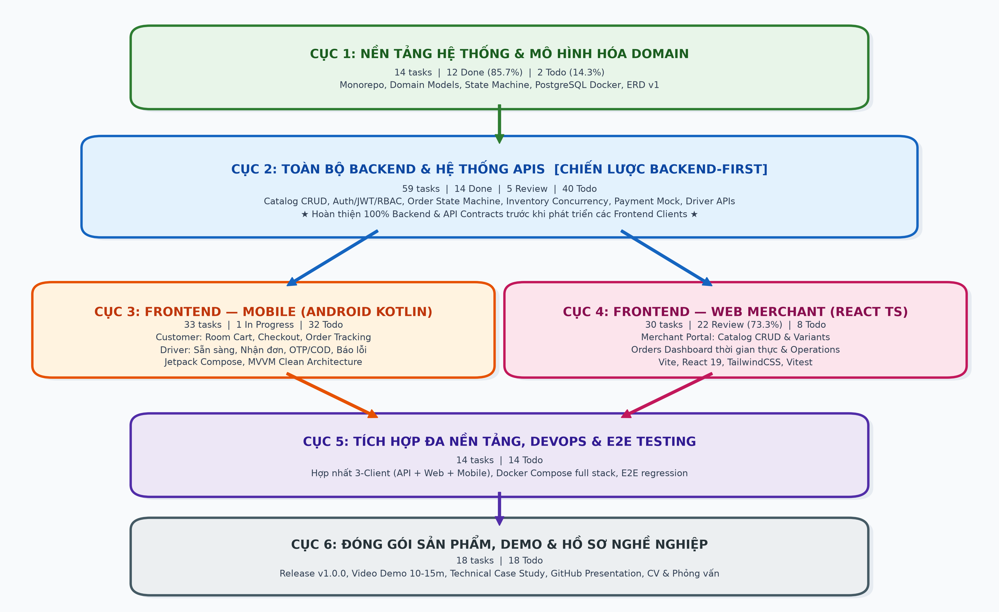
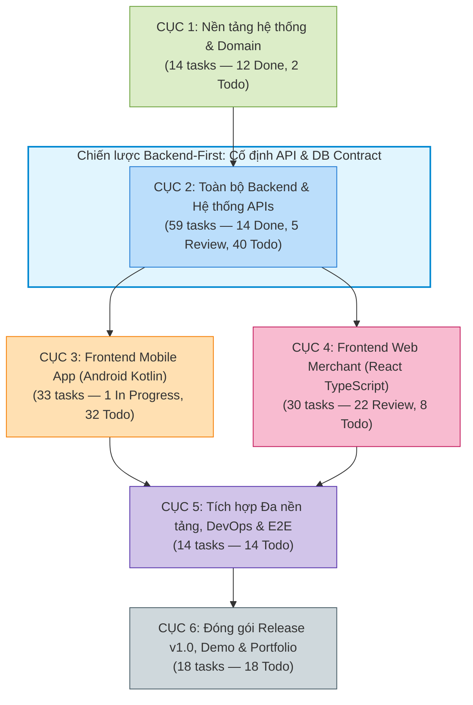

# Kế Hoạch Phát Triển FreshFlow MVP Theo Cục (Backend-First Strategy)

> **Chiến lược tổ chức mới:** Hoàn thiện trọn vẹn toàn bộ Backend Core, Database, State Machine và REST APIs trước khi phát triển các Frontend Clients (Mobile Kotlin và React Web), giúp cố định API Contract, tránh phụ thuộc mock và tối ưu năng suất kiểm thử.
> **Cam kết tính toàn vẹn:** Giữ nguyên 100% Task ID, nội dung yêu cầu, ước tính giờ, tiêu chí nghiệm thu và **Trạng thái thực tế (Status)** của toàn bộ 168 task.

## 1. Tổng quan Trạng thái Hệ thống (Dynamic Status Distribution)

*Bảng này trên trang tính **Overview** trong file Excel được liên kết bằng công thức động (`COUNTIF`), tự động nhảy số khi cập nhật trạng thái tại trang **Kế hoạch theo cục**.*

| Trạng thái (Status) | Số lượng Task | Tỷ lệ (%) | Ghi chú & Đánh giá tiến độ |
| :--- | :---: | :---: | :--- |
| 🟢 **Done** | **26** | 15.5% | Hoàn thành Cục 1 (Tuần 1) và toàn bộ Catalog Backend v0.1 (Tuần 2) |
| 🟣 **Review** | **27** | 16.1% | Đã code xong & đang review: React Web Catalog (Tuần 3), React Orders Dashboard & Backend Order API v1 (Tuần 4) |
| 🟡 **In Progress** | **1** | 0.6% | `FF-04-07-2`: Chuẩn bị kiến trúc Android customer app |
| 🔴 **Blocked** | **0** | 0.0% | Chưa có tác vụ nào bị chặn |
| ⚪ **Deferred** | **0** | 0.0% | Chưa có tác vụ nào bị hoãn |
| ⚪ **Todo** | **114** | 67.8% | Các task Backend nâng cao, Mobile Kotlin, Web hoàn thiện, E2E và Release |
| **TỔNG CỘNG** | **168** | **100.0%** | **Đầy đủ 168/168 task từ kế hoạch 12 tuần gốc** |

## 2. Ma trận Tiến độ & Tỷ lệ Phần trăm theo từng Cục (Status Matrix by Block)

*Bảng công thức đa điều kiện (`COUNTIFS`) tính tỷ lệ hoàn thành, đang review, đang làm và chưa làm riêng cho từng Cục:*

| Cục | Tên Cục phát triển | Tổng Task | Done | Review | In Prog | Todo | % Done | % Review | % In Prog | % Todo | Đánh giá tiến độ Cục |
| :---: | :--- | :---: | :---: | :---: | :---: | :---: | :---: | :---: | :---: | :---: | :--- |
| **CỤC 1** | Nền tảng hệ thống & Domain Architecture | 14 | 12 | 0 | 0 | 2 | **85.7%** | 0.0% | 0.0% | 14.3% | Gần hoàn tất, chỉ còn 2 task review/planning W1 |
| **CỤC 2** | Toàn bộ Backend & Hệ thống APIs | 59 | 14 | 5 | 0 | 40 | **23.7%** | 8.5% | 0.0% | 67.8% | Trọng tâm số 1: Catalog Done, Order v1 Review, tiếp tục Auth/Inventory/Driver |
| **CỤC 3** | Frontend - Mobile Client (Android Kotlin) | 33 | 0 | 0 | 1 | 32 | **0.0%** | 0.0% | 3.0% | 97.0% | Đang khởi động kiến trúc Customer & Driver app |
| **CỤC 4** | Frontend - Web Merchant (React TypeScript) | 30 | 0 | 22 | 0 | 8 | **0.0%** | 73.3% | 0.0% | 26.7% | Tiến độ rất tốt: 73.3% tasks đang ở trạng thái Review (Catalog & Orders UI) |
| **CỤC 5** | Tích hợp Đa nền tảng, DevOps & E2E Testing | 14 | 0 | 0 | 0 | 14 | **0.0%** | 0.0% | 0.0% | 100.0% | Chờ hoàn thành Backend & Frontends |
| **CỤC 6** | Đóng gói Sản phẩm, Demo & Hồ sơ Nghề nghiệp | 18 | 0 | 0 | 0 | 18 | **0.0%** | 0.0% | 0.0% | 100.0% | Giai đoạn cuối dự án (v1.0.0, Demo Video & Portfolio) |
| **TỔNG** | **Toàn bộ 6 Cục phát triển MVP** | **168** | **26** | **27** | **1** | **114** | **15.5%** | **16.1%** | **0.6%** | **67.8%** | **Theo dõi tiến độ tự động toàn hệ thống** |

## 3. Sơ đồ Cấu trúc 6 Cục Phát triển (Backend-First Flowchart)

---

## 4. Danh Sách Chi Tiết Toàn Bộ 168 Task Theo Cục

### CỤC 1: NỀN TẢNG HỆ THỐNG & MÔ HÌNH HÓA DOMAIN (Foundation & Architecture) — Thiết lập monorepo, quy ước kiến trúc, thiết kế domain model, state machine, docker database và ERD nền móng

#### 1.1. Phạm vi MVP & Thiết kế Domain State Machine (4 tasks)

| STT | Task ID | Tuần gốc | Track | Task cần làm | Ưu tiên | Giờ | Trạng thái | Ghi chú & Rationale |
| :---: | :---: | :---: | :---: | :--- | :---: | :---: | :---: | :--- |
| 1 | `FF-01-01-1` | W01 | `Planning` | Chốt MVP, actor và business rules — cập nhật Driver scope | Must | 2h | 🟢 **Done** | Đã cập nhật sau quyết định thêm Driver vào MVP. |
| 2 | `FF-01-01-2` | W01 | `Git/Java` | Khởi tạo mono-repo và quy ước làm việc | Must | 2h | 🟢 **Done** |  |
| 3 | `FF-01-02-1` | W01 | `Domain` | Thiết kế Order/Payment state machine theo acceptance, capacity và delivery flow mới | Must | 2.5h | 🟢 **Done** |  |
| 4 | `FF-01-02-2` | W01 | `Java` | Tạo value object và tính tiền | Must | 2.5h | 🟢 **Done** |  |
#### 1.2. Khởi tạo Backend Skeleton & Hạ tầng PostgreSQL Docker (4 tasks)

| STT | Task ID | Tuần gốc | Track | Task cần làm | Ưu tiên | Giờ | Trạng thái | Ghi chú & Rationale |
| :---: | :---: | :---: | :---: | :--- | :---: | :---: | :---: | :--- |
| 5 | `FF-01-03-1` | W01 | `Backend` | Tạo freshflow-api Spring Boot skeleton | Must | 2.5h | 🟢 **Done** |  |
| 6 | `FF-01-03-2` | W01 | `Infrastructure` | Chạy PostgreSQL local bằng Docker; Messaging là optional extension | Must | 2h | 🟢 **Done** |  |
| 7 | `FF-01-04-1` | W01 | `Backend` | Thiết lập package/module boundary | Must | 2h | 🟢 **Done** |  |
| 8 | `FF-01-04-2` | W01 | `Quality` | Thiết lập test, formatter và API convention | Must | 2h | 🟢 **Done** |  |
#### 1.3. Mô hình dữ liệu ERD, Quy trình Backlog & Quản trị rủi ro (6 tasks)

| STT | Task ID | Tuần gốc | Track | Task cần làm | Ưu tiên | Giờ | Trạng thái | Ghi chú & Rationale |
| :---: | :---: | :---: | :---: | :--- | :---: | :---: | :---: | :--- |
| 9 | `FF-01-05-1` | W01 | `Planning` | Vẽ ERD và API map cho ProductVariant, capacity, payment, delivery và dispute | Must | 2h | 🟢 **Done** |  |
| 10 | `FF-01-05-2` | W01 | `Git` | Thiết lập issue/backlog workflow | Must | 1.5h | 🟢 **Done** |  |
| 11 | `FF-01-06-1` | W01 | `Review` | Demo môi trường và domain | Must | 2.5h | 🟢 **Done** |  |
| 12 | `FF-01-06-2` | W01 | `Documentation` | Chốt kế hoạch dữ liệu và rủi ro | Must | 1.5h | 🟢 **Done** |  |
| 13 | `FF-01-07-1` | W01 | `Review` | Ôn và kiểm tra kiến thức tuần 1 | Must | 1h | ⚪ Todo |  |
| 14 | `FF-01-07-2` | W01 | `Planning` | Lập kế hoạch tuần 2 | Must | 0.5h | ⚪ Todo |  |
### CỤC 2: TOÀN BỘ BACKEND & HỆ THỐNG APIS (Complete Backend Services, DB & REST) — Xây dựng trọn vẹn toàn bộ Backend từ Catalog, Auth/RBAC, Order State Machine, Inventory Concurrency, Payment Mock đến Delivery Driver API trước khi chuyển sang Client

#### 2.1. Catalog & Store Module (JPA Entities, Flyway, CRUD, Search & Pagination) (14 tasks)

| STT | Task ID | Tuần gốc | Track | Task cần làm | Ưu tiên | Giờ | Trạng thái | Ghi chú & Rationale |
| :---: | :---: | :---: | :---: | :--- | :---: | :---: | :---: | :--- |
| 15 | `FF-02-01-1` | W02 | `Backend` | Tạo entity Store, StoreCategory, Category, Product và ProductVariant | Must | 2.5h | 🟢 **Done** | [Backend-First] Hoàn thành toàn bộ API & DB trước khi chuyển sang client. |
| 16 | `FF-02-01-2` | W02 | `Database` | Viết Flyway migration catalog | Must | 2.5h | 🟢 **Done** | [Backend-First] Hoàn thành toàn bộ API & DB trước khi chuyển sang client. |
| 17 | `FF-02-02-1` | W02 | `Backend` | Tạo repository và catalog service | Must | 2.5h | 🟢 **Done** | [Backend-First] Hoàn thành toàn bộ API & DB trước khi chuyển sang client. |
| 18 | `FF-02-02-2` | W02 | `Backend` | Tạo DTO và mapper cho ProductVariant, capacity và availability | Must | 2h | 🟢 **Done** | [Backend-First] Hoàn thành toàn bộ API & DB trước khi chuyển sang client. |
| 19 | `FF-02-03-1` | W02 | `REST` | Xây Product và ProductVariant CRUD API | Must | 3h | 🟢 **Done** | [Backend-First] Hoàn thành toàn bộ API & DB trước khi chuyển sang client. |
| 20 | `FF-02-03-2` | W02 | `REST` | Validation và error handling catalog | Must | 2h | 🟢 **Done** | [Backend-First] Hoàn thành toàn bộ API & DB trước khi chuyển sang client. |
| 21 | `FF-02-04-1` | W02 | `REST` | Thêm pagination, sorting, search và filter availability/variant cho catalog | Must | 2.5h | 🟢 **Done** | [Backend-First] Hoàn thành toàn bộ API & DB trước khi chuyển sang client. |
| 22 | `FF-02-04-2` | W02 | `Docs` | Tích hợp OpenAPI và Postman collection | Must | 1.5h | 🟢 **Done** | [Backend-First] Hoàn thành toàn bộ API & DB trước khi chuyển sang client. |
| 23 | `FF-02-05-1` | W02 | `Quality` | Viết unit/controller test catalog | Must | 3h | 🟢 **Done** | [Backend-First] Hoàn thành toàn bộ API & DB trước khi chuyển sang client. |
| 24 | `FF-02-05-2` | W02 | `Database` | Kiểm tra JPA query và dữ liệu seed | Should | 1.5h | 🟢 **Done** | [Backend-First] Hoàn thành toàn bộ API & DB trước khi chuyển sang client. |
| 25 | `FF-02-06-1` | W02 | `Integration` | Demo Catalog vertical slice | Must | 2.5h | 🟢 **Done** | [Backend-First] Hoàn thành toàn bộ API & DB trước khi chuyển sang client. |
| 26 | `FF-02-06-2` | W02 | `Refactor` | Đóng gói release Catalog v0.1 | Must | 1.5h | 🟢 **Done** | [Backend-First] Hoàn thành toàn bộ API & DB trước khi chuyển sang client. |
| 27 | `FF-02-07-1` | W02 | `Review` | Ôn JPA/REST và viết retrospective | Must | 1h | 🟢 **Done** | [Backend-First] Hoàn thành toàn bộ API & DB trước khi chuyển sang client. |
| 28 | `FF-02-07-2` | W02 | `Planning` | Chuẩn bị React architecture | Must | 0.5h | 🟢 **Done** | [Backend-First] 13/9/2026 |
#### 2.2. User, Store Ownership & Authentication/RBAC Core (Spring Security & JWT) (10 tasks)

| STT | Task ID | Tuần gốc | Track | Task cần làm | Ưu tiên | Giờ | Trạng thái | Ghi chú & Rationale |
| :---: | :---: | :---: | :---: | :--- | :---: | :---: | :---: | :--- |
| 29 | `FF-04-01-2` | W04 | `Backend` | Tạo User/Store ownership model | Must | 2.5h | 🟣 **Review** | [Backend-First] Hoàn thành toàn bộ API & DB trước khi chuyển sang client. |
| 30 | `FF-07-01-1` | W07 | `Backend` | Tạo User/Role, user_store_roles, Store ownership và Driver profile migration | Must | 2.5h | ⚪ Todo | [Backend-First] Hoàn thành toàn bộ API & DB trước khi chuyển sang client. |
| 31 | `FF-07-01-2` | W07 | `Backend` | Implement register endpoint | Must | 2h | ⚪ Todo | [Backend-First] Hoàn thành toàn bộ API & DB trước khi chuyển sang client. |
| 32 | `FF-07-02-1` | W07 | `Backend` | Implement login và JWT provider | Must | 2.5h | ⚪ Todo | [Backend-First] Hoàn thành toàn bộ API & DB trước khi chuyển sang client. |
| 33 | `FF-07-02-2` | W07 | `Backend` | Cấu hình SecurityFilter và endpoint rules | Must | 2.5h | ⚪ Todo | [Backend-First] Hoàn thành toàn bộ API & DB trước khi chuyển sang client. |
| 34 | `FF-07-05-1` | W07 | `Backend` | Authorization theo Store ownership và Driver assignment | Must | 2.5h | ⚪ Todo | [Backend-First] Hoàn thành toàn bộ API & DB trước khi chuyển sang client. |
| 35 | `FF-07-05-2` | W07 | `Quality` | Security test và secret review | Must | 2h | ⚪ Todo | [Backend-First] Hoàn thành toàn bộ API & DB trước khi chuyển sang client. |
| 36 | `FF-07-06-2` | W07 | `Docs` | Viết security section cho README | Must | 1.5h | ⚪ Todo | [Backend-First] Hoàn thành toàn bộ API & DB trước khi chuyển sang client. |
| 37 | `FF-07-07-1` | W07 | `Review` | Ôn Spring Security/JWT | Must | 1h | ⚪ Todo | [Backend-First] Hoàn thành toàn bộ API & DB trước khi chuyển sang client. |
| 38 | `FF-07-07-2` | W07 | `Planning` | Chuẩn bị inventory và concurrency | Must | 0.5h | ⚪ Todo | [Backend-First] Hoàn thành toàn bộ API & DB trước khi chuyển sang client. |
#### 2.3. Customer Public Catalog Endpoint (Public API for Clients) (1 tasks)

| STT | Task ID | Tuần gốc | Track | Task cần làm | Ưu tiên | Giờ | Trạng thái | Ghi chú & Rationale |
| :---: | :---: | :---: | :---: | :--- | :---: | :---: | :---: | :--- |
| 39 | `FF-05-05-2` | W05 | `Backend` | Tạo public catalog endpoint cho Customer với ProductVariant và capacity | Must | 1.5h | ⚪ Todo | [Backend-First] Hoàn thành toàn bộ API & DB trước khi chuyển sang client. |
#### 2.4. Order Management & Order State Machine Core (Create, Transitions & History) (7 tasks)

| STT | Task ID | Tuần gốc | Track | Task cần làm | Ưu tiên | Giờ | Trạng thái | Ghi chú & Rationale |
| :---: | :---: | :---: | :---: | :--- | :---: | :---: | :---: | :--- |
| 40 | `FF-06-03-1` | W06 | `Backend` | Tạo Order và OrderItem persistence | Must | 3h | ⚪ Todo | [Backend-First] Hoàn thành toàn bộ API & DB trước khi chuyển sang client. |
| 41 | `FF-06-03-2` | W06 | `Backend` | Tạo checkout request và create order API | Must | 2.5h | ⚪ Todo | [Backend-First] Hoàn thành toàn bộ API & DB trước khi chuyển sang client. |
| 42 | `FF-06-05-1` | W06 | `Backend` | Tạo order detail/history API có acceptance, payment, delivery và dispute | Must | 2h | ⚪ Todo | [Backend-First] Hoàn thành toàn bộ API & DB trước khi chuyển sang client. |
| 43 | `FF-04-02-2` | W04 | `Backend` | Tạo Order read API tối thiểu | Must | 2.5h | 🟣 **Review** | [Backend-First] Hoàn thành toàn bộ API & DB trước khi chuyển sang client. |
| 44 | `FF-04-03-2` | W04 | `Backend` | Hoàn thiện Order state transition API theo acceptance/payment/delivery flow | Must | 2.5h | 🟣 **Review** | [Backend-First] Hoàn thành toàn bộ API & DB trước khi chuyển sang client. |
| 45 | `FF-04-04-2` | W04 | `Backend` | API contract review và versioning | Must | 2h | 🟣 **Review** | [Backend-First] Hoàn thành toàn bộ API & DB trước khi chuyển sang client. |
| 46 | `FF-04-05-2` | W04 | `Quality` | Backend order read/write tests | Must | 2h | 🟣 **Review** | [Backend-First] Hoàn thành toàn bộ API & DB trước khi chuyển sang client. |
#### 2.5. Inventory, Daily Capacity & Idempotent Checkout (Concurrency & Audit) (13 tasks)

| STT | Task ID | Tuần gốc | Track | Task cần làm | Ưu tiên | Giờ | Trạng thái | Ghi chú & Rationale |
| :---: | :---: | :---: | :---: | :--- | :---: | :---: | :---: | :--- |
| 47 | `FF-06-07-1` | W06 | `Review` | Ôn transaction, Room và checkout | Must | 1h | ⚪ Todo | [Backend-First] Hoàn thành toàn bộ API & DB trước khi chuyển sang client. |
| 48 | `FF-08-01-1` | W08 | `Backend` | Tạo inventory location, stock record và daily capacity record | Must | 2.5h | ⚪ Todo | [Backend-First] Hoàn thành toàn bộ API & DB trước khi chuyển sang client. |
| 49 | `FF-08-01-2` | W08 | `Backend` | Implement reserve/release service cho stock và daily capacity | Must | 2.5h | ⚪ Todo | [Backend-First] Hoàn thành toàn bộ API & DB trước khi chuyển sang client. |
| 50 | `FF-08-02-1` | W08 | `Backend` | Thêm availability/capacity validation vào checkout | Must | 2.5h | ⚪ Todo | [Backend-First] Hoàn thành toàn bộ API & DB trước khi chuyển sang client. |
| 51 | `FF-08-02-2` | W08 | `Backend` | Thiết kế Idempotency-Key | Must | 2.5h | ⚪ Todo | [Backend-First] Hoàn thành toàn bộ API & DB trước khi chuyển sang client. |
| 52 | `FF-08-03-1` | W08 | `Backend` | Viết concurrency test cho stock/capacity cuối cùng | Must | 3h | ⚪ Todo | [Backend-First] Hoàn thành toàn bộ API & DB trước khi chuyển sang client. |
| 53 | `FF-08-04-2` | W08 | `Backend` | Audit inventory/capacity adjustment | Should | 2h | ⚪ Todo | [Backend-First] Hoàn thành toàn bộ API & DB trước khi chuyển sang client. |
| 54 | `FF-08-05-1` | W08 | `Quality` | Hoàn thiện order/inventory/capacity checkout integration tests | Must | 3h | ⚪ Todo | [Backend-First] Hoàn thành toàn bộ API & DB trước khi chuyển sang client. |
| 55 | `FF-08-05-2` | W08 | `Docs` | Viết failure matrix cho capacity/stock/checkout | Must | 1.5h | ⚪ Todo | [Backend-First] Hoàn thành toàn bộ API & DB trước khi chuyển sang client. |
| 56 | `FF-08-06-1` | W08 | `Integration` | Demo checkout made-to-order và limited-stock với idempotency | Must | 3h | ⚪ Todo | [Backend-First] Hoàn thành toàn bộ API & DB trước khi chuyển sang client. |
| 57 | `FF-08-06-2` | W08 | `Refactor` | Tối ưu transaction và lỗi domain | Must | 1.5h | ⚪ Todo | [Backend-First] Hoàn thành toàn bộ API & DB trước khi chuyển sang client. |
| 58 | `FF-08-07-1` | W08 | `Review` | Ôn concurrency/idempotency | Must | 1h | ⚪ Todo | [Backend-First] Hoàn thành toàn bộ API & DB trước khi chuyển sang client. |
| 59 | `FF-08-07-2` | W08 | `Planning` | Chọn mức microservices/messaging phù hợp | Must | 0.5h | ⚪ Todo | [Backend-First] Hoàn thành toàn bộ API & DB trước khi chuyển sang client. |
#### 2.6. Payment Mock, Acceptance Compensation & Delivery/Driver APIs (7 tasks)

| STT | Task ID | Tuần gốc | Track | Task cần làm | Ưu tiên | Giờ | Trạng thái | Ghi chú & Rationale |
| :---: | :---: | :---: | :---: | :--- | :---: | :---: | :---: | :--- |
| 60 | `FF-09-01-1` | W09 | `Backend` | Hoàn thiện Order acceptance, payment-aware state machine và Merchant actions | Must | 2.5h | ⚪ Todo | [Backend-First] Hoàn thành toàn bộ API & DB trước khi chuyển sang client. |
| 61 | `FF-09-02-1` | W09 | `Backend` | Tạo Payment Mock cho ONLINE_MOCK, CASH_ON_DELIVERY và BANK_TRANSFER_ON_DELIVERY | Must | 2h | ⚪ Todo | [Backend-First] Hoàn thành toàn bộ API & DB trước khi chuyển sang client. |
| 62 | `FF-09-03-1` | W09 | `Backend` | Tạo Driver profile, availability, assignment và balancing domain | Must | 2.5h | ⚪ Todo | [Backend-First] Thay cho RabbitMQ event envelope; messaging để Phase 2. |
| 63 | `FF-09-03-2` | W09 | `Backend` | Tạo Driver assigned-orders, availability và assignment API | Must | 2.5h | ⚪ Todo | [Backend-First] Thay cho notification consumer; notification là Should/Phase 2. |
| 64 | `FF-09-04-1` | W09 | `Backend` | Implement checkout/payment acceptance compensation | Should | 3h | ⚪ Todo | [Backend-First] Hoàn thành toàn bộ API & DB trước khi chuyển sang client. |
| 65 | `FF-09-05-1` | W09 | `Backend` | Hoàn thiện Driver assignment API, audit trail và delivery credentials | Must | 2h | ⚪ Todo | [Backend-First] Hoàn thành toàn bộ API & DB trước khi chuyển sang client. |
| 66 | `FF-09-07-1` | W09 | `Quality` | Test Driver delivery, payment confirmation và dispute resolution | Must | 1h | ⚪ Todo | [Backend-First] Hoàn thành toàn bộ API & DB trước khi chuyển sang client. |
#### 2.7. Backend Optimization, Integration Tests & Technical Hardening (7 tasks)

| STT | Task ID | Tuần gốc | Track | Task cần làm | Ưu tiên | Giờ | Trạng thái | Ghi chú & Rationale |
| :---: | :---: | :---: | :---: | :--- | :---: | :---: | :---: | :--- |
| 67 | `FF-10-01-1` | W10 | `Quality` | Lập test pyramid/matrix cho catalog variant, capacity, payment và delivery | Must | 2h | ⚪ Todo | [Backend-First] Hoàn thành toàn bộ API & DB trước khi chuyển sang client. |
| 68 | `FF-10-01-2` | W10 | `Backend` | Bổ sung integration test với Testcontainers | Must | 3h | ⚪ Todo | [Backend-First] Hoàn thành toàn bộ API & DB trước khi chuyển sang client. |
| 69 | `FF-10-04-1` | W10 | `Architecture` | Tách catalog module thành service stretch có kiểm soát | Stretch | 2h | ⚪ Todo | [Backend-First] Hoàn thành toàn bộ API & DB trước khi chuyển sang client. |
| 70 | `FF-11-02-1` | W11 | `Backend` | Tối ưu query, index và pagination baseline | Must | 2.5h | ⚪ Todo | [Backend-First] Hoàn thành toàn bộ API & DB trước khi chuyển sang client. |
| 71 | `FF-11-02-2` | W11 | `Quality` | Thêm API smoke/E2E script | Must | 2h | ⚪ Todo | [Backend-First] Hoàn thành toàn bộ API & DB trước khi chuyển sang client. |
| 72 | `FF-11-03-1` | W11 | `Security` | Authorization review và abuse cases | Must | 2.5h | ⚪ Todo | [Backend-First] Hoàn thành toàn bộ API & DB trước khi chuyển sang client. |
| 73 | `FF-11-03-2` | W11 | `Docs` | Hoàn thiện API docs và examples | Must | 2h | ⚪ Todo | [Backend-First] Hoàn thành toàn bộ API & DB trước khi chuyển sang client. |
### CỤC 3: FRONTEND - MOBILE CLIENT (Android Kotlin: Customer & Driver App) — Phát triển ứng dụng Android native bằng Jetpack Compose: luồng khách hàng (Catalog, Giỏ hàng offline, Checkout, Theo dõi đơn) và luồng tài xế (Bật nhận đơn, Nhận đơn, OTP/COD, Báo lỗi)

#### 3.1. Nền tảng Android App, Architecture MVVM & Design System (4 tasks)

| STT | Task ID | Tuần gốc | Track | Task cần làm | Ưu tiên | Giờ | Trạng thái | Ghi chú & Rationale |
| :---: | :---: | :---: | :---: | :--- | :---: | :---: | :---: | :--- |
| 74 | `FF-04-07-2` | W04 | `Planning` | Chuẩn bị Android customer app | Must | 0.5h | 🟡 **In Progress** | [Mobile Frontend] Xây dựng native Android app (Customer & Driver) trên nền Backend hoàn chỉnh. |
| 75 | `FF-05-01-1` | W05 | `Android` | Khởi tạo Android app và design system | Must | 2.5h | ⚪ Todo | [Mobile Frontend] Xây dựng native Android app (Customer & Driver) trên nền Backend hoàn chỉnh. |
| 76 | `FF-05-01-2` | W05 | `Android` | Tạo navigation và screen skeleton | Must | 2h | ⚪ Todo | [Mobile Frontend] Xây dựng native Android app (Customer & Driver) trên nền Backend hoàn chỉnh. |
| 77 | `FF-05-02-1` | W05 | `Android` | Tạo Kotlin domain models và UI state | Must | 2h | ⚪ Todo | [Mobile Frontend] Xây dựng native Android app (Customer & Driver) trên nền Backend hoàn chỉnh. |
#### 3.2. Customer Catalog Browsing & Detail Screens (10 tasks)

| STT | Task ID | Tuần gốc | Track | Task cần làm | Ưu tiên | Giờ | Trạng thái | Ghi chú & Rationale |
| :---: | :---: | :---: | :---: | :--- | :---: | :---: | :---: | :--- |
| 78 | `FF-05-02-2` | W05 | `Android` | Dựng Store/Product list UI | Must | 2.5h | ⚪ Todo | [Mobile Frontend] Xây dựng native Android app (Customer & Driver) trên nền Backend hoàn chỉnh. |
| 79 | `FF-05-03-1` | W05 | `Android` | Tích hợp Retrofit API interface | Must | 2.5h | ⚪ Todo | [Mobile Frontend] Xây dựng native Android app (Customer & Driver) trên nền Backend hoàn chỉnh. |
| 80 | `FF-05-03-2` | W05 | `Android` | Tạo repository và mapper | Must | 2h | ⚪ Todo | [Mobile Frontend] Xây dựng native Android app (Customer & Driver) trên nền Backend hoàn chỉnh. |
| 81 | `FF-05-04-1` | W05 | `Android` | Tạo ViewModel và gọi catalog thật | Must | 2.5h | ⚪ Todo | [Mobile Frontend] Xây dựng native Android app (Customer & Driver) trên nền Backend hoàn chỉnh. |
| 82 | `FF-05-04-2` | W05 | `Android` | Tối ưu UI loading/error/empty | Should | 2h | ⚪ Todo | [Mobile Frontend] Xây dựng native Android app (Customer & Driver) trên nền Backend hoàn chỉnh. |
| 83 | `FF-05-05-1` | W05 | `Android` | Tạo ProductDetail với ProductVariant/size và availability/capacity | Must | 2.5h | ⚪ Todo | [Mobile Frontend] Xây dựng native Android app (Customer & Driver) trên nền Backend hoàn chỉnh. |
| 84 | `FF-05-06-1` | W05 | `Integration` | Demo Android catalog với API thật | Must | 3h | ⚪ Todo | [Mobile Frontend] Xây dựng native Android app (Customer & Driver) trên nền Backend hoàn chỉnh. |
| 85 | `FF-05-06-2` | W05 | `Quality` | Mobile UI polish và accessibility | Should | 1.5h | ⚪ Todo | [Mobile Frontend] Xây dựng native Android app (Customer & Driver) trên nền Backend hoàn chỉnh. |
| 86 | `FF-05-07-1` | W05 | `Review` | Ôn Kotlin/Retrofit/MVVM | Must | 1h | ⚪ Todo | [Mobile Frontend] Xây dựng native Android app (Customer & Driver) trên nền Backend hoàn chỉnh. |
| 87 | `FF-05-07-2` | W05 | `Planning` | Thiết kế Driver Android thin MVP | Must | 0.5h | ⚪ Todo | [Mobile Frontend] Scope change: Driver Android app thin workflow đã vào MVP. |
#### 3.3. Offline Cart Persistence với Room Database & CartRepository (3 tasks)

| STT | Task ID | Tuần gốc | Track | Task cần làm | Ưu tiên | Giờ | Trạng thái | Ghi chú & Rationale |
| :---: | :---: | :---: | :---: | :--- | :---: | :---: | :---: | :--- |
| 88 | `FF-06-01-1` | W06 | `Android` | Tạo Room Entity/DAO/Database cho cart | Must | 2.5h | ⚪ Todo | [Mobile Frontend] Xây dựng native Android app (Customer & Driver) trên nền Backend hoàn chỉnh. |
| 89 | `FF-06-01-2` | W06 | `Android` | Tạo CartRepository và single-store rule | Must | 2.5h | ⚪ Todo | [Mobile Frontend] Xây dựng native Android app (Customer & Driver) trên nền Backend hoàn chỉnh. |
| 90 | `FF-06-02-1` | W06 | `Android` | Xây CartScreen và quantity controls | Must | 2.5h | ⚪ Todo | [Mobile Frontend] Xây dựng native Android app (Customer & Driver) trên nền Backend hoàn chỉnh. |
#### 3.4. Mobile Authentication & DataStore Token Management (3 tasks)

| STT | Task ID | Tuần gốc | Track | Task cần làm | Ưu tiên | Giờ | Trạng thái | Ghi chú & Rationale |
| :---: | :---: | :---: | :---: | :--- | :---: | :---: | :---: | :--- |
| 91 | `FF-06-07-2` | W06 | `Planning` | Chuẩn bị security integration | Must | 0.5h | ⚪ Todo | [Mobile Frontend] Xây dựng native Android app (Customer & Driver) trên nền Backend hoàn chỉnh. |
| 92 | `FF-07-04-1` | W07 | `Android` | Tạo LoginScreen và AuthRepository | Must | 2.5h | ⚪ Todo | [Mobile Frontend] Xây dựng native Android app (Customer & Driver) trên nền Backend hoàn chỉnh. |
| 93 | `FF-07-04-2` | W07 | `Android` | Lưu token và logout | Must | 2h | ⚪ Todo | [Mobile Frontend] Xây dựng native Android app (Customer & Driver) trên nền Backend hoàn chỉnh. |
#### 3.5. Customer Checkout, Stock Invalidation & Order Tracking UI (7 tasks)

| STT | Task ID | Tuần gốc | Track | Task cần làm | Ưu tiên | Giờ | Trạng thái | Ghi chú & Rationale |
| :---: | :---: | :---: | :---: | :--- | :---: | :---: | :---: | :--- |
| 94 | `FF-06-04-1` | W06 | `Android` | Tạo CheckoutScreen và address form | Must | 2.5h | ⚪ Todo | [Mobile Frontend] Xây dựng native Android app (Customer & Driver) trên nền Backend hoàn chỉnh. |
| 95 | `FF-06-04-2` | W06 | `Android` | Kết nối submit order và clear cart policy | Must | 2.5h | ⚪ Todo | [Mobile Frontend] Xây dựng native Android app (Customer & Driver) trên nền Backend hoàn chỉnh. |
| 96 | `FF-06-05-2` | W06 | `Android` | Tạo OrdersScreen và OrderDetail | Must | 2h | ⚪ Todo | [Mobile Frontend] Xây dựng native Android app (Customer & Driver) trên nền Backend hoàn chỉnh. |
| 97 | `FF-06-06-1` | W06 | `Integration` | Demo Android browse→cart→checkout→history | Must | 3.5h | ⚪ Todo | [Mobile Frontend] Xây dựng native Android app (Customer & Driver) trên nền Backend hoàn chỉnh. |
| 98 | `FF-06-06-2` | W06 | `Quality` | Fix critical checkout bugs và commit milestone | Must | 1.5h | ⚪ Todo | [Mobile Frontend] Xây dựng native Android app (Customer & Driver) trên nền Backend hoàn chỉnh. |
| 99 | `FF-08-04-1` | W08 | `Android` | Hiển thị variant unavailable/capacity exhausted và cart invalidation trên Android | Must | 2h | ⚪ Todo | [Mobile Frontend] Xây dựng native Android app (Customer & Driver) trên nền Backend hoàn chỉnh. |
| 100 | `FF-09-02-2` | W09 | `Android` | Xây Customer order tracking UI theo acceptance/payment/delivery state | Must | 2h | ⚪ Todo | [Mobile Frontend] Xây dựng native Android app (Customer & Driver) trên nền Backend hoàn chỉnh. |
#### 3.6. Mobile Driver Client Workflow (Nhận đơn, OTP/COD & Delivery Report) (3 tasks)

| STT | Task ID | Tuần gốc | Track | Task cần làm | Ưu tiên | Giờ | Trạng thái | Ghi chú & Rationale |
| :---: | :---: | :---: | :---: | :--- | :---: | :---: | :---: | :--- |
| 101 | `FF-09-04-2` | W09 | `Android Driver` | Khởi tạo Driver Android app, login và role routing | Must | 1.5h | ⚪ Todo | [Mobile Frontend] Thay cho notification inbox Android; push notification là out of scope MVP. |
| 102 | `FF-09-05-2` | W09 | `Android Driver` | Xây Driver assigned-orders và delivery detail UI | Must | 1.5h | ⚪ Todo | [Mobile Frontend] Xây dựng native Android app (Customer & Driver) trên nền Backend hoàn chỉnh. |
| 103 | `FF-09-06-2` | W09 | `Android Driver` | Thêm OTP/PIN COD và bank transfer confirmation/delivery failure | Must | 1.5h | ⚪ Todo | [Mobile Frontend] Xây dựng native Android app (Customer & Driver) trên nền Backend hoàn chỉnh. |
#### 3.7. Mobile Quality, Unit Tests & Polish Lifecycle/Rotation (3 tasks)

| STT | Task ID | Tuần gốc | Track | Task cần làm | Ưu tiên | Giờ | Trạng thái | Ghi chú & Rationale |
| :---: | :---: | :---: | :---: | :--- | :---: | :---: | :---: | :--- |
| 104 | `FF-10-02-2` | W10 | `Android` | Tạo unit test ViewModel/Repository Customer và Driver | Must | 2.5h | ⚪ Todo | [Mobile Frontend] Xây dựng native Android app (Customer & Driver) trên nền Backend hoàn chỉnh. |
| 105 | `FF-11-01-2` | W11 | `Android` | Polish Customer và Driver payment/delivery flows | Must | 2.5h | ⚪ Todo | [Mobile Frontend] Xây dựng native Android app (Customer & Driver) trên nền Backend hoàn chỉnh. |
| 106 | `FF-11-04-2` | W11 | `Android` | Kiểm tra lifecycle, rotation và crash cases Customer/Driver | Must | 2.5h | ⚪ Todo | [Mobile Frontend] Xây dựng native Android app (Customer & Driver) trên nền Backend hoàn chỉnh. |
### CỤC 4: FRONTEND - WEB MERCHANT (React TypeScript: Catalog, Order Dashboard & Operations) — Phát triển cổng thông tin quản lý cho chủ cửa hàng (Merchant Portal): Quản lý danh mục, Biến thể món, Sức chứa hàng ngày, Tiếp nhận & Xử lý đơn hàng, Gán tài xế và Khiếu nại

#### 4.1. Web Setup, AppShell Layout, Router & API Client (4 tasks)

| STT | Task ID | Tuần gốc | Track | Task cần làm | Ưu tiên | Giờ | Trạng thái | Ghi chú & Rationale |
| :---: | :---: | :---: | :---: | :--- | :---: | :---: | :---: | :--- |
| 107 | `FF-03-01-1` | W03 | `React` | Khởi tạo React TypeScript app và design system | Must | 2.5h | 🟣 **Review** | [React Web] Hoàn thiện Merchant Portal dựa trên API thực tế từ Backend. |
| 108 | `FF-03-01-2` | W03 | `React` | Tạo AppShell và layout merchant | Must | 2h | 🟣 **Review** | [React Web] Hoàn thiện Merchant Portal dựa trên API thực tế từ Backend. |
| 109 | `FF-03-02-1` | W03 | `React` | Thiết lập router và protected route placeholder | Must | 2h | 🟣 **Review** | [React Web] Hoàn thiện Merchant Portal dựa trên API thực tế từ Backend. |
| 110 | `FF-03-02-2` | W03 | `React` | Tạo typed API client và environment config | Must | 2h | 🟣 **Review** | [React Web] Hoàn thiện Merchant Portal dựa trên API thực tế từ Backend. |
#### 4.2. Merchant Catalog Management (CRUD Product, Variant & Capacity) (10 tasks)

| STT | Task ID | Tuần gốc | Track | Task cần làm | Ưu tiên | Giờ | Trạng thái | Ghi chú & Rationale |
| :---: | :---: | :---: | :---: | :--- | :---: | :---: | :---: | :--- |
| 111 | `FF-03-03-1` | W03 | `React` | Xây ProductList với API thật | Must | 2.5h | 🟣 **Review** | [React Web] Hoàn thiện Merchant Portal dựa trên API thực tế từ Backend. |
| 112 | `FF-03-03-2` | W03 | `React` | Thêm search/filter/pagination/sort | Must | 2.5h | 🟣 **Review** | [React Web] Hoàn thiện Merchant Portal dựa trên API thực tế từ Backend. |
| 113 | `FF-03-04-1` | W03 | `React` | Xây ProductCreate form có ProductVariant, inventory mode, capacity và auto-accept | Must | 2.5h | 🟣 **Review** | [React Web] Hoàn thiện Merchant Portal dựa trên API thực tế từ Backend. |
| 114 | `FF-03-04-2` | W03 | `React` | Xây ProductEdit và soft hide cho Product/Variant/Category | Must | 2.5h | 🟣 **Review** | [React Web] Hoàn thiện Merchant Portal dựa trên API thực tế từ Backend. |
| 115 | `FF-03-05-1` | W03 | `React` | Tạo reusable toast/error boundary | Must | 2h | 🟣 **Review** | [React Web] Hoàn thiện Merchant Portal dựa trên API thực tế từ Backend. |
| 116 | `FF-03-05-2` | W03 | `Quality` | Component test web catalog | Must | 2h | 🟣 **Review** | [React Web] Hoàn thiện Merchant Portal dựa trên API thực tế từ Backend. |
| 117 | `FF-03-06-1` | W03 | `Integration` | Demo Merchant Catalog | Must | 3h | 🟣 **Review** | [React Web] Hoàn thiện Merchant Portal dựa trên API thực tế từ Backend. |
| 118 | `FF-03-06-2` | W03 | `Polish` | Responsive và accessibility pass | Should | 1.5h | 🟣 **Review** | [React Web] Hoàn thiện Merchant Portal dựa trên API thực tế từ Backend. |
| 119 | `FF-03-07-1` | W03 | `Review` | Ôn React/TypeScript và review code | Must | 1h | 🟣 **Review** | [React Web] Hoàn thiện Merchant Portal dựa trên API thực tế từ Backend. |
| 120 | `FF-03-07-2` | W03 | `Planning` | Chuẩn bị auth và Android foundation | Must | 0.5h | 🟣 **Review** | [React Web] Hoàn thiện Merchant Portal dựa trên API thực tế từ Backend. |
#### 4.3. Merchant Order Dashboard & State Transitions (Accept/Reject/Dispatch) (8 tasks)

| STT | Task ID | Tuần gốc | Track | Task cần làm | Ưu tiên | Giờ | Trạng thái | Ghi chú & Rationale |
| :---: | :---: | :---: | :---: | :--- | :---: | :---: | :---: | :--- |
| 121 | `FF-04-01-1` | W04 | `React` | Thiết kế Merchant dashboard có số liệu thật | Must | 2.5h | 🟣 **Review** | [React Web] Hoàn thiện Merchant Portal dựa trên API thực tế từ Backend. |
| 122 | `FF-04-02-1` | W04 | `React` | Tạo Orders list merchant | Must | 2.5h | 🟣 **Review** | [React Web] Hoàn thiện Merchant Portal dựa trên API thực tế từ Backend. |
| 123 | `FF-04-03-1` | W04 | `React` | Tạo Order detail và status/payment action cho Merchant | Must | 2.5h | 🟣 **Review** | [React Web] Hoàn thiện Merchant Portal dựa trên API thực tế từ Backend. |
| 124 | `FF-04-04-1` | W04 | `React` | Tạo filter/sort/persistence cho dashboard | Should | 2h | 🟣 **Review** | [React Web] Hoàn thiện Merchant Portal dựa trên API thực tế từ Backend. |
| 125 | `FF-04-05-1` | W04 | `Quality` | Web accessibility và error UX pass | Should | 2h | 🟣 **Review** | [React Web] Hoàn thiện Merchant Portal dựa trên API thực tế từ Backend. |
| 126 | `FF-04-06-1` | W04 | `Integration` | Demo Merchant workflow | Must | 3h | 🟣 **Review** | [React Web] Hoàn thiện Merchant Portal dựa trên API thực tế từ Backend. |
| 127 | `FF-04-06-2` | W04 | `Refactor` | Đóng gói Web MVP v0.1 | Must | 1.5h | 🟣 **Review** | [React Web] Hoàn thiện Merchant Portal dựa trên API thực tế từ Backend. |
| 128 | `FF-04-07-1` | W04 | `Review` | Review React và REST interview basics | Must | 1h | 🟣 **Review** | [React Web] Hoàn thiện Merchant Portal dựa trên API thực tế từ Backend. |
#### 4.4. Web Customer Preview & Auth Integration (AuthContext, Interceptor) (3 tasks)

| STT | Task ID | Tuần gốc | Track | Task cần làm | Ưu tiên | Giờ | Trạng thái | Ghi chú & Rationale |
| :---: | :---: | :---: | :---: | :--- | :---: | :---: | :---: | :--- |
| 129 | `FF-06-02-2` | W06 | `React` | Tạo customer-facing responsive preview | Should | 1.5h | ⚪ Todo | [React Web] Hoàn thiện Merchant Portal dựa trên API thực tế từ Backend. |
| 130 | `FF-07-03-1` | W07 | `React` | Tích hợp login và AuthContext | Must | 2.5h | ⚪ Todo | [React Web] Hoàn thiện Merchant Portal dựa trên API thực tế từ Backend. |
| 131 | `FF-07-03-2` | W07 | `React` | Axios interceptor và route guard thật | Must | 2h | ⚪ Todo | [React Web] Hoàn thiện Merchant Portal dựa trên API thực tế từ Backend. |
#### 4.5. Merchant Inventory Adjustment & Order Workflow Integration UI (2 tasks)

| STT | Task ID | Tuần gốc | Track | Task cần làm | Ưu tiên | Giờ | Trạng thái | Ghi chú & Rationale |
| :---: | :---: | :---: | :---: | :--- | :---: | :---: | :---: | :--- |
| 132 | `FF-08-03-2` | W08 | `React` | Tạo inventory và daily capacity management tối giản cho Merchant | Should | 2h | ⚪ Todo | [React Web] Hoàn thiện Merchant Portal dựa trên API thực tế từ Backend. |
| 133 | `FF-09-01-2` | W09 | `React` | Xây Order workflow UI cho Merchant theo acceptance/payment/delivery | Must | 2.5h | ⚪ Todo | [React Web] Hoàn thiện Merchant Portal dựa trên API thực tế từ Backend. |
#### 4.6. Web Component Tests, Accessibility (a11y) & UX Polish (3 tasks)

| STT | Task ID | Tuần gốc | Track | Task cần làm | Ưu tiên | Giờ | Trạng thái | Ghi chú & Rationale |
| :---: | :---: | :---: | :---: | :--- | :---: | :---: | :---: | :--- |
| 134 | `FF-10-02-1` | W10 | `Quality` | Web component/integration test critical flow | Must | 2.5h | ⚪ Todo | [React Web] Hoàn thiện Merchant Portal dựa trên API thực tế từ Backend. |
| 135 | `FF-11-01-1` | W11 | `React` | Polish UI theo user flow | Must | 2.5h | ⚪ Todo | [React Web] Hoàn thiện Merchant Portal dựa trên API thực tế từ Backend. |
| 136 | `FF-11-04-1` | W11 | `Web` | Thêm loading performance và accessibility check | Should | 2h | ⚪ Todo | [React Web] Hoàn thiện Merchant Portal dựa trên API thực tế từ Backend. |
### CỤC 5: TÍCH HỢP HỆ THỐNG ĐA NỀN TẢNG, DEVOPS & E2E TESTING (Full Integration & QA) — Hợp nhất 3 client (Backend + Web + Mobile), triển khai Docker Compose toàn diện, kiểm thử E2E kịch bản giao dịch thực tế và diễn tập triển khai

#### 5.1. Tích hợp xác thực & Demo luồng xuyên suốt Customer-Merchant-Driver (3 tasks)

| STT | Task ID | Tuần gốc | Track | Task cần làm | Ưu tiên | Giờ | Trạng thái | Ghi chú & Rationale |
| :---: | :---: | :---: | :---: | :--- | :---: | :---: | :---: | :--- |
| 137 | `FF-07-06-1` | W07 | `Integration` | Demo authenticated web + Android | Must | 3h | ⚪ Todo |  |
| 138 | `FF-09-06-1` | W09 | `Integration` | Demo full Customer–Merchant–Driver workflow với ba payment method | Must | 3h | ⚪ Todo |  |
| 139 | `FF-09-07-2` | W09 | `Planning` | Lập kế hoạch testing/deployment cho ba client | Must | 0.5h | ⚪ Todo |  |
#### 5.2. DevOps, Docker Compose Full Stack & Architecture Diagrams (3 tasks)

| STT | Task ID | Tuần gốc | Track | Task cần làm | Ưu tiên | Giờ | Trạng thái | Ghi chú & Rationale |
| :---: | :---: | :---: | :---: | :--- | :---: | :---: | :---: | :--- |
| 140 | `FF-10-03-1` | W10 | `DevOps` | Viết Dockerfile backend và frontend | Must | 2.5h | ⚪ Todo |  |
| 141 | `FF-10-03-2` | W10 | `DevOps` | Compose full local MVP; messaging chỉ bật bằng optional profile | Must | 2.5h | ⚪ Todo |  |
| 142 | `FF-10-04-2` | W10 | `Docs` | Vẽ architecture/container/sequence diagrams | Must | 2h | ⚪ Todo |  |
#### 5.3. Bảo mật, Hardening Config, Clean Deployment Rehearsal & Scope Freeze (6 tasks)

| STT | Task ID | Tuần gốc | Track | Task cần làm | Ưu tiên | Giờ | Trạng thái | Ghi chú & Rationale |
| :---: | :---: | :---: | :---: | :--- | :---: | :---: | :---: | :--- |
| 143 | `FF-10-05-1` | W10 | `Security` | Hardening config và dependency review | Must | 2h | ⚪ Todo |  |
| 144 | `FF-10-05-2` | W10 | `Quality` | Chạy full test và sửa P0/P1 cho ba client | Must | 2.5h | ⚪ Todo |  |
| 145 | `FF-10-06-1` | W10 | `Integration` | Clean-machine deployment rehearsal | Must | 3h | ⚪ Todo |  |
| 146 | `FF-10-06-2` | W10 | `Review` | Đóng gói MVP v0.8 và chốt scope freeze | Must | 1.5h | ⚪ Todo |  |
| 147 | `FF-10-07-1` | W10 | `Review` | Review testing/DevOps/system design | Must | 1h | ⚪ Todo |  |
| 148 | `FF-10-07-2` | W10 | `Planning` | Lập checklist release và portfolio | Must | 0.5h | ⚪ Todo |  |
#### 5.4. Full Regression Demo & Dọn dẹp mã nguồn cuối kỳ (2 tasks)

| STT | Task ID | Tuần gốc | Track | Task cần làm | Ưu tiên | Giờ | Trạng thái | Ghi chú & Rationale |
| :---: | :---: | :---: | :---: | :--- | :---: | :---: | :---: | :--- |
| 149 | `FF-11-06-1` | W11 | `Integration` | Full regression demo | Must | 3.5h | ⚪ Todo |  |
| 150 | `FF-11-06-2` | W11 | `Refactor` | Code review và cleanup cuối | Must | 1.5h | ⚪ Todo |  |
### CỤC 6: ĐÓNG GÓI SẢN PHẨM, DEMO & HỒ SƠ NGHỀ NGHIỆP (Release v1.0.0, Portfolio & Career) — Đóng gói bản phát hành chính thức v1.0.0, quay video demo hoàn chỉnh, xây dựng portfolio dự án, case study kỹ thuật và chuẩn bị hồ sơ ứng tuyển

#### 6.1. Thu thập Media, Video Demo 3 Client & Hồ sơ Portfolio v1 (4 tasks)

| STT | Task ID | Tuần gốc | Track | Task cần làm | Ưu tiên | Giờ | Trạng thái | Ghi chú & Rationale |
| :---: | :---: | :---: | :---: | :--- | :---: | :---: | :---: | :--- |
| 151 | `FF-11-05-1` | W11 | `Portfolio` | Chụp screenshot và quay demo ba client | Must | 2.5h | ⚪ Todo |  |
| 152 | `FF-11-05-2` | W11 | `Portfolio` | Viết CV bullets và project summary | Must | 1.5h | ⚪ Todo |  |
| 153 | `FF-11-07-1` | W11 | `Review` | Mock interview backend/frontend/mobile | Must | 1h | ⚪ Todo |  |
| 154 | `FF-11-07-2` | W11 | `Planning` | Chuẩn bị final release | Must | 0.5h | ⚪ Todo |  |
#### 6.2. Sửa lỗi phát hành cuối cùng, Tài liệu hoá & Gắn tag Release v1.0.0 (4 tasks)

| STT | Task ID | Tuần gốc | Track | Task cần làm | Ưu tiên | Giờ | Trạng thái | Ghi chú & Rationale |
| :---: | :---: | :---: | :---: | :--- | :---: | :---: | :---: | :--- |
| 155 | `FF-12-01-1` | W12 | `Release` | Fix release blockers và final bug triage | Must | 2.5h | ⚪ Todo |  |
| 156 | `FF-12-01-2` | W12 | `Docs` | Hoàn thiện README chính | Must | 2h | ⚪ Todo |  |
| 157 | `FF-12-02-1` | W12 | `Quality` | Chạy final automated checks | Must | 3h | ⚪ Todo |  |
| 158 | `FF-12-02-2` | W12 | `Release` | Tạo Git tag và changelog v1.0.0 | Must | 1.5h | ⚪ Todo |  |
#### 6.3. Kịch bản Demo 10-15 phút & Dry Run hoàn hảo (2 tasks)

| STT | Task ID | Tuần gốc | Track | Task cần làm | Ưu tiên | Giờ | Trạng thái | Ghi chú & Rationale |
| :---: | :---: | :---: | :---: | :--- | :---: | :---: | :---: | :--- |
| 159 | `FF-12-03-1` | W12 | `Demo` | Viết demo script 10–15 phút cho catalog variant, capacity và ba payment paths | Must | 2h | ⚪ Todo |  |
| 160 | `FF-12-03-2` | W12 | `Demo` | Chạy dry run và sửa điểm yếu | Must | 2h | ⚪ Todo |  |
#### 6.4. GitHub Presentation, Project Case Study & Nghề nghiệp / CV (4 tasks)

| STT | Task ID | Tuần gốc | Track | Task cần làm | Ưu tiên | Giờ | Trạng thái | Ghi chú & Rationale |
| :---: | :---: | :---: | :---: | :--- | :---: | :---: | :---: | :--- |
| 161 | `FF-12-04-1` | W12 | `Portfolio` | Hoàn thiện GitHub presentation cho ba client | Must | 2h | ⚪ Todo |  |
| 162 | `FF-12-04-2` | W12 | `Portfolio` | Tạo project case study | Must | 2h | ⚪ Todo |  |
| 163 | `FF-12-05-1` | W12 | `Career` | Chuẩn bị CV và LinkedIn/GitHub profile | Must | 2h | ⚪ Todo |  |
| 164 | `FF-12-05-2` | W12 | `Career` | Lập danh sách công ty và job target | Must | 1.5h | ⚪ Todo |  |
#### 6.5. Final Retrospective 3 Client, Đóng gói Archive & Bắt đầu Ứng tuyển (4 tasks)

| STT | Task ID | Tuần gốc | Track | Task cần làm | Ưu tiên | Giờ | Trạng thái | Ghi chú & Rationale |
| :---: | :---: | :---: | :---: | :--- | :---: | :---: | :---: | :--- |
| 165 | `FF-12-06-1` | W12 | `Final` | Final demo và retrospective cho FreshFlow MVP ba client | Must | 3h | ⚪ Todo |  |
| 166 | `FF-12-06-2` | W12 | `Final` | Đóng gói archive và backup | Must | 1.5h | ⚪ Todo |  |
| 167 | `FF-12-07-1` | W12 | `Review` | Tổng kết kiến thức và gap analysis | Must | 1h | ⚪ Todo |  |
| 168 | `FF-12-07-2` | W12 | `Career` | Bắt đầu/đặt lịch ứng tuyển | Must | 1h | ⚪ Todo |  |
